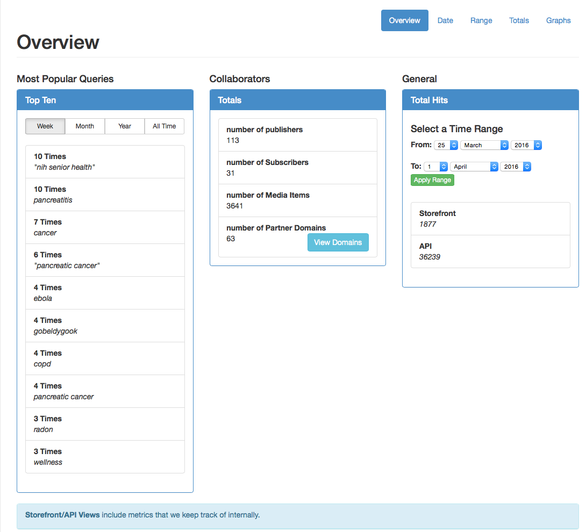
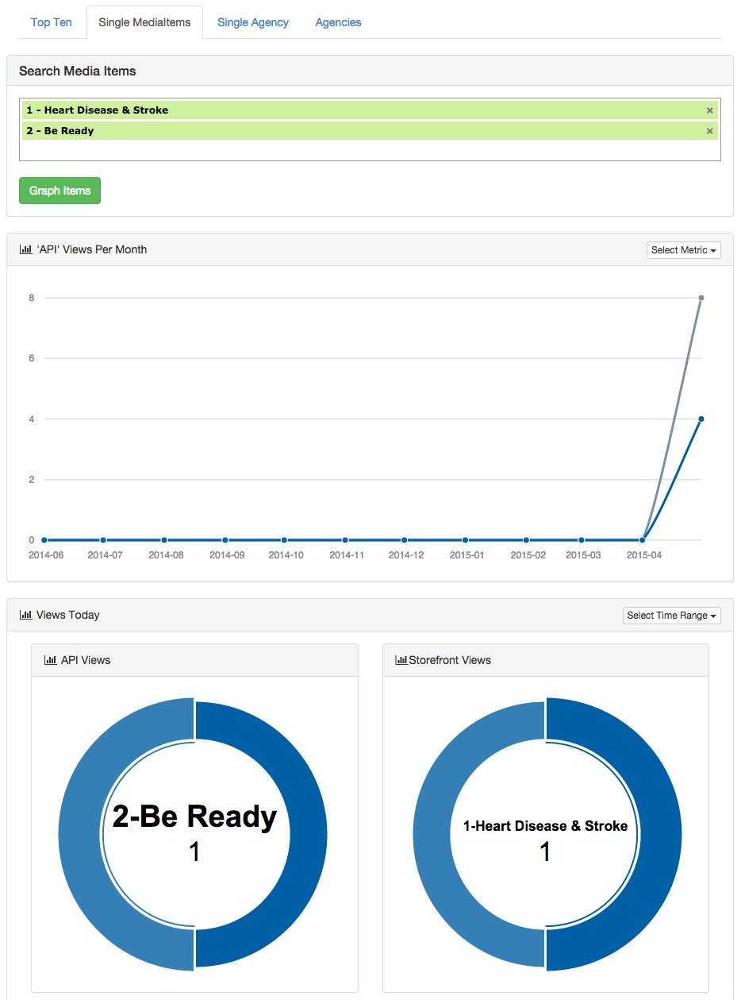

# Metrics

## Metrics Report

##### **View**
 
+ From the Syndication Dashboard, click Metrics> Metrics Report 

+ Overview tab & content will appear.

##### **Overview**

+ Most Popular Queries: It enables users to populate data based on Week/Month/Year/AllTime

+ Subscribers: Displays total numbr of Subscribers.

+ Google Analytics Overview:
+ Change Date/Month/Year and click Go, it will bring information based on selected date

##### **Date**

+ Click on Date tab, it will bring media based on current date.
+ Select a specific date and click Submit Date button, it will bring media based on that date.

##### **Range**

+ Click on Range tab, it will bring media with options to select a time range.
+ Select a date range and click Submit Date Range button, it will bring media based on selected date range.
+ Click on Past Week button, it will bring media current date to past week.
+ Click on Past Month button, it will bring media current date to past month.
+ Click on Past Year button, it will bring media current date to past year.

##### **Totals**
+ Click on Totals tab, it will bring total for all media item.
+ Click Next, it will bring media from next page. 
+ Click Previous, it will bring media from previous page. 

##### **Graphs**
+ Click on Graphs tab, it will bring Metric Graphs Page with four tabs: Top Ten, Single MediaItems, Single Agency & Agencies.

+ From Select Metric drop down list list select API/Storefront, it will bring graph based on selection.
+ From Time Time Range drop down list select Today/This Week/This Month/This Year, it will display donut chart for API Views and Storefront Views when data is available.
+ Click on Single MediaItems > Type Media Name > Click Graph Items

+ Click on Single Agency > select an agency > Click Apply Agency

+ Click Agencies tab, it will display graph for all agencies and donut chart will represent API & Storefront view based on agency.

***
##Campaign Metrics

##### View

+ From the Syndication Dashboard, click the Metrics menu and Campaign Metrics submenu.  

+ The Campaign Metric List screen will appear.

##### Create

+ From the Campaign Metric List screen, click the New button.  The Create Campaign Metric screen will appear.
 

+ Select the desired Campaign name from the drop-down menu.

+ Enter the Storefront View Count.

+ Enter the API View Count.

+ Select the Day, Month, Year, Time from the drop-down menus.

+ Click the Create button.  The Show Campaign screen will appear with a confirmation message.  

+ Click the List button.  The Campaign Metric List screen will appear.
 

##### Sort

+ From the Campaign Metric List screen, click the desired heading (Storefront View Count, API View Count, Day).

+ Click again.  The order will be changed (descending to ascending).

##### Edit

+ From the Campaign Metric List screen, click the link desired Campaign name link.  
 

+ The Show Campaign Metric screen will appear.

+ Click the Edit button.  The Edit Campaign Metric screen will appear.

 
+ Modify the desired fields.

+ Either click the Cancel or Update button. The Show Campaign Metric screen will appear.  If the Update button was selected then a confirmation message will appear as in the example below.

+ Click the List button.  The Campaign Metric List screen will appear.

##### Delete

+ Click the desired Campaign Metric name link.  

 

+ The Show Campaign Metric screen will appear.
 

+ Click the Delete button.  The Are You Sure pop-up window will appear.

 
+ Click the OK button.  The Campaign Metric List screen will appear with a confirmation message.

##Media Metrics

##### View

+ From the Syndication Dashboard, click the Metrics menu and Media Metrics submenu.  

+ The Media Metric List screen will appear.

 

##### Create

+ From the Media Metric List screen, click the New button.  The Create Media Metric screen will appear.
 

+ Select the Day, Month, Year, Time from the drop-down menus.

+ Enter the Storefront View Count.

+ Enter the API View Count.

+ Select the desired Media name from the drop-down menu.

+ Click the Create button.  The Show Media Metric screen will appear with a confirmation message.  

+ Click the List button.  The Media Metric List screen will appear.
 

##### Sort

+ From the Media Metric List screen, click the desired heading (Day, Storefront View Count, API View Count).

+ Click again.  The order will be changed (descending to ascending).

##### Edit

+ From the Media Metric List screen, click the link desired Media Metric date link.  
 

The Show Media Metric screen will appear.

+ Click the Edit button.  The Edit Media Metric screen will appear.

+Modify the desired fields.

+ Either click the Cancel or Update button. The Show Media Metric screen will appear.  If the Update button was selected then a confirmation message will appear as in the example below.
 

+ Click the List button.  The Media Metric List screen will appear.

 

##### Delete

+ Click the desired Media Metric date link.  
 

+ The Show Media Metric screen will appear.

+ Click the Delete button.  The Are You Sure pop-up window will appear.

 

+ Click the OK button.  The Media Metric List screen will appear with a confirmation message.

 
