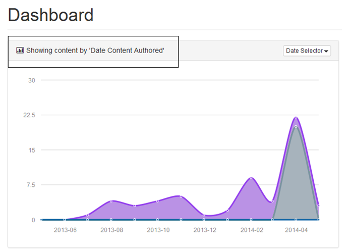

 
#Login
 
+ Launch a web browser, enter the following uniform resource locater (url) in the address bar:  http://ctacdev.com:8090/SyndicationAdmin  

+ Hit Enter or Click Go button next to the address bar, Syndication Dashboard Login screen will appear. 

+ Enter Username.

+ Enter Password.

+ Click Login button.  Syndication Dashboard Landing Page screen will appear.

# View Syndication Dashboard and Events
 

+ Click the Showing Content by ‘Date Syndication Captured’ chart next to the desired date to display the number of media items syndication captured per month by agency. 

 

+ Click Date Selector drop-down menu.  
 
+ Select (Date) Syndication Updated from Date Selector drop-down menu, graphic will change to show ‘Date Syndication Updated.’

+ Select (Date) Content Authored from the Date Selector drop-down menu.  The graphic will change to show ‘Date Content Authored.’

+ Select (Date) Content Updated from the Date Selector drop-down menu.  The graphic will change to show ‘Date Content Updated.’

 
+ Select (Date) Content Published from Date Selector drop-down menu, graphic will change to show ‘Date Content Published.’

+ Select (Date) Content Reviewed from Date Selector drop-down menu, graphic will change to show ‘Date Content Reviewed.’

+ View Timeline section to see the most recent postings.  

+ View Notifications Panel section to see the most recent changes in the system i.e., system startup, system shutdown.

+ Click View All Events link, detailed Event Listing screen will appear.

+ Click Syndication Dashboard link, Syndication Dashboard screen will appear.

+ View # of Media Items by Agency donut chart to see the total number of media items by agency, organization, or operating division.  Point the curser on the chart to display the desired agency, organization, or operating division. 

+ View # of Media Items by Type donut chart for a breakdown of media items by media type.  Point the cursor on the desired type to display the media type and # i.e. Image 24

