# Media Items

## Search Media Items

##### **View**
 
+ From Syndication Dashboard, click the Media menu and Search Media Items submenu.

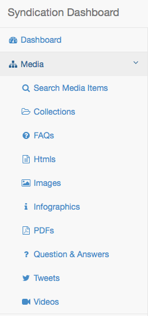

+ Search Media Items screen will appear.

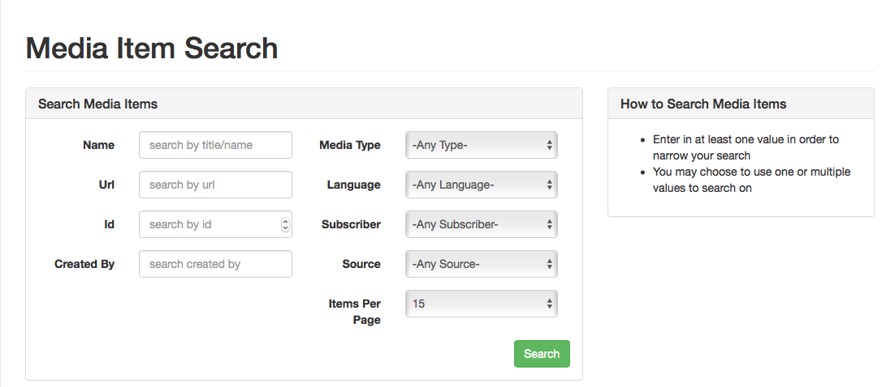

##### **Search by Name**

+ Enter media name at Name text box and click Search button, It will bring all media item related to that name.

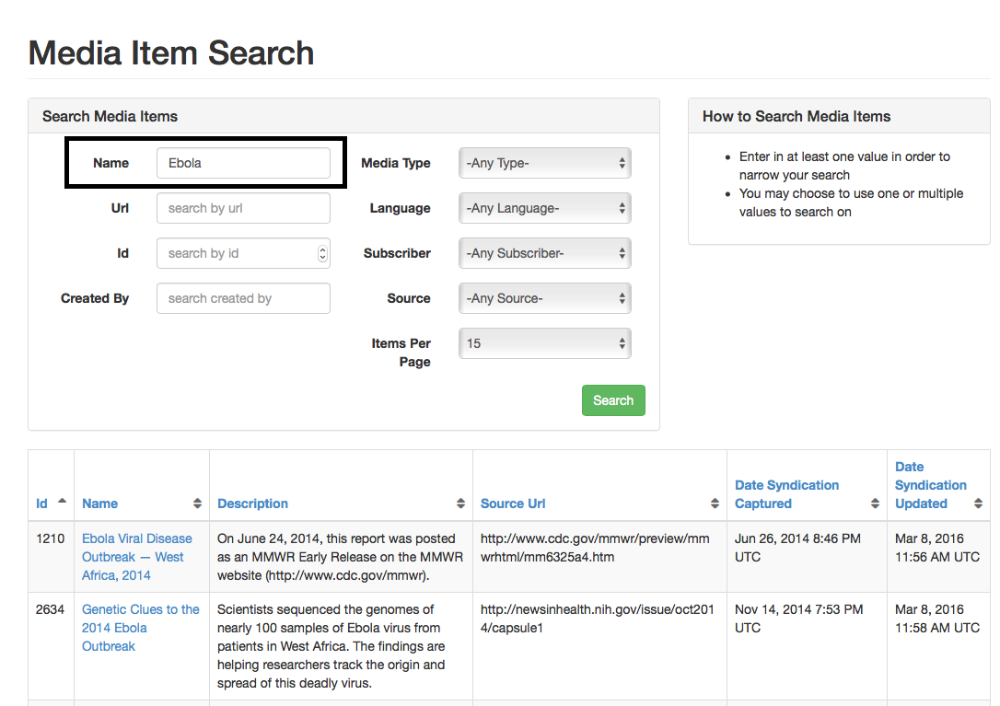

##### **Search by Url**
+ Enter media url at Url text box and click Search button, It will bring all media item related to that url.

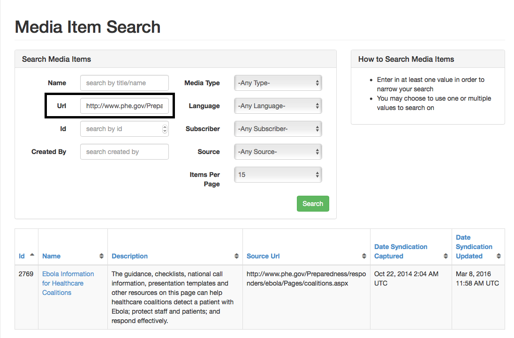

##### **Search by Id**
+ Enter media id at Id text box and click Search button, It will bring all media item related to that id.

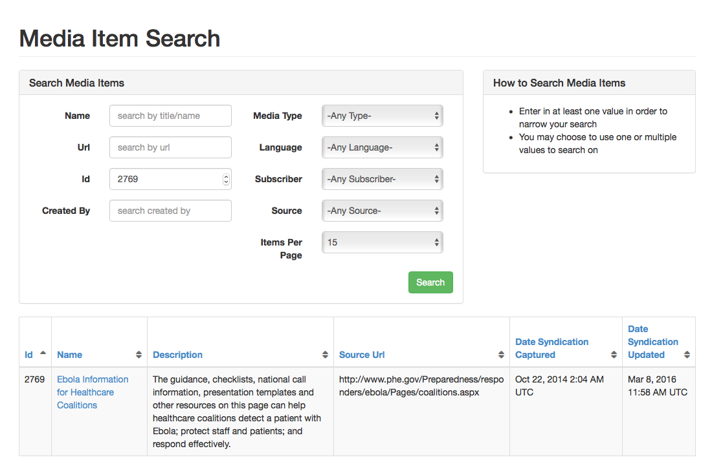

##### **Search by Media Type**
+ Select media type from drop down and click Search button, It will bring all media item related to that media type.

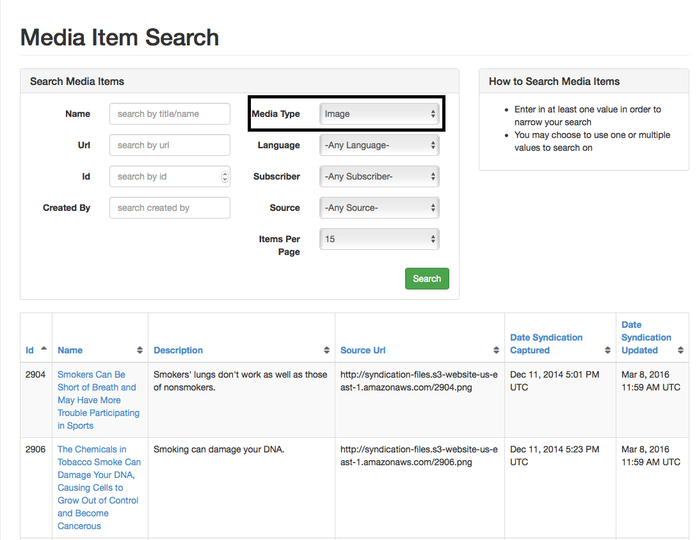

##### **Search by Language**
+ Select Language from drop down and click Search button, It will bring all media item related to selected language.

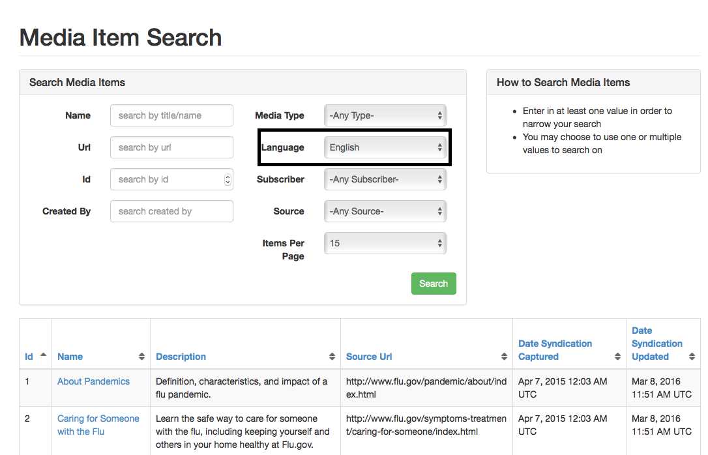

##### **Search with multiple value**
+ Select media type from drop down menu
+ Select Language from drop down menu
+ Click Search button, It will bring all media item related to selected language & media type.

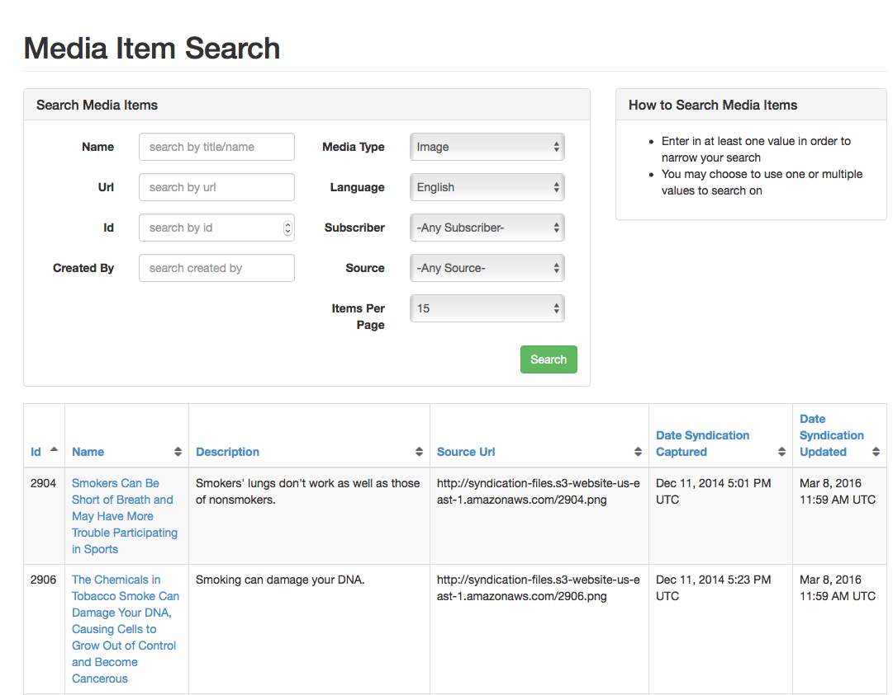

## Audio

##### **View**

+ From the Syndication Dashboard, click Media menu and Audio submenu.  

+ The Audio List screen will appear.  

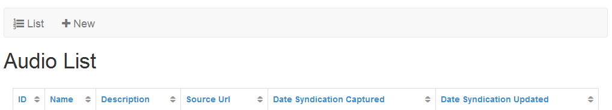

##### **Create**

+ From the Audio List screen, click New button, Create Audio page will appear.

+ Enter Name.  Note: there is a 255 character limit.

+ Optionally, enter Description.  Note: there is a 2000 character limit.

+ Enter Source URL.  Note: this should begin with http or https.

+ Optionally, enter Target URL.  Note: this should begin with http or https.

+ Optionally, enter Custom Thumbnail URL

+ Optionally, enter Custom Preview URL

+ Enter Date Syndication Captured [current date will be auto selected].

+ Enter Date Syndication Updated [current date will be auto selected].

+ Enter Date Syndication Visible [current date will be auto selected].

+ Optionally, enter Date Content Authored.

+ Optionally, enter Date Content Updated.

+ Optionally, enter Date Content Published.

+ Optionally, enter Date Content Reviewed.

+ Select Language from the drop-down menu.

+ Confirm Active checkbox is checked by default.

+ Confirm Visible in Storefront checkbox is checked by default.

+ Confirm Manually Managed checkbox is checked by default.

+ Optionally, enter the External GUID.  Note: there is a 255 character limit.

+ Select the Source from the drop-down menu.

+ Optionally, enter the duration time in seconds.

+ Select Subscriber from dropdown

+ Click the Create button.  The Show Audio screen will appear with a confirmation message.  Note: only the completed fields will appear.

+ Click the List button.  The Audio List screen will appear.

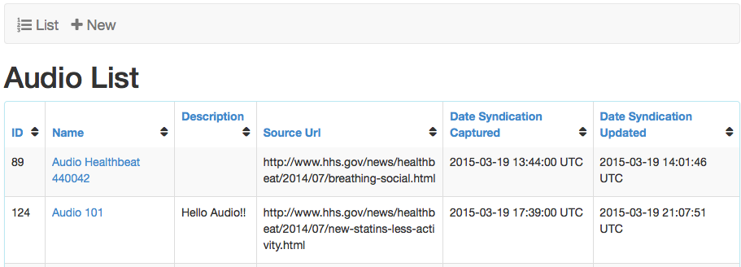

##### **Sort**

+ From the Audio List screen, click the desired heading (ID, Name, Description, Source URL, Date Syndication Captured, Date Syndication Updated).

+ Click again.  The order will be changed (descending to ascending).

##### **Edit**

+ From the Audio List screen, click the link desired Name link.  

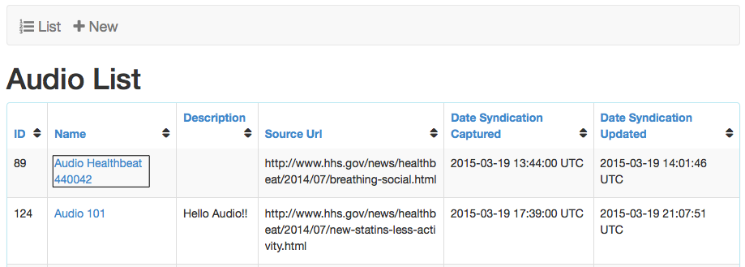

+ The Show Audio screen will appear.

+ Click the Edit button.  The Edit Audio screen will appear.

+ Modify the desired fields.

+ Either click the Cancel or Update button. The Show Audio screen will appear.  If the Update button was selected then a confirmation message will appear as in the example below.

+ Click the List button.  The Audio List screen will appear.

## Collection

##### **View**

+ From the Syndication Dashboard, click the Media menu and Collections submenu.  

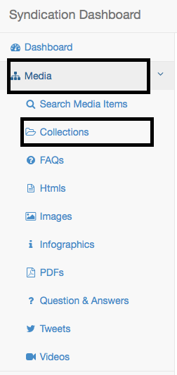

+ The Collection list screen will appear.

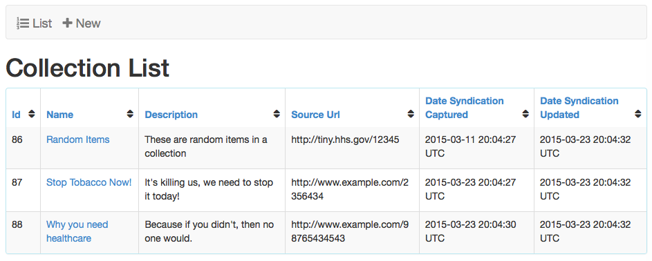

##### **Create**

+ From the Collection List screen, click the New button.  The Create Collection screen will appear.
 
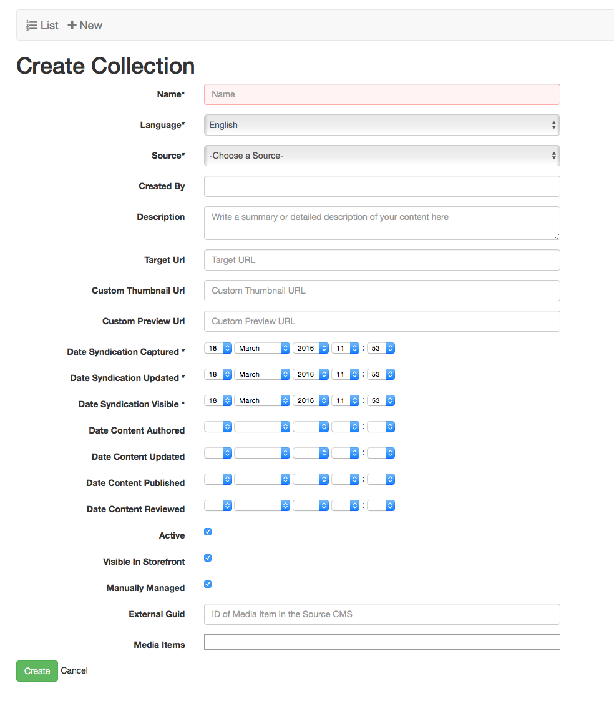

+ Enter the Name.  Note: there is a 255 character limit.

+ Optionally, enter the Description.  Note: there is a 2000 character limit.

+ Enter the Source URL.  Note: this should begin with http or https.

+ Optionally, enter the Target URL.  Note: this should begin with http or https.

+ Optionally, enter the Date Content Authored.

+ Optionally, enter the Date Content Updated.

+ Optionally, enter the Date Content Published.

+ Optionally, enter the Date Content Reviewed.

+ Enter the Date Syndication Captured [current date will be auto selected].

+ Enter the Date Syndication Updated [current date will be auto selected].

+ Enter the Date Syndication Visible [current date will be auto selected].

+ Select the Language from the drop-down menu.

+ Confirm Active checkbox is checked by default.

+ Confirm Visible in Storefront checkbox is checked by default.

+ Confirm Manually Managed checkbox is checked by default.

+ Optionally, enter the External GUID.  Note: there is a 255 character limit.

+ Select the Source from the drop-down menu.

+ Optionally, select the Media Items, if available.

+ Select Subscriber from dropdown

+ Click the Create button.  The Show collection screen will appear with a confirmation message.  Note: only the fields completed will appear.

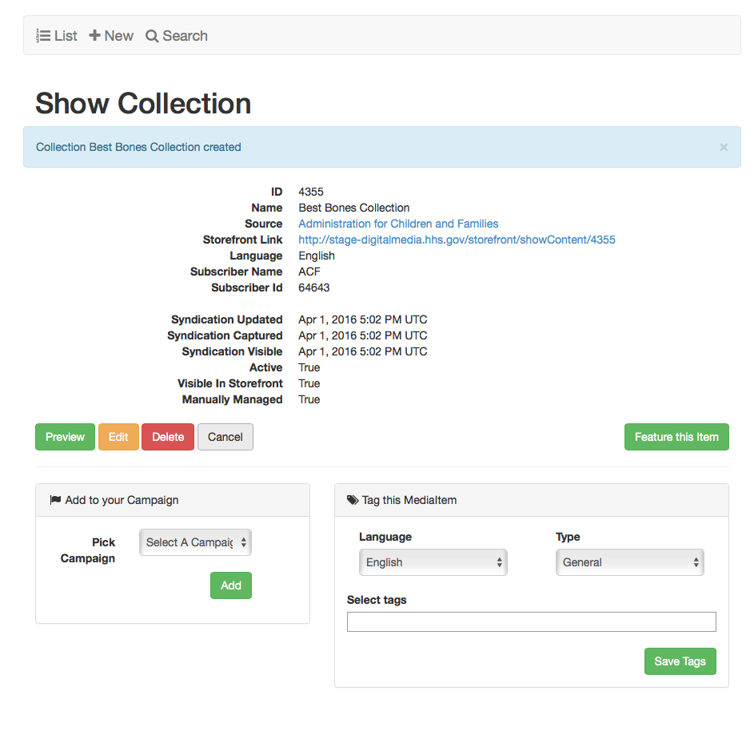

+ Click the List button.  The Collection List screen will appear.

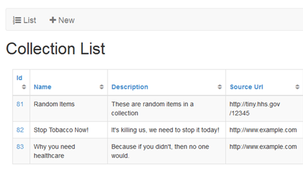

##### **Sort**

+ From the Collection List screen, click the desired heading (ID, Name, Description, Source URL, Date Syndication Captured, Date Syndication Updated).

+ Click again.  The order will be changed (descending to ascending).

##### **Edit**

+ From the Collection List screen, click the link desired collection ID link.  

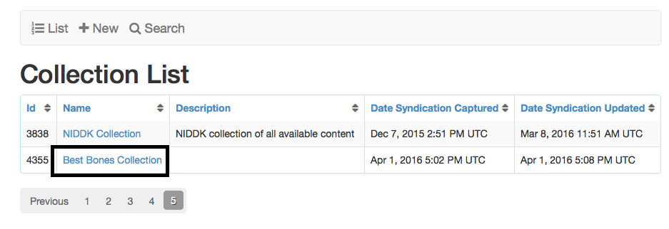

+ The Show collection screen will appear.

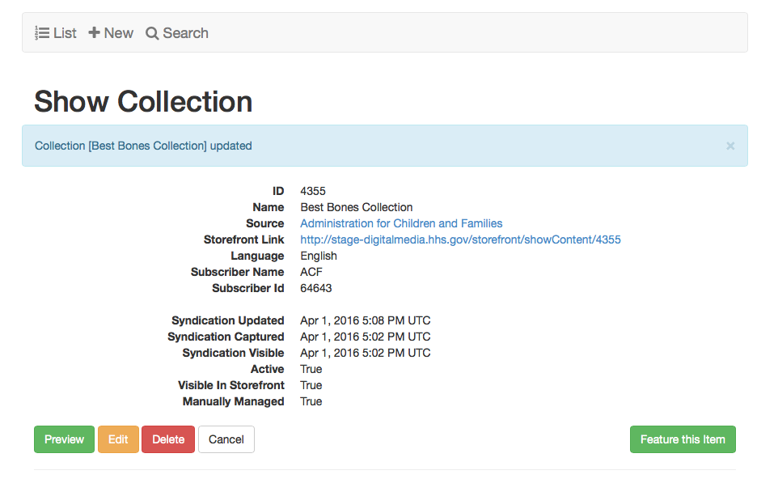

+ Click the Edit button.  The Edit Collection screen will appear.
 
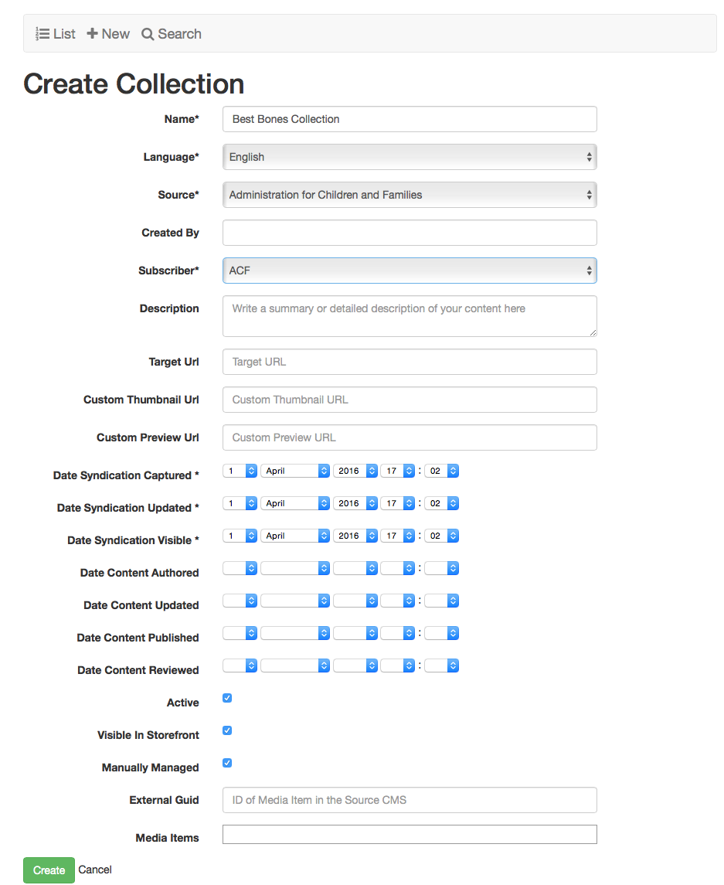

+ Modify the desired fields.

+ Either click the Cancel or Update button. The Show Collection screen will appear.  If the Update button was selected then a confirmation message will appear as in the example below.

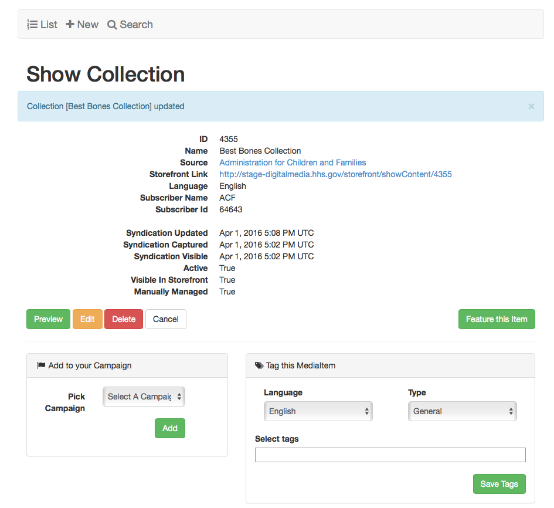

+ Click the List button.  The Collection List screen will appear.

## Html

##### **View**
 
+ From the Syndication Dashboard, click the Media menu and HTMLS submenu.  

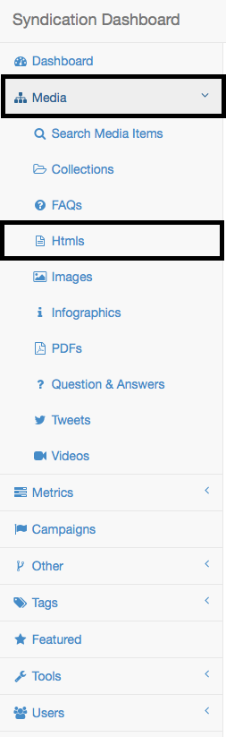

+ The HTML List screen will appear.

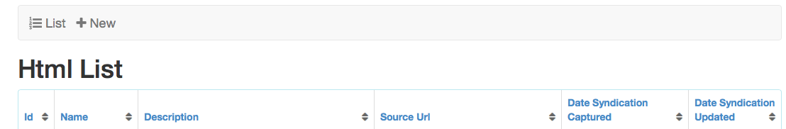

##### **Create**

+ From the HTML List screen, click the New button.  The Create HTML screen will appear.

+ Enter the Name.  Note: there is a 255 character limit.

+ Optionally, enter the Description.  Note: there is 2000 character limit.

+ Enter the Source URL.  Note: this should begin with http or https.

+ Optionally, enter the Target URL.  Note: this should begin with http or https.

+ Optionally, enter the Date Content Authored.

+ Optionally, enter the Date Content Updated.

+ Optionally, enter the Date Content Published.

+ Optionally, enter the Date Content Reviewed.

+ Enter the Date Syndication Captured.

+ Enter the Date Syndication Updated.

+ Enter the Date Syndication Visible.

+ Select the Language from the drop-down menu.

+ Confirm the Active checkbox is checked by default.

+ Confirm Visible in Storefront checkbox is checked by default.

+ Confirm Manually Managed checkbox is checked by default.

+ Optionally, enter the External GUID.  Note: there is a 255 character limit.

+ Select Source from the drop-down menu.

+ Select Subscriber from drop-down menu.

+ Click the Create button.  The Show collection screen will appear with a confirmation message.  Note: only the fields completed will appear.

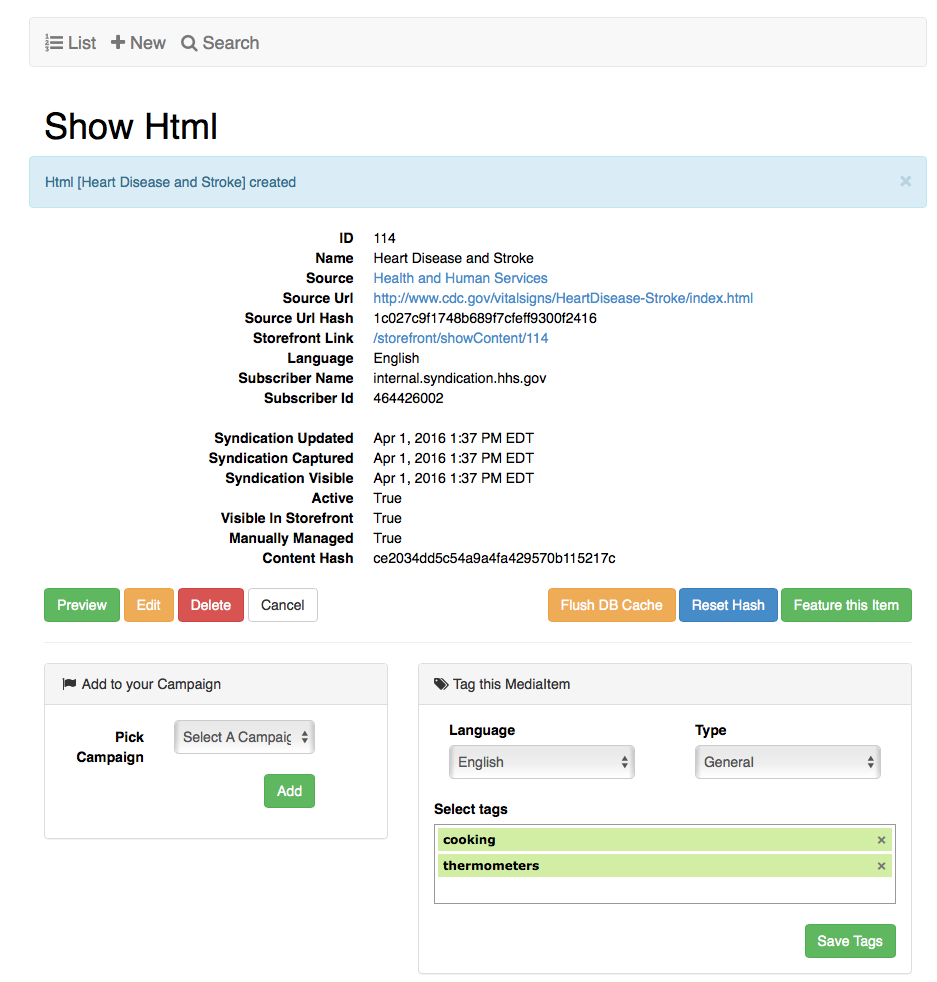

+ Click the List button.  The HTML List screen will appear.

##### **Sort**

+ From the HTML List screen, click the desired heading (ID, Name, Description, Source URL, Date Syndication Captured, Date Syndication Updated).

+ Click again.  The order will be changed (descending to ascending).

##### **Edit**

+ From the HTML List screen, click the link desired HTML ID link.  

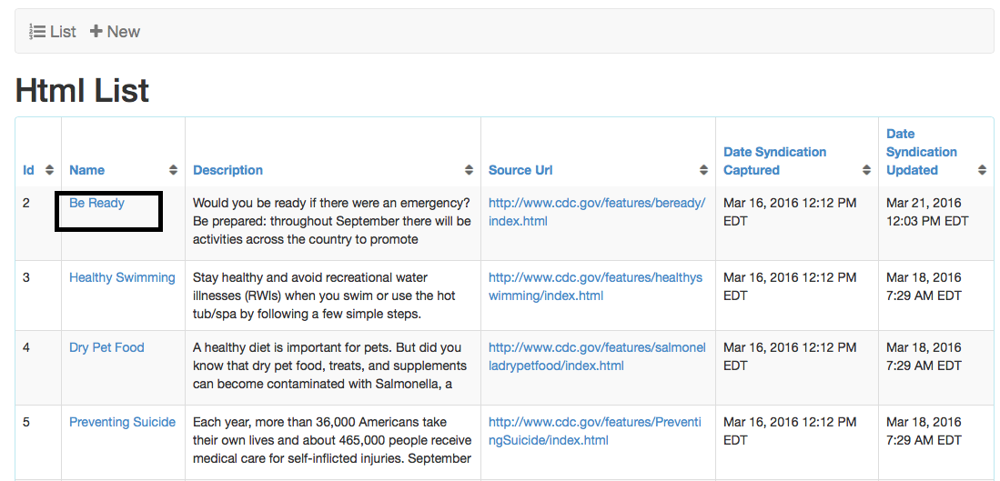

+ The Show HTML screen will appear.

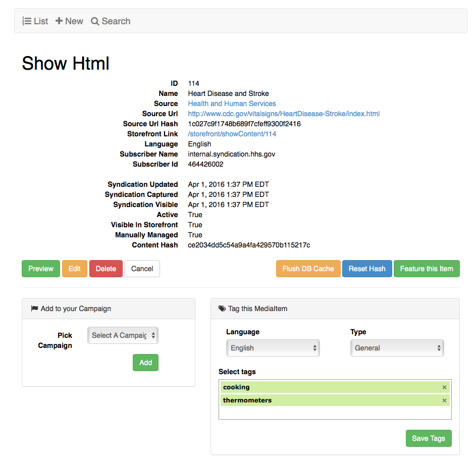

+ Click the Edit button.  The Edit HTML screen will appear.
 
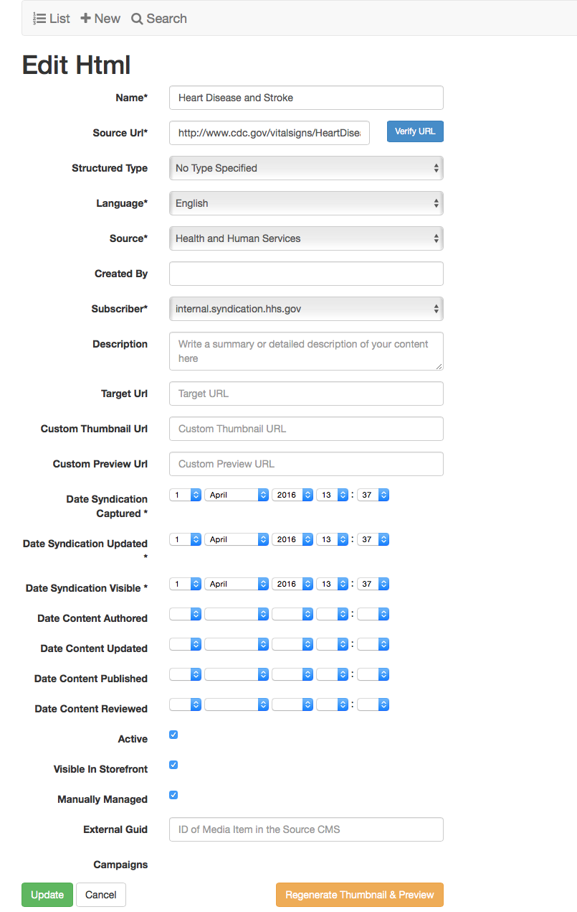

+ Modify the desired fields.

+ Either click the Cancel or Update button. The Show HTML screen will appear.  If the Update button was selected then a confirmation message will appear as in the example below.

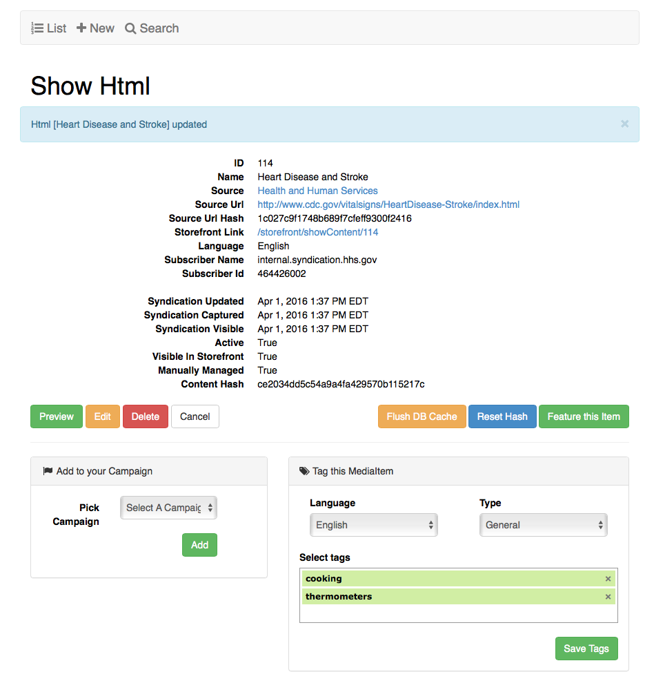

+ Click the List button.  The HTML List screen will appear.

## Image

##### **View**
 
+ From the Syndication Dashboard, click the Media menu and Images submenu.  

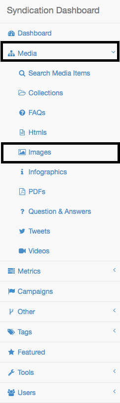

+ The Image List screen will appear.

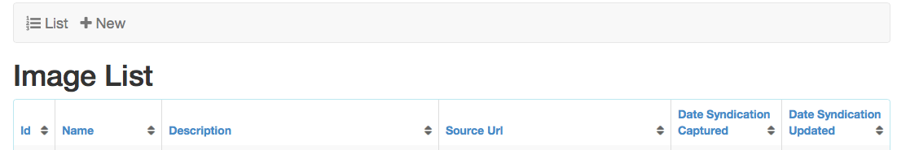

##### **Create**

+ From the Image List screen, click the New button.  The Create Image screen will appear.
 
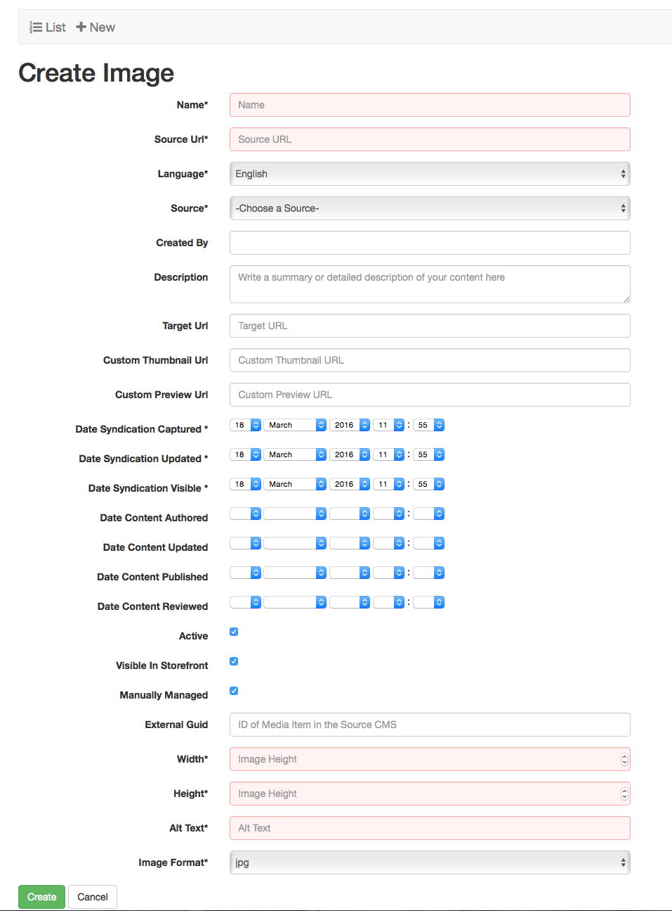

+ Enter the Name.  Note: there is a 255 character limit.

+ Optionally, enter the Description.  Note: there is a 2000 character limit.

+ Enter the Source URL.  Note: this should begin with http or https.

+ Optionally, enter the Target URL.  Note: this should begin with http or https.

+ Optionally, enter the Date Content Authored.

+ Optionally, enter the Date Content Updated.

+ Optionally, enter the Date Content Published.

+ Optionally, enter the Date Content Reviewed.

+ Enter the Date Syndication Captured.

+ Enter the Date Syndication Updated.

+ Enter the Date Syndication Visible.

+ Select the Language from the drop-down menu.

+ Confirm the Active checkbox is checked by default.

+ Confirm Visible in Storefront checkbox is checked by default.

+ Confirm Manually Managed checkbox is checked by default.

+ Optionally, enter the External GUID.  Note: there is a 255 character limit.

+ Optionally, enter the Hash.  Note: there is a 255 character limit.

+ Select the Source from the drop-down menu.

+ Enter the Width.

+ Enter the Height.

+ Enter the Image Format.

+ Enter the Alt Text.

+ Select Subscriber from drop-down menu.

+ Click the Create button.  The Show Image screen will appear with a confirmation message.  Note: only the fields completed will appear.

+ Optionally, click the Add Alternate Image link.  For detailed instructions go to Create an Alternate Image.

+ Optionally, select a Campaign, if available.

+ Optionally, select or add an Extended Attribute, if available.  For detailed instructions go to Create an Extended Attribute.

+ Click the List button.  The Image List screen will appear.

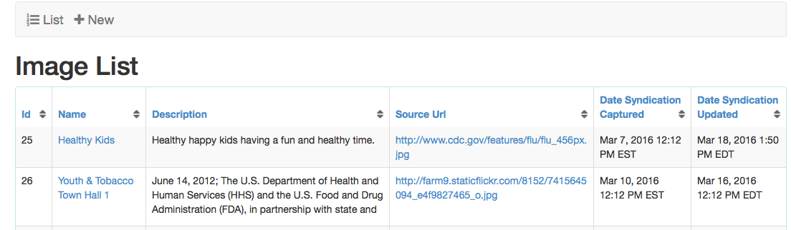

##### **Sort**

+ From the Image List screen, click the desired heading (ID, Name, Description, Source URL, Date Syndication Captured, Date Syndication Updated).

+ Click again.  The order will be changed (descending to ascending).

##### **Edit**

+ From the Image List screen, click the link desired Image ID link.  
 
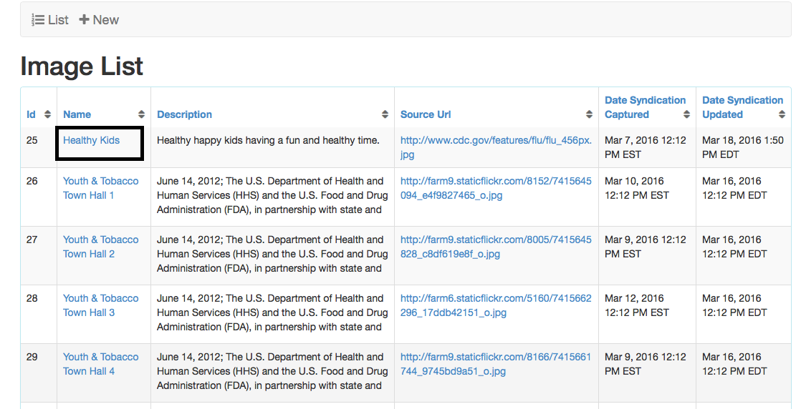

+ The Show Image screen will appear.

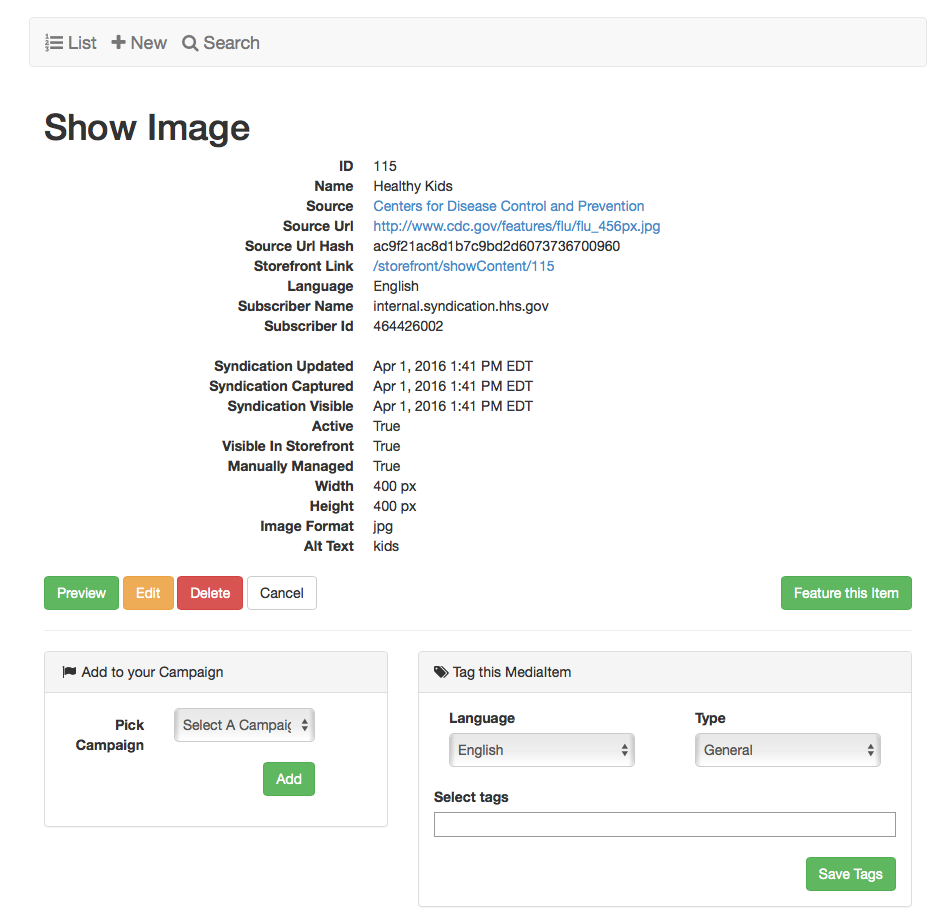

+ Click the Edit button.  The Edit Image screen will appear.

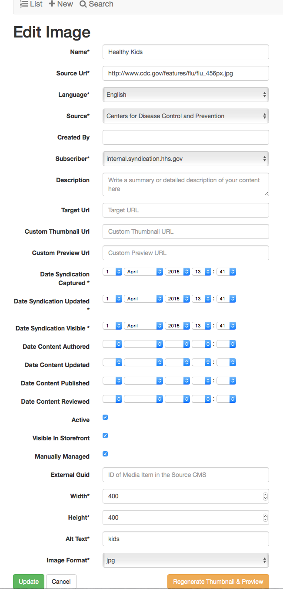

+ Modify the desired fields.

+ Either click the Cancel or Update button. The Show Image screen will appear.  If the Update button was selected then a confirmation message will appear as in the example below.

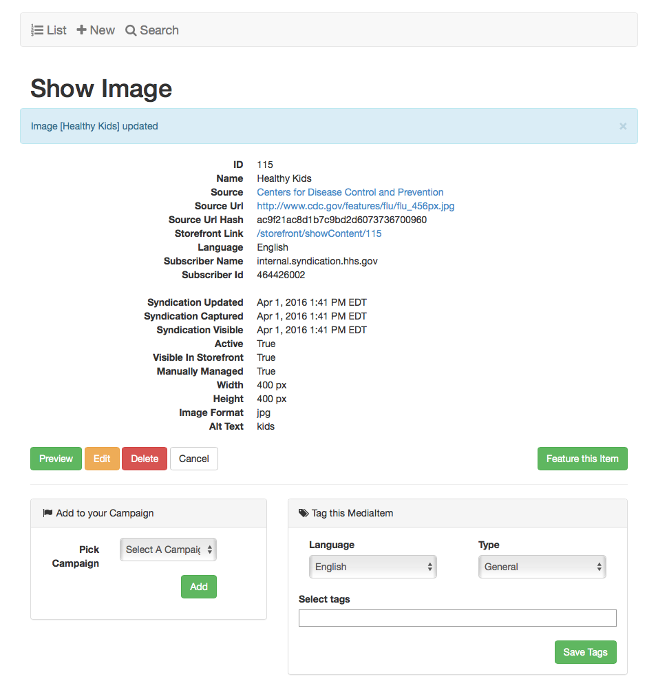

+ Click the List button.  The Image List screen will appear.
 

## Infographic

##### **View**
 
+ From the Syndication Dashboard, click the Media menu and Infographics submenu.  

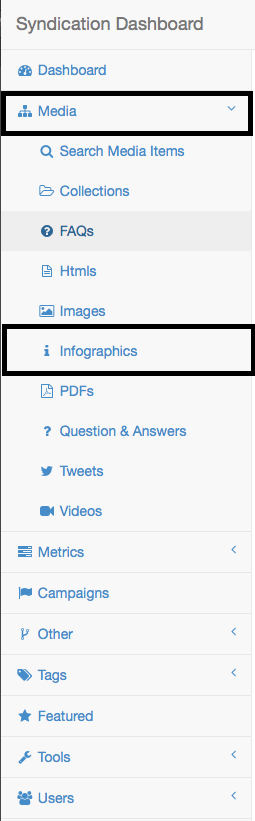

+ The Infographic List screen will appear.
 
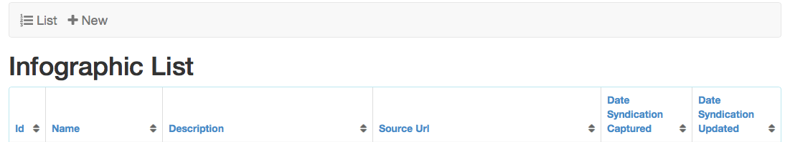

##### **Create**

+ From the Infographic List screen, click the New button.  The Create Infographic screen will appear.

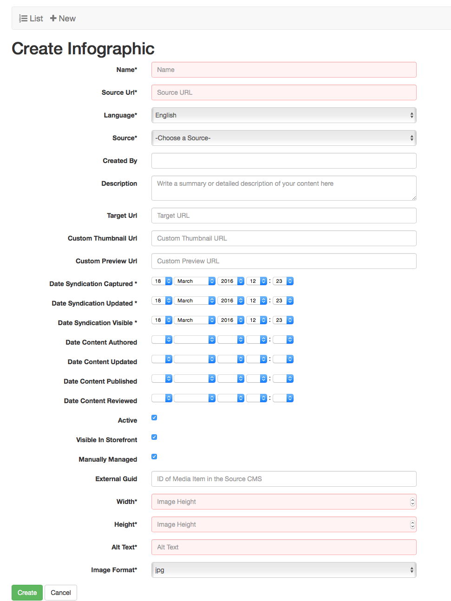

+ Enter the Name.  Note: there is a 255 character limit.

+ Optionally, enter the Description.  Note: there is a 2000 character limit.

+ Enter the Source URL.  Note: this should begin with http or https.

+ Optionally, enter the Target URL.  Note: this should begin with http or https.

+ Optionally, enter the Date Content Authored.

+ Optionally, enter the Date Content Updated.

+ Optionally, enter the Date Content Published.

+ Optionally, enter the Date Content Reviewed.

+ Enter the Date Syndication Captured.

+ Enter the Date Syndication Updated.

+ Enter the Date Syndication Visible.

+ Select the Language from the drop-down menu.

+ Confirm the Active checkbox is checked by default.

+ Confirm Visible in Storefront checkbox is checked by default.

+ Confirm Manually Managed checkbox is checked by default.

+ Optionally, enter External GUID.  Note: there is a 255 character limit.

+ Optionally, enter Hash.  Note: there is a 255 character limit.

+ Select Source from the drop-down menu.

+ Enter Width.

+ Enter Height.

+ Enter Infographic/Image Format.

+ Enter Alt Text.

+ Select Subscriber from drop-down menu.

+ Click the Create button.  The Show Infographic screen will appear with a confirmation message.  Note: only the fields completed will appear.

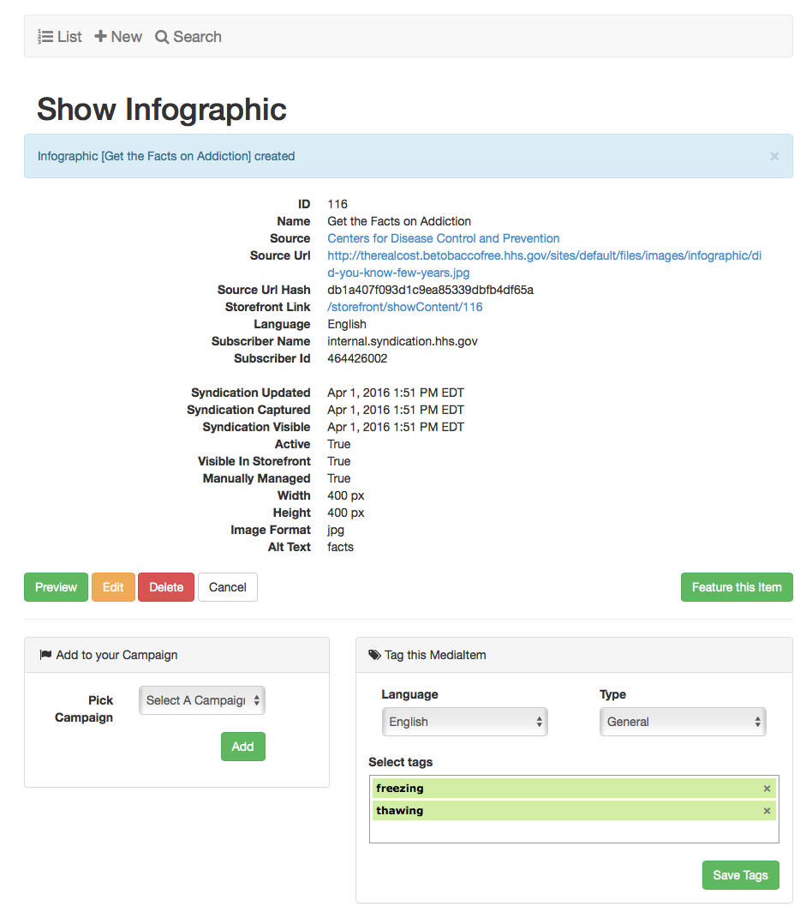

+ Optionally, click the Add Alternate Image link.  For detailed instructions go to Create an Alternate Image.

+ Optionally, select a Campaign, if available.

+ Optionally, select or add an Extended Attribute, if available.  For detailed instructions go to Create an Extended Attribute.

+ Click the List button.  The Infographic List screen will appear.

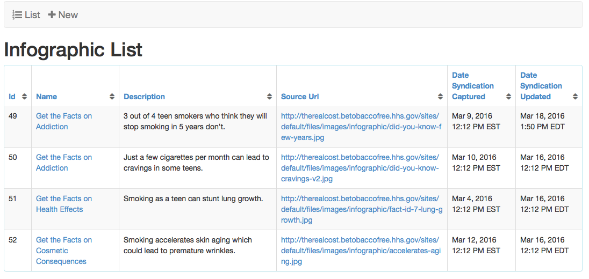

##### **Sort**

+ From the Infographic List screen, click the desired heading (ID, Name, Description, Source URL, Date Syndication Captured Authored, Date Syndication Updated).

+ Click again.  The order will be changed (descending to ascending).

##### **Edit**

+ From the Infographic List screen, click the link desired Infographic ID link.  

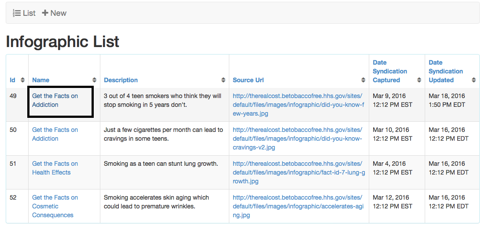

+ The Show Infographic screen will appear.

+ Click the Edit button.  The Edit Infographic screen will appear.
 
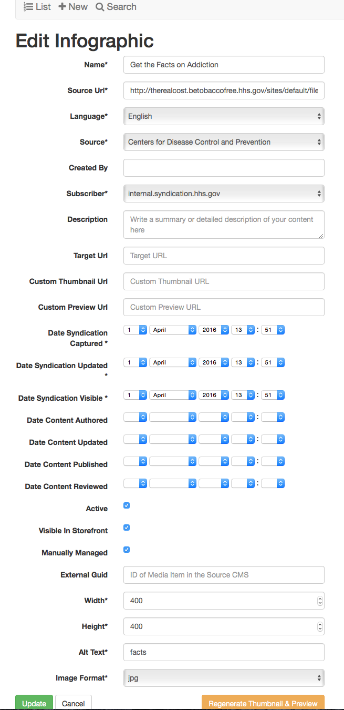

+ Modify the desired fields.

+ Either click the Cancel or Update button. The Show Infographic screen will appear.  If the Update button was selected then a confirmation message will appear as in the example below.

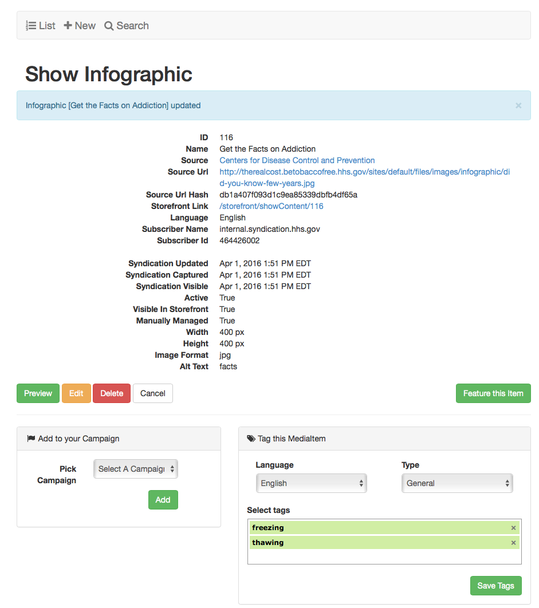

+ Click the List button.  The Infographic List screen will appear.
 
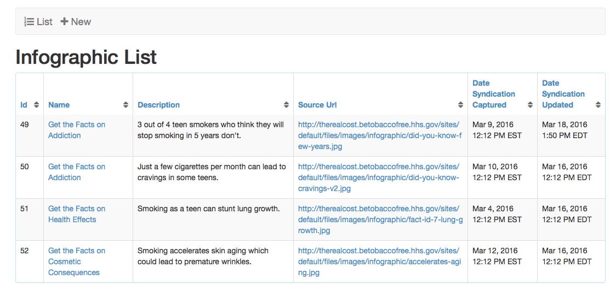

## PDFs

##### **View**
 
+ From the Syndication Dashboard, click the Media menu and PDFs submenu.

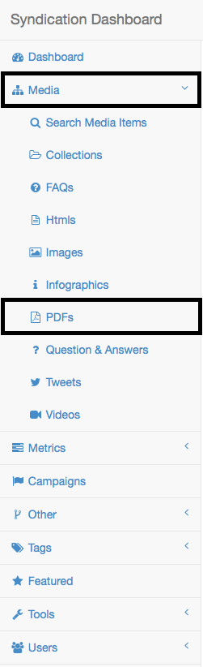

+ PDF List screen will appear.

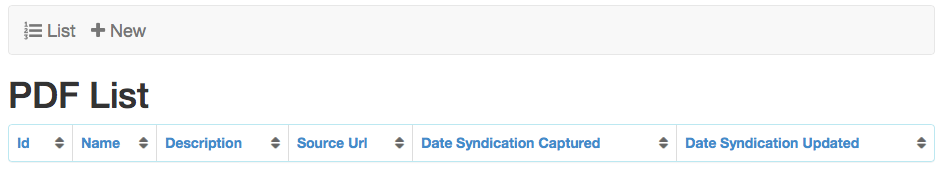

##### **Create**

+ From PDF List screen, click New button, Create PDF screen will appear.

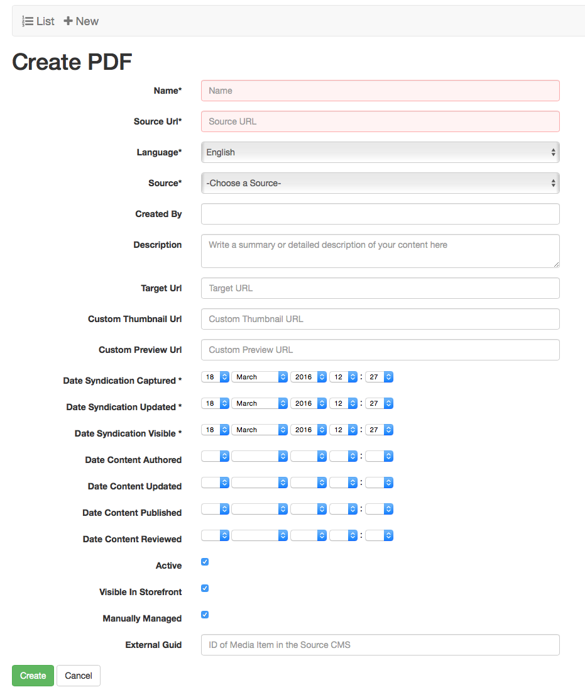

+ Enter Name.  Note: there is a 255 character limit.

+ Optionally, enter the Description.  Note: there is 2000 character limit.

+ Enter Source URL.  Note: this should begin with http or https.

+ Optionally, enter Target URL.  Note: this should begin with http or https.

+ Optionally, enter Custom Thumbnail URL.  Note: this should begin with http or https.

+ Optionally, enter Custom Preview URL.  Note: this should begin with http or https.

+ Optionally, enter Date Content Authored.

+ Optionally, enter Date Content Updated.

+ Optionally, enter Date Content Published.

+ Optionally, enter Date Content Reviewed.

+ Enter Date Syndication Captured.

+ Enter Date Syndication Updated.

+ Enter Date Syndication Visible.

+ Select Language from the drop-down menu.

+ Confirm Active checkbox is checked by default.

+ Confirm Visible in Storefront checkbox is checked by default.

+ Confirm Manually Managed checkbox is checked by default.

+ Confirm Visible In Storefront checkbox is checked by default.

+ Confirm Manually Managed checkbox is checked by default.

+ Optionally, enter External GUID.  Note: there is a 255 character limit.

+ Select the Source from the drop-down menu.

+ Select Subscriber from drop-down menu.

+ Click Create button.  The Show PDF screen will appear with a confirmation message.  Note: only the fields completed will appear.

##### **Add to Campaign**
+ Select a Campaign from Pick Campaign drop down list and click Add button.
+ Once Campaign is added to the media item, it wil display confirmation message.

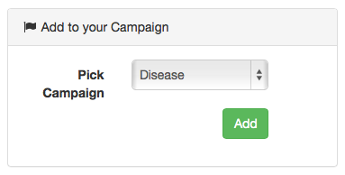

##### **Tag this MediaItem**

+ Select Language.
+ Select Tag Type: General/Topic/Audience.
+ Type Tag name at Select tags text box [user may select a tag from existing ones].
+ Once Tag is added to the media item, it wil display confirmation message. 

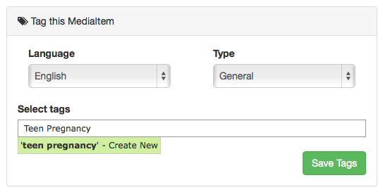

##### **Feature this Item**
+ Click on Feature this Item.
+ it will bring confirmation message:The media item has been featured. Click here for feature page
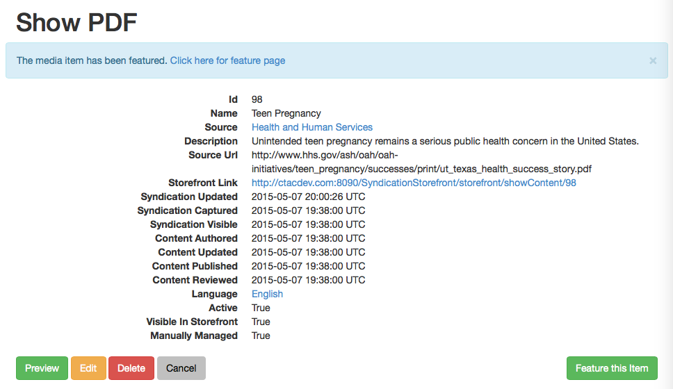

+ Click on: "Click here for feature page", it will redirect to the Featured Media page.
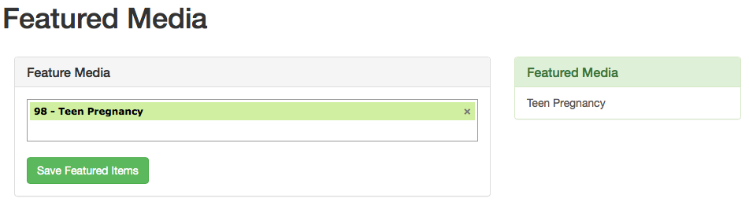

+ Click on the media item, it will redirect to media show page for that media item.
+ Click the List button, PDF List screen will appear.

##### **Sort**

+ From PDF List screen, click on desired heading (ID, Name, Description, Source URL, Date Syndication Captured, Date Syndication Updated), the order will change (descending to ascending).

##### **Edit - Add Description**

+ From PDF List screen, click on desired PDF Name link, Show PDF screen will appear.

+ Click Edit button, Edit PDF screen will appear.

+ Modify at desired fields (Type something at Description field)

+ Either click Cancel or Update button. The Show PDF screen will appear. If the Update button was selected then a confirmation message will appear as in the example below.

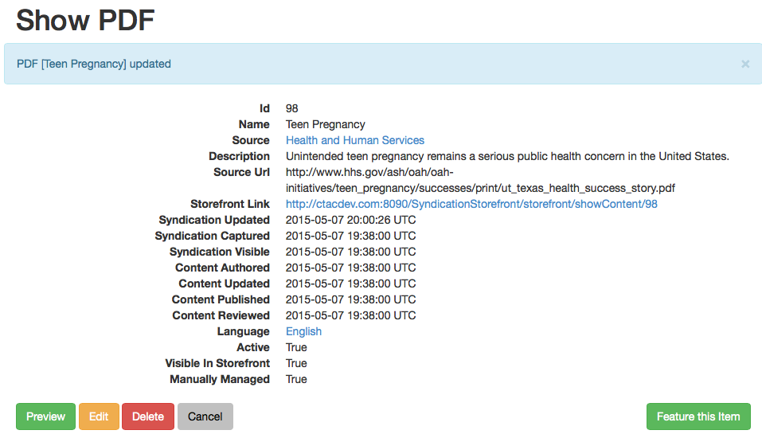

+ Click the List button. The PDF List screen will appear.

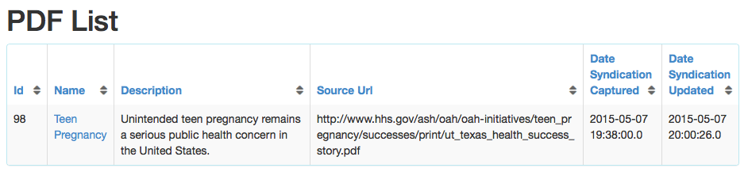

## Periodicals

##### **View**
 
+ From the Syndication Dashboard, click the Media menu and Periodical submenu.

+ Periodical List screen will appear.

##### **Create**

+ From Periodical List screen, click the New button.  Create Periodical screen will appear.

+ Enter Name.  Note: there is a 255 character limit.

+ Optionally, enter the Description.  Note: there is 2000 character limit.

+ Enter Source URL.  Note: this should begin with http or https.

+ Optionally, enter Target URL.  Note: this should begin with http or https.

+ Optionally, enter Custom Thumbnail URL.  Note: this should begin with http or https.

+ Optionally, enter Custom Preview URL.  Note: this should begin with http or https.

+ Select Period: Daily/Weekly/Monthly/Annually

+ Optionally, enter Date Content Authored.

+ Optionally, enter Date Content Updated.

+ Optionally, enter Date Content Published.

+ Optionally, enter Date Content Reviewed.

+ Enter Date Syndication Captured.

+ Enter Date Syndication Updated.

+ Enter Date Syndication Visible.

+ Select Language from the drop-down menu.

+ Confirm Active checkbox is checked by default.

+ Confirm Visible In Storefront checkbox is checked by default.

+ Confirm Manually Managed checkbox is checked by default.

+ Optionally, enter External GUID.  Note: there is a 255 character limit.

+ Select the Source from the drop-down menu.

+ Select Subscriber from drop-down menu.

+ Click the Create button.  The Show Periodical screen will appear with a confirmation message.  Note: only the fields completed will appear.

##### **Add to Campaign**
+ Select a Campaign from Pick Campaign drop down list and click Add button.
+ Once Campaign is added to the media item, it wil display confirmation message.

##### **Tag this MediaItem**

+ Select Language.
+ Select Tag Type: General/Topic/Audience.
+ Type Tag name at Select tags text box [user may select a tag from existing ones].
+ Once Tag is added to the media item, it wil display confirmation message. 

##### **Feature this Item**
+ Click on Feature this Item.
+ it will bring confirmation message:The media item has been featured. Click here for feature page

+ Click on: "Click here for feature page", it will redirect to the Featured Media page.
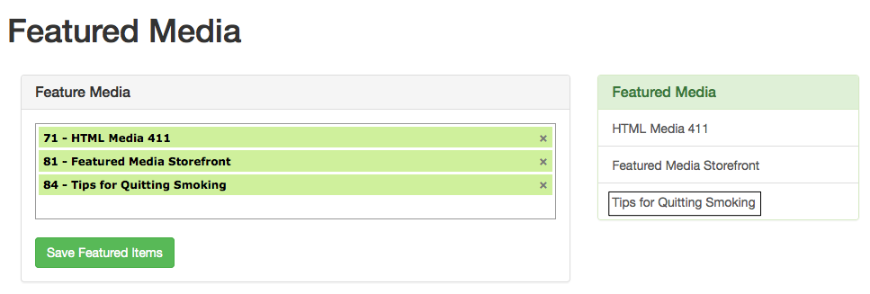

+ Click on the media item, it will redirect to media show page for that media item.
+ Click the List button.  The Periodical List screen will appear.

##### **Sort**

+ From the Periodical List screen, click the desired heading (ID, Name, Description, Source URL, Date Syndication Captured, Date Syndication Updated), the order will change (descending to ascending).

##### **Edit - Regenerate Thumbnail & Preview**

+ From Periodical List screen, click on desired Periodical ID link, show Periodical screen will appear.

+ Click  Edit button, Edit Periodical screen will appear.

+ Modify at desired fields (click on Regenerate Thumbnail & Preview)

+ Either click the Cancel or Update button. The Show Periodical screen will appear.  If the Update button was selected then a confirmation message will appear as in the example below.

+ Click the List button. The Periodical List screen will appear.

## Social Media

##### **View**
 
+ From the Syndication Dashboard, click the Media menu and Social Media submenu.  

+ The Social Media List screen will appear.

##### **Create**

+ From the Social Media List screen, click the New button.  The Create Social Media screen will appear.
 
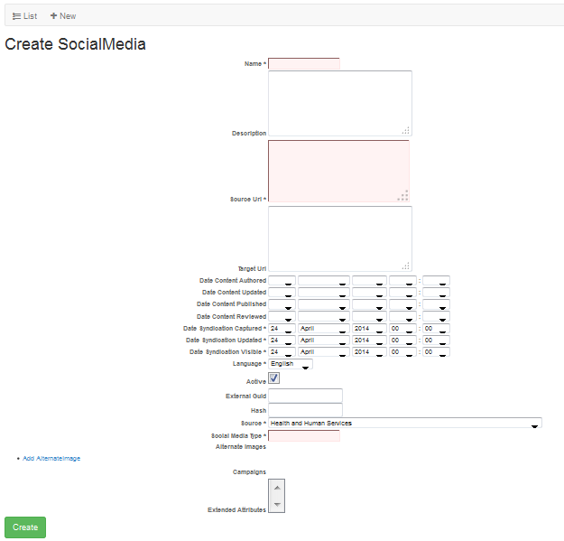

+ Enter the Name.  Note: there is a 255 character limit.

+ Optionally, enter the Description.  Note: there is a 2000 character limit.

+ Enter the Source URL.  Note: this should begin with http or https.

+ Optionally, enter the Target URL.  Note: this should begin with http or https.

+ Optionally, enter the Date Content Authored.

+ Optionally, enter the Date Content Updated.

+ Optionally, enter the Date Content Published.

+ Optionally, enter the Date Content Reviewed.

+ Enter the Date Syndication Captured.

+ Enter the Date Syndication Updated.

+ Enter the Date Syndication Visible.

+ Select the Language from the drop-down menu.

+ Confirm the Active checkbox is checked by default.

+ Confirm Visible in Storefront checkbox is checked by default.

+ Confirm Manually Managed checkbox is checked by default.

+ Optionally, enter the External GUID.  Note: there is a 255 character limit.

+ Optionally, enter the Hash.  Note: there is a 255 character limit.

+ Select the Source from the drop-down menu.

+ Enter the Social Media Type.

+ Click the Create button.  The Show Social Media screen will appear with a confirmation message.  Note: only the fields completed will appear.

+ Click the List button.  The Social Media List screen will appear.

+ Optionally, click the Add Alternate Image link.  For detailed instructions go to Create an Alternate Image.

+ Optionally, select a Campaign, if available.

+ Optionally, select or add an Extended Attribute, if available.  For detailed instructions go to Create an Extended Attribute.

##### **Sort**

+ From the Social Media List screen, click the desired heading (ID, Name, Description, Source URL, Date Syndication Captured, Date Syndication Updated).

+ Click again.  The order will be changed (descending to ascending).

##### **Edit**

+ From the Social Media List screen, click the link desired Social Media ID link.  

+ The Show Social Media screen will appear.

+ Click the Edit button.  The Edit Social Media screen will appear.

+ Modify the desired fields.

+ Either click the Cancel or Update button. The Show Social Media screen will appear.  If the Update button was selected then a confirmation message will appear as in the example below.
 

+ Click the List button.  The Social Media List screen will appear.

## Video

##### **View**

+ From the Syndication Dashboard, click the Media menu and Videos submenu.  

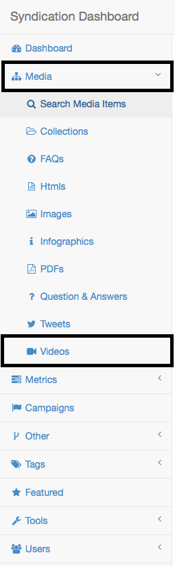

+ The Video List screen will appear.

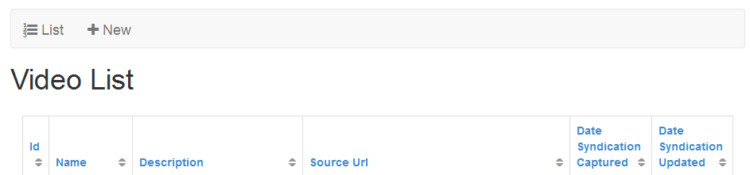

##### **Create**

+ From the Video List screen, click the New button.  The Create Video screen will appear.

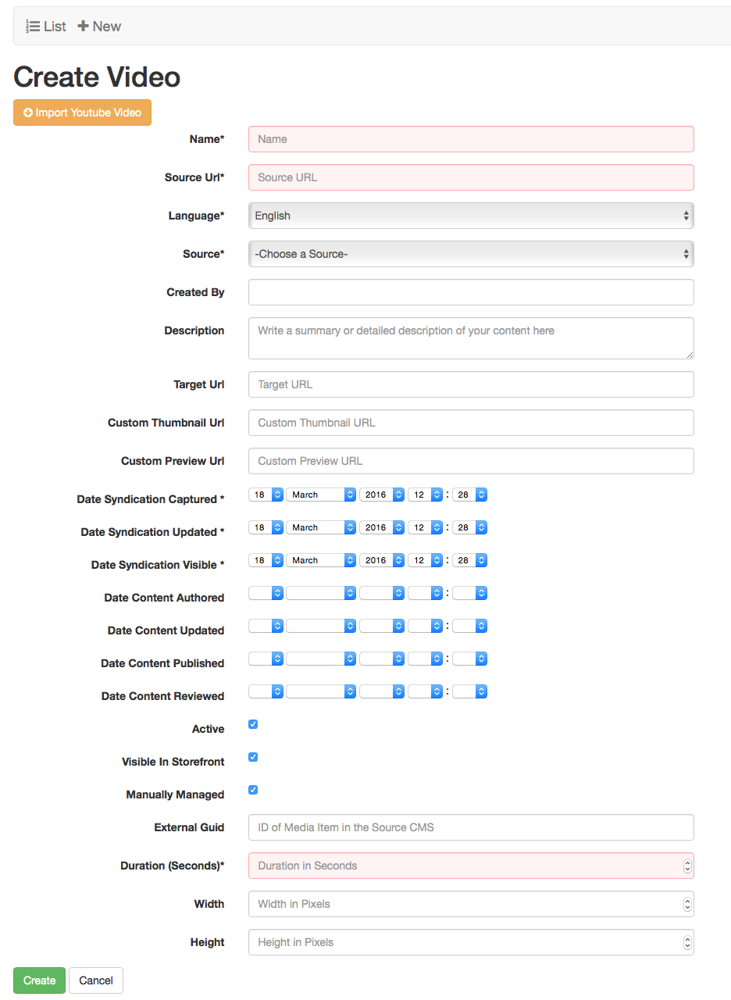

+ Enter the Name.  Note: there is a 255 character limit.

+ Optionally, enter the Description.  Note: there is a 2000 character limit.

+ Enter the Source URL.  Note: this should begin with http or https.

+ Optionally, enter the Target URL.  Note: this should begin with http or https.

+ Optionally, enter the Date Content Authored.

+ Optionally, enter the Date Content Updated.

+ Optionally, enter the Date Content Published.

+ Optionally, enter the Date Content Reviewed.

+ Enter the Date Syndication Captured.

+ Enter the Date Syndication Updated.

+ Enter the Date Syndication Visible.

+ Select the Language from the drop-down menu.

+ Confirm the Active checkbox is checked by default.

+ Confirm Manually Managed checkbox is checked by default.

+ Optionally, enter the External GUID.  Note: there is 255 character limit.

+ Optionally, enter the Hash.  Note: there is a 255 character limit.

+ Select the Source from the drop-down menu.

+ Enter the Duration in seconds.

+ Optionally, enter a Width.

+ Optionally, enter a Height.

+ Select Subscriber from drop-down menu.

+ Click the Create button.  The Show Video screen will appear with a confirmation message.  Note: only the fields completed will appear.

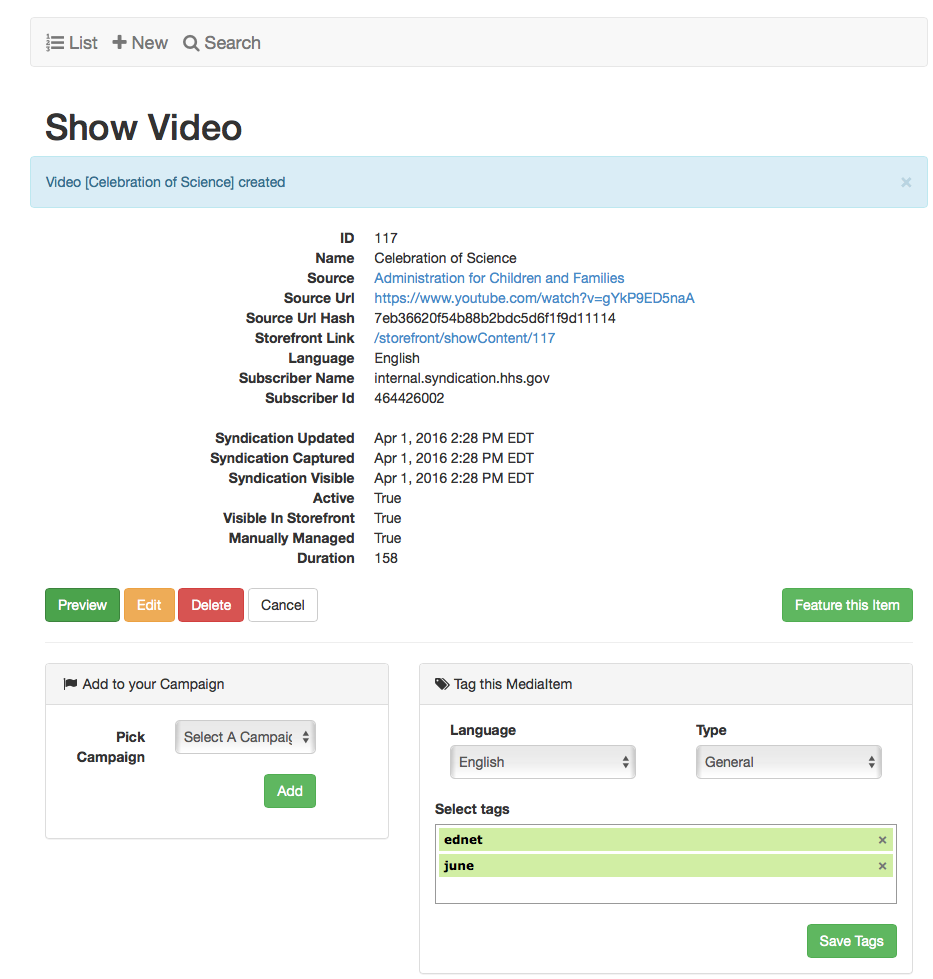

+ Optionally, click the Add Alternate Image link.  For detailed instructions go to Create an Alternate Image.

+ Optionally, select a Campaign, if available.

+ Optionally, select or add an Extended Attribute, if available.  For detailed instructions go to Create an Extended Attribute.

+ + Click the List button.  The Video List screen will appear.

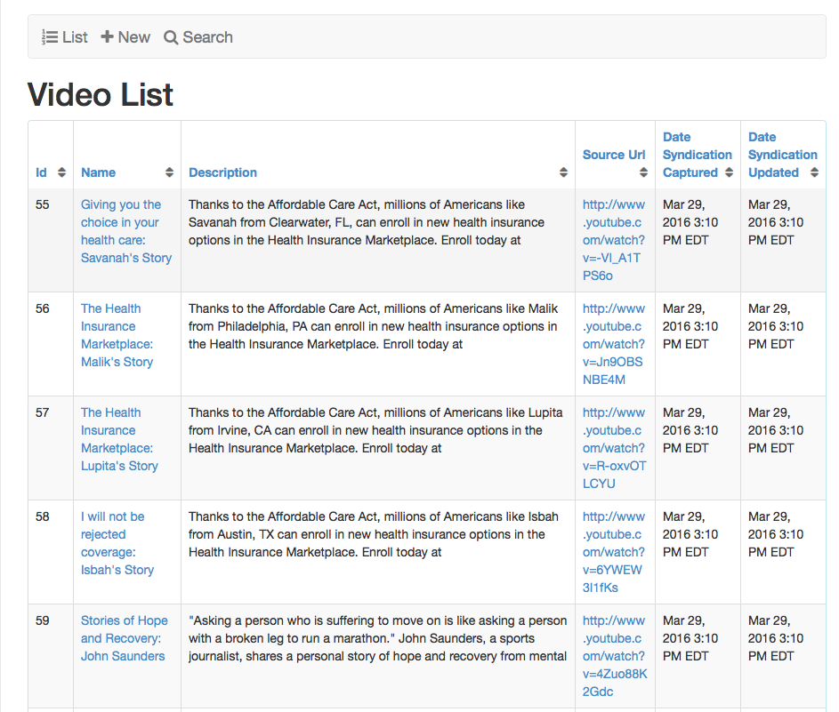

##### **Sort**

+ From the Video List screen, click the desired heading (ID, Name, Description, Source URL, Date Syndication Captured, Date Syndication Updated).

+ Click again.  The order will be changed (descending to ascending).

##### **Edit**

+ From the Video List screen, click the link desired Video ID link.  

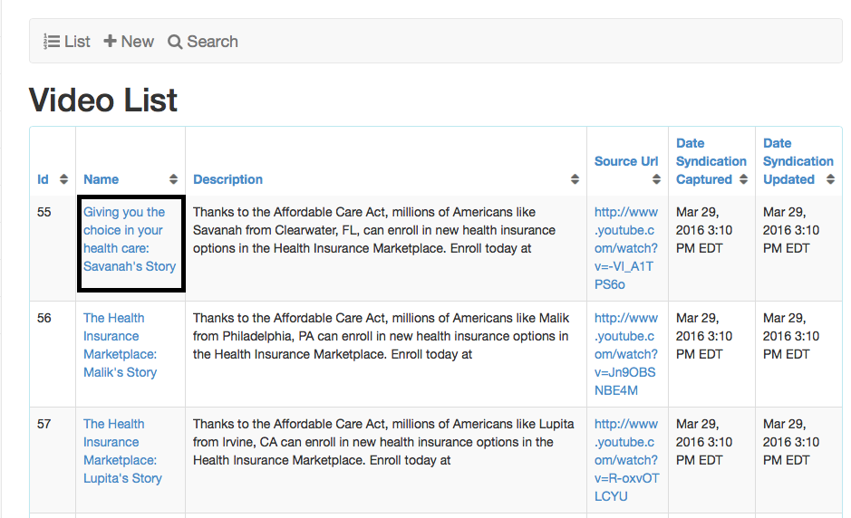

+ The Show Video screen will appear.

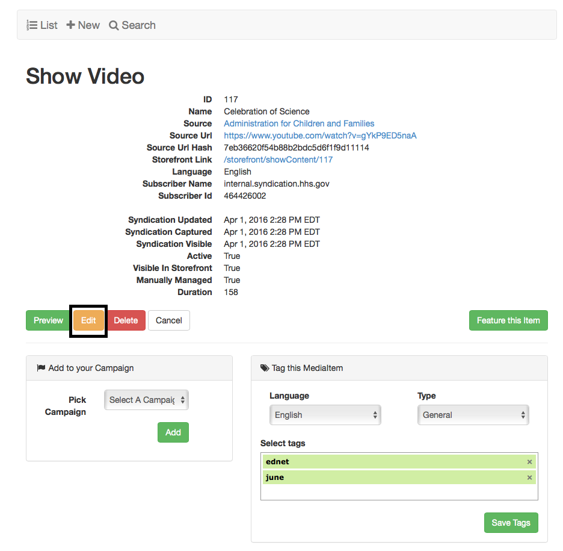

+ Click the Edit button.  The Edit Video screen will appear.
 
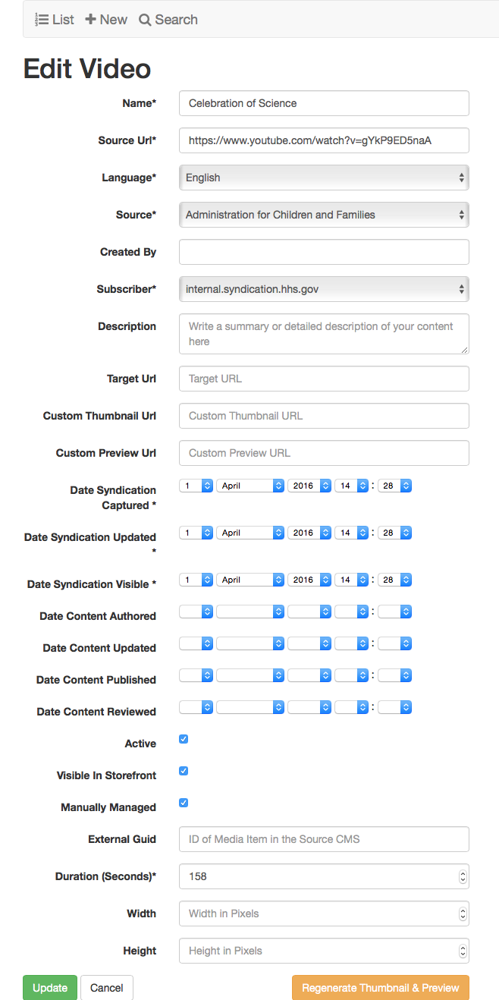

+ Modify the desired fields.

+ Either click the Cancel or Update button. The Show Video screen will appear.  If the Update button was selected then a confirmation message will appear as in the example below.

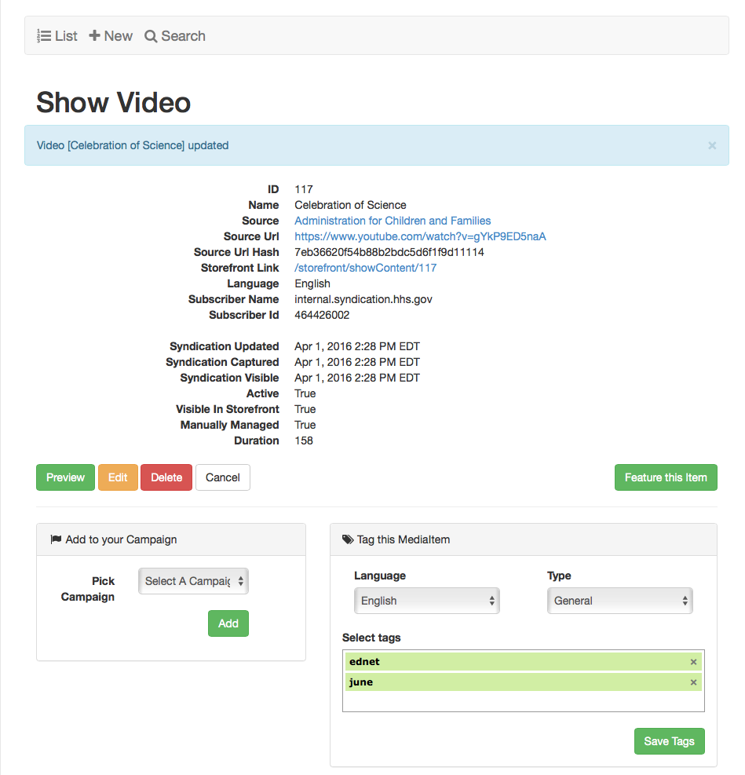

+ Click the List button.  The Video List screen will appear.

## Widget

##### **View**

+ From the Syndication Dashboard, click the Media menu and Widgets submenu.  

+ The Widget List screen will appear.

##### **Create**

+ From the Widget List screen, click the New button.  The Create Widget screen will appear.

+ Enter Name. Note: there is a 255 character limit.

+ Optionally, enter Description.  Note: there is a 2000 character limit.

+ Enter Source URL.  Note: this should begin with http or https.

+ Optionally, enter Target URL.  Note: this should begin with http or https.

+ Optionally, enter Date Content Authored.

+ Optionally, enter Date Content Updated.

+ Optionally, enter Date Content Published.

+ Optionally, enter Date Content Reviewed.

+ Enter Date Syndication Captured.

+ Enter Date Syndication Updated.

+ Enter Date Syndication Visible.

+ Select Language from the drop-down menu.

+ Confirm Active checkbox is checked by default.

+ Confirm Visible in Storefront checkbox is checked by default.

+ Confirm Manually Managed checkbox is checked by default.

+ Optionally, enter External GUID.  Note: there is a 255 character limit.

+ Optionally, enter Hash.  Note: there is a 255 character limit.

+ Select Source from the drop-down menu.

+ Enter Height.

+ Enter Width.

+ Enter Code.

+ Select Subscriber from drop-down menu.

+ Click Create button.  The Show Widget screen will appear with a confirmation message.  Note: only the fields completed will appear.

+ Optionally, click Add Alternate Image link.  For detailed instructions go to Create an Alternate Image.

+ Optionally, select a Campaign, if available.

+ Optionally, select or add an Extended Attribute, if available.  For detailed instructions go to Create an Extended Attribute.

+ Click the List button.  The Widget List screen will appear.

##### **Sort**

+ From Widget List screen, click desired heading (ID, Name, Description, Source URL, Date Syndication Captured, Date Syndication Updated).

+ Click again.  The order will be changed (descending to ascending).

##### **Edit**

+ From Widget List screen, click link desired Widget ID link.  The Show Widget screen will appear.

+ Click Edit button.  The Edit Widget screen will appear.
 

+ Modify desired fields.

+ Either click Cancel or Update button, Show Widget screen will appear.  If the Update button was selected then a confirmation message will appear as in the example below.

+ Click List button.  The Widget List screen will appear.

