#Other

## Alternate Images

#### View

+ From the Syndication Dashboard, click the Other menu and Alternate Images submenu.  
 
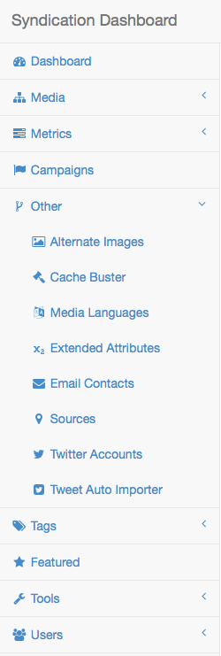

+ The Alternate Image List screen will appear.

#### Create

+ From the Alternate Image List screen, click the New button.  The Create Alternate Image screen will appear.

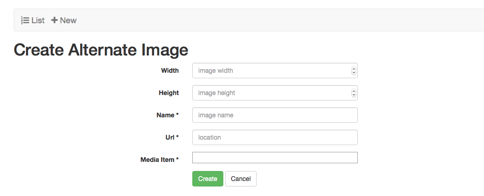

+ Optionally, enter the Width. 

+ Optionally, enter the Height.

+ Optionally, enter the Name.  Note: there is a 255 character limit. 

+ Enter the URL.  Note: this should begin with http or https.

+ Select the Media Item from the drop-down menu.

+ Click the Create button.  The Show Alternate Image screen will appear with a confirmation message.  Note: only the fields completed will appear.

 
+ Click the List button.  The Alternate Image List screen will appear.

#### Sort

+ From the Alternate Image List screen, click the desired heading (ID, Width, Height, Name, URL).

+ Click again.  The order will be changed (descending to ascending).

#### Edit

+ From the Alternate Images list screen, click the link desired Alternate Image ID link.  
 

+ The Show Alternate Image screen will appear.

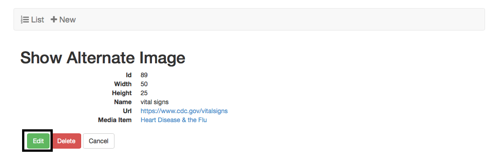

+ Click the Edit button.  The Edit Alternate Image screen will appear.

+ Modify the desired fields.

+ Either click the Cancel or click the Update button. The Show Alternate Image screen will appear.  If the Update button was selected then a confirmation message will appear on the screen as in the example below.

+ Click the List button.  The Alternate Image List screen will appear.

#### Delete
 
+ Click the desired Alternate Image ID link.  
 

+ The Show Alternate Image screen will appear.

+ Click the Delete button.  The Are You Sure pop-up window will appear.

+ Click the OK button.  The Alternate Image List screen will appear with a confirmation message.

## Campaigns

#### View

+ From the Syndication Dashboard, click the Other menu and Campaigns submenu.  

+ The Campaign List screen will appear.

 
#### Create

+ From the Campaign List screen, click the New button.  The Create Campaign screen will appear.
 
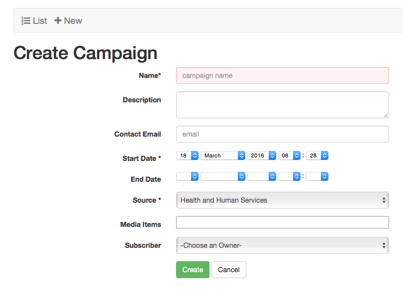

+ Enter the Name.

+ Optionally, enter the Description. 

+ Optionally, enter the Contact Email.

+ Select the Start Date and Time from the drop-down menus.

+ Optionally, select the End Date and Time from the drop-down menus.

+ Optionally, select the Source from the drop-down menu.

+ Optionally, select, if available, or add a campaign metric.  Refer to detailed instructions for 
Create a Campaign Metric.  

+ Optionally, select the Media Item(s).

+ Click the Create button.  The Show Campaign screen will appear with a confirmation message.  Note: only the fields completed will appear.
 

+ Click the List button.  The Campaign List screen will appear.

#### Sort

+ From the Campaign List screen, click the desired heading (ID, Name, Description, Contact Email, Start Date, End Date).

+ Click again.  The order will be changed (descending to ascending).

#### Edit

+ From the Campaign List screen, click the link desired Campaign ID link.  The Show Campaign screen will appear

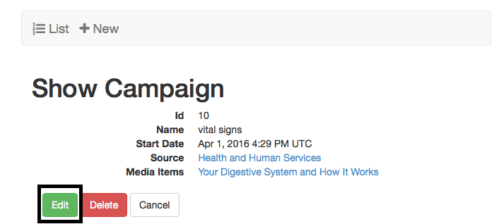

+ Click the Edit button.  The Edit Campaign screen will appear.

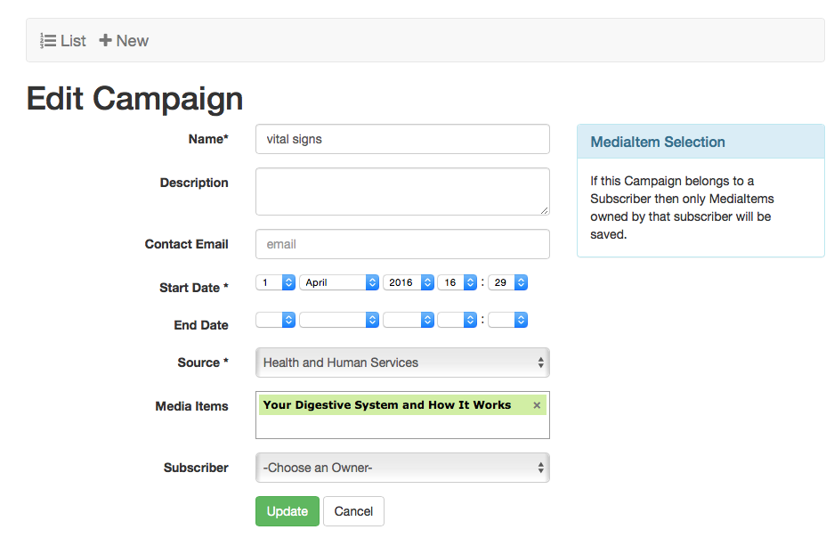

+ Modify the desired fields.

+ Either click the Cancel or click the Update button. The Show Campaign screen will appear.  If the Update button was selected then a confirmation message will appear on the screen as in the example below.

+ Click the List button.  The Campaign List screen will appear.

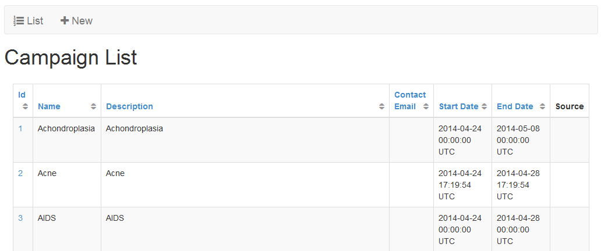

#### Delete

+ Click the desired Campaign ID link.  

+ The Show Campaign screen will appear.
 
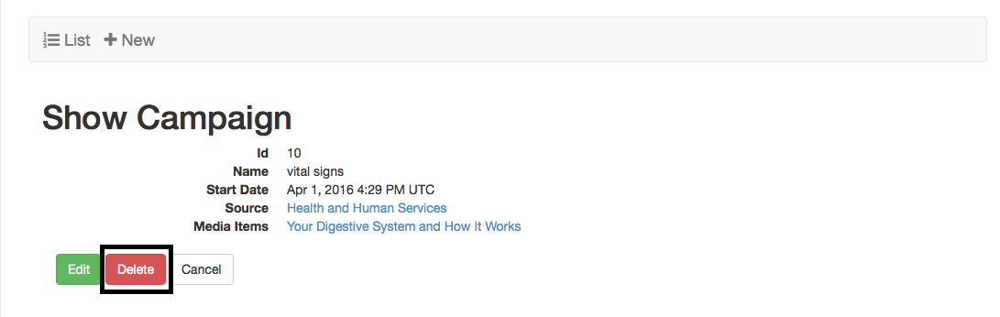

+ Click the Delete button.  The Are You Sure pop-up window will appear.

 

+ Click the OK button.  The Campaign List screen will appear with a confirmation message.
 

## Languages

#### View

+ From the Syndication Dashboard, click the Other menu and Languages submenu.  

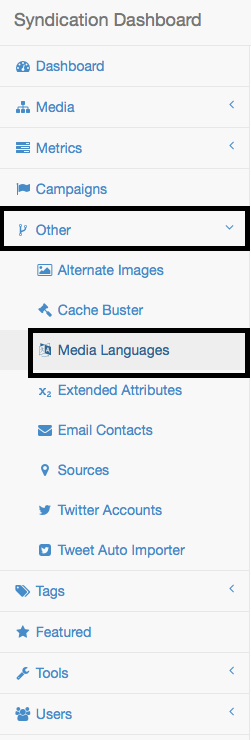

+ The Language List screen will appear.

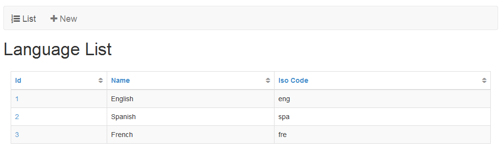

#### Create

+ From the Language List screen, click the New button.  The Create Language screen will appear.
 

+ Enter the Name.  Note: valid language names are based on the following standards: http://loc.gov/standards/iso639-2/php/code_list.php.

+ Enter the ISO Code.  Note: 3 digit ISO codes must be lower case and are based on the following standards: http://loc.gov/standards/iso639-2/php/code_list.php.  

 
+ Click the Create button.  The Show Language screen will appear with a confirmation message.  

+ Click the List button.  The Language List screen will appear.

#### Sort

+ From the Language List screen, click the desired heading (ID, Name, Iso Code) to sort. 

+ Click again.  The order will be changed (descending to ascending).

#### Edit

+ From the Language List screen, click the link desired Language ID link.  The Show Language screen will appear.

 
+ Click the Edit button.  The Edit Language screen will appear.
 

+ Modify the desired fields.

+ Either click the Cancel or click the Update button. If the Update button was then a confirmation message will appear on the screen.  If the Cancel Link was selected then the Show Language screen will appear as in the example below.

 
+ Click the List button.  The Language List screen will appear.

#### Delete

+ Click the desired Language ID link.  

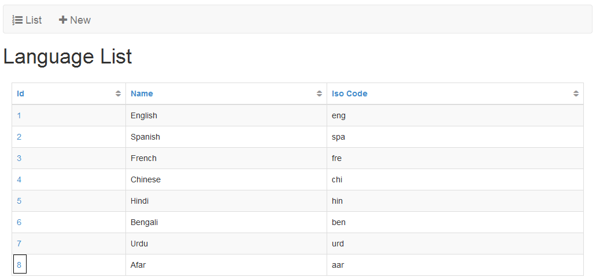
 
+ The Show Language screen will appear.
 

+ Click the Delete button.  The Are You Sure pop-up window will appear.

+ Click the OK button.  The Language List screen will appear with a confirmation message.

## Extended Attributes

#### View

+ From the Syndication Dashboard, click the Other menu and Extended Attributes submenu.  

+ The Extended Attribute List screen will appear.

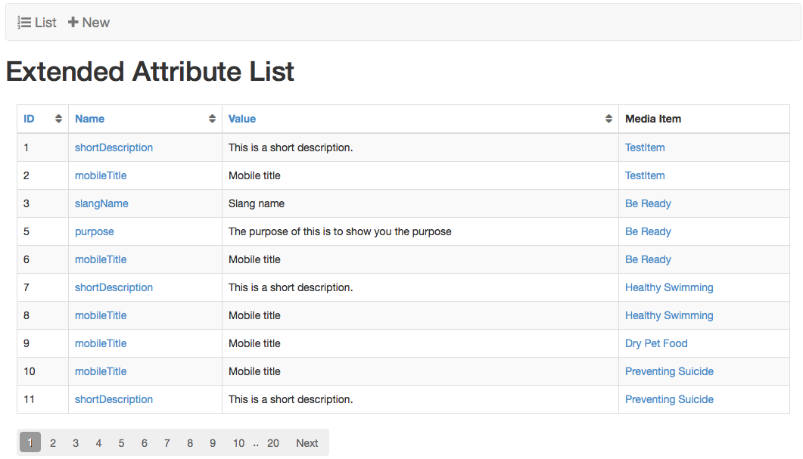

#### Create

+ From the Extended Attribute List screen, click the New button.  

The Create Extended Attribute screen will appear.

+ Enter the Name.  Note: there is a 255 character limit.  

+ Enter the Value.  Note: there is a 255 character limit.

+ Select the Media Item from the drop-down menu.

+ Click the Create button.  The Show Extended Attribute screen will appear with a confirmation message.  
 

+ Click the List button.  The Extended Attribute List screen will appear.

#### Sort

+ From the Extended Attribute List screen, click the desired heading (ID, Name, Value) to sort. 

+ Click again.  The order will be changed (descending to ascending).

#### Edit

+ From the Extended Attributes List screen, click the link desired Extended Attribute ID link.  

+ The Show Extended Attribute screen will appear.

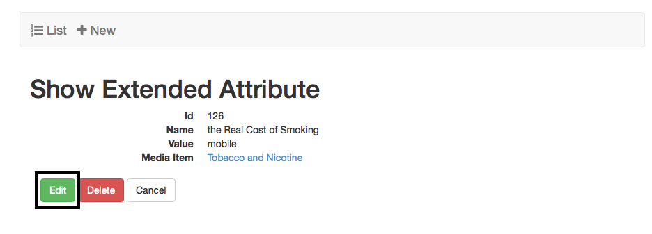

+ Click the Edit button.  The Edit Extended Attribute screen will appear.

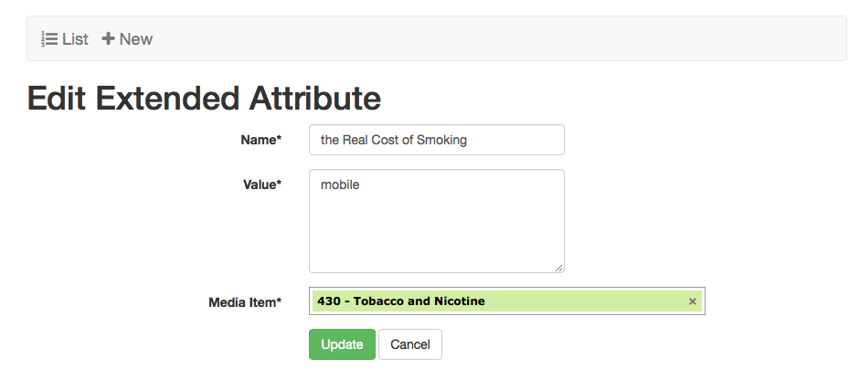

+ Modify the desired fields.

+ Either click the Cancel or click the Update button.  The Show Extended Attribute screen will appear.  If the Update Link was selected then a confirmation message will appear as in the example below.

+ Click the List button.  The Extended Attribute List screen will appear.

#### Delete

+ Click the desired Extended Attribute ID link.

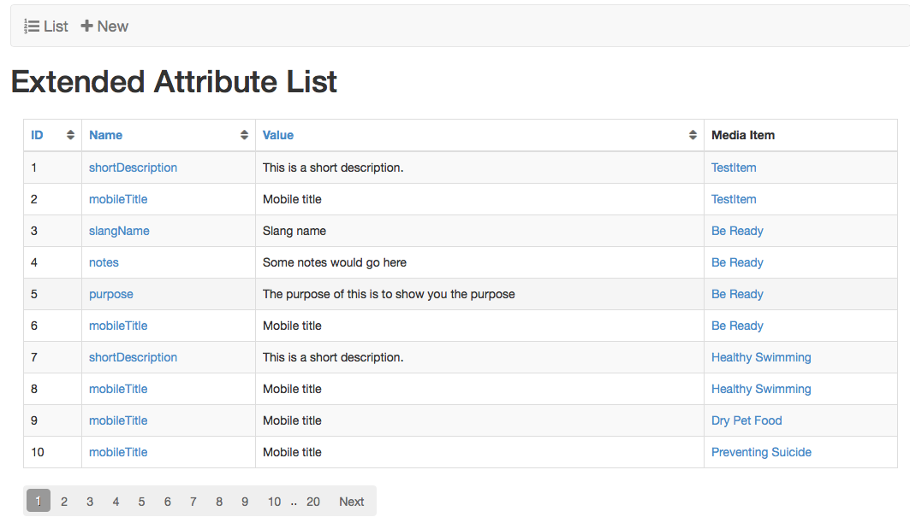

+ The Show Extended Attribute screen will appear.
 

+ Click the Delete button.  The Are You Sure pop-up window will appear.

+ Click the OK button.  The Extended Attribute List screen will appear with a confirmation message.
 

## Sources

#### View

+ From the Syndication Dashboard, click the Other menu and Sources submenu.  
 

+ The Source List screen will appear.

#### Create

+ From the Source List screen, click the New button.  

+ The Create Source screen will appear.

+ Enter the Name.  Note: there is a 255 character limit.

+ Enter the Acronym.  

+ Optionally, enter the Contact Email. 

+ Enter the Website URL.  Note: this should begin with http or https.

+ Optionally, enter the Large Logo URL.  Note: this should begin with http or https.

+ Optionally, enter the Small Logo URL.  Note: this should begin with http or https.

+ Optionally, enter the Description.  Note: there is a 2000 character limit.

+ Click the Create button.  The Show Source screen will appear with a confirmation message.  

+ Click the List button.  The Show Source screen will appear.

 
#### Sort

+ From the Source List screen, click the desired heading (ID, Name, Acronym, Description, Contact Email, Website URL, Large Logo URL, Small Logo URL) to sort. 

+ Click again.  The order will be changed (descending to ascending).

#### Edit

+ From the Source List screen, click the desired Source Name link.
 
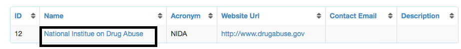

+ The Show Source screen will appear.
 

+ Click the Edit button.  The Edit Source screen will appear.
 
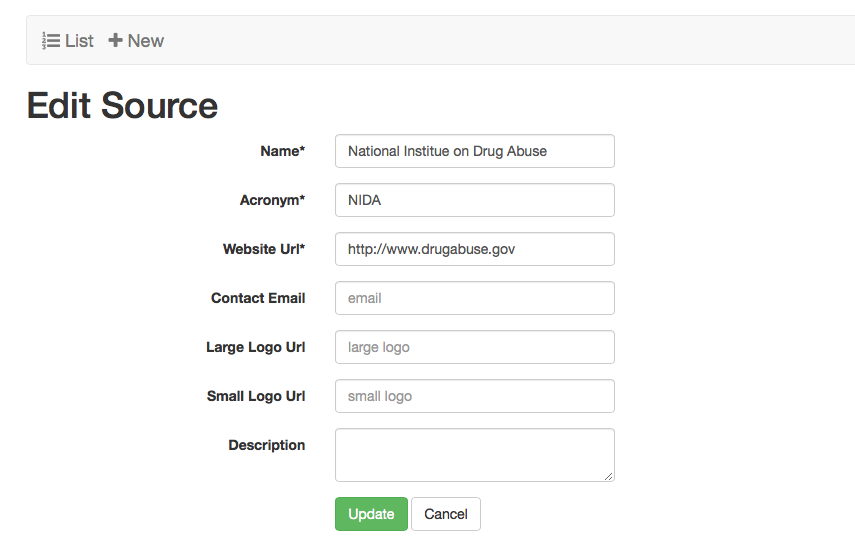

+ Modify the desired fields.

+ Either click the Cancel or click the Update button.  The Show Source screen will appear.  If the Update Link was selected then a confirmation message will appear as in the example below.
 
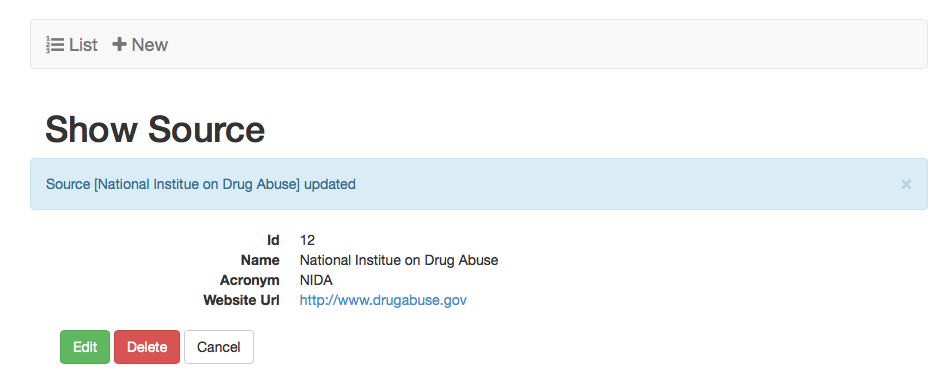

+ Click the List button.  The Source List screen will appear.

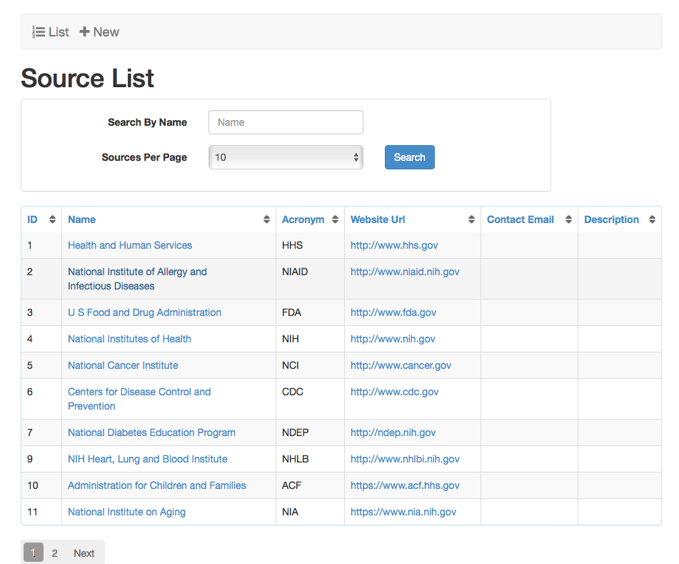
 
#### Delete

+ Click the desired Source Name link.

+ The Show Source screen will appear.

+ Click the Delete button.  The Are You Sure pop-up window will appear.

 
+ Click the OK button.  The Source List screen will appear with a confirmation message.

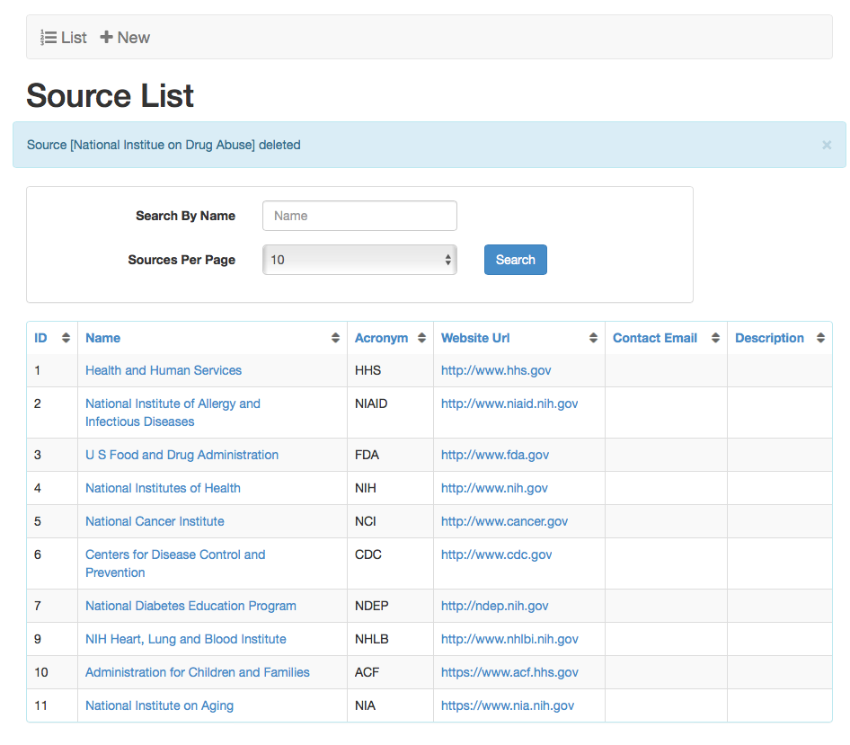

## Twitter Account

+ Twitter Accounts should be the exact name of the twitter account that created the twitter posts that you want to import.

#### View

+ From the Syndication Dashboard, click the Other menu and Twitter Accounts submenu.

+ The Twitter Account List screen will appear.

#### Create

+ From the Twitter Account List screen, click the New button.

+ The Create Twitter Account screen will appear.

+ Enter the Name.  Note: there is a 255 character limit.

+ Select a Subscriber from the drop-down menu only if you are an admin.

+ Click the Add button.  The Show Twitter Account screen will appear with a confirmation message.

+ Click the List button.  The Show Twitter Account screen will appear.

#### Sort

+ From the Twitter Account List screen, click the desired heading (ID, Account Name) to sort.

+ Click again.  The order will be changed (descending to ascending).

#### Edit

+ From the Twitter Account List screen, click the link desired Source Name link.

+ The Show Twitter Account screen will appear.

+ Click the Edit button.  The Edit Twitter Account screen will appear.

+ Modify the desired fields.

+ Either click the Cancel or click the Update button.  The Show Twitter Account screen will appear.  If the Update Link was selected then a confirmation message will appear as in the example below.

+ Click the List button.  The Twitter Account List screen will appear.

#### Delete

+ Click the desired TwitterAccount Name link.

+ The Show Twitter Account screen will appear.

+ Click the Delete button.  The Are You Sure pop-up window will appear.

+ Click the OK button.  The Twitter Account List screen will appear with a confirmation message.

## Tweet Auto Importer

#### View

+ From the Syndication Dashboard, click the Other menu and Tweet Auto Importer submenu.

+ The Tweet Auto Importer List screen will appear.

#### Create

+ From the Tweet Auto Importer List screen, click the New button.

+ The Create Tweet Auto Importer screen will appear.

+ Enter Hashtag(s) to have the importer import all tweets form the selected twitter account that contain the hashtag(s) used.

+ Select a start and end date for when the importer will start and stop importing new tweets.

+ Select the Twitter Account that created the posts you want imported.

+ Select a source to give the tweet media items that will be generated from the imports.

+ Click the Create button.  The Show Twitter Auto Importer screen will appear with a link to the collection that will contain all of the tweets imported.

+ Click the List button.  The list Tweet Auto Importer screen will appear.

#### Sort

+ From the Tweet Auto Importer List screen, click the desired heading (ID, Hash Tags) to sort.

+ Click again.  The order will be changed (descending to ascending).

#### View Imports

+ From the Tweet Auto Importer List screen, click the desired Twitter Auto Importer Hash Tags link.

+ The Show Tweet Auto Importer screen will appear.

+ Click on the Collection Status name to view the Mediaitem collection that contains all of the imported tweets.

+ You will be brought to the collection MediaItem's show page.

#### Delete

+ Click the desired Tweet Auto Importer Name link.

+ The Show Tweet Auto Importer screen will appear.

+ Click the Delete button.  The Are You Sure pop-up window will appear.

+ Click the OK button.  The Tweet Auto Importer List screen will appear with a confirmation message.

## Featured Media

#### View

+ From the Syndication Dashboard, click the Featured menu.

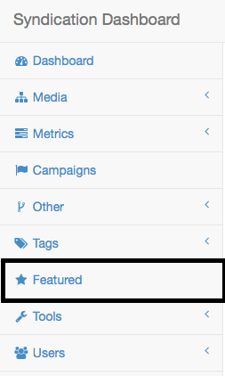

+ The Featured Media List screen will appear.

#### Add Media Items

+ From the Featured Media List screen, enter desired media item title or partial title. Select from the drop-down.  Note: If the media item is not active it should not appear. 

 
+ Click the Save Featured Items button.

#### Delete Media Items

+ From the Featured Media List screen, click the x next the media item(s) to be removed from the list. 

+ Click the Save Featured Items button.
