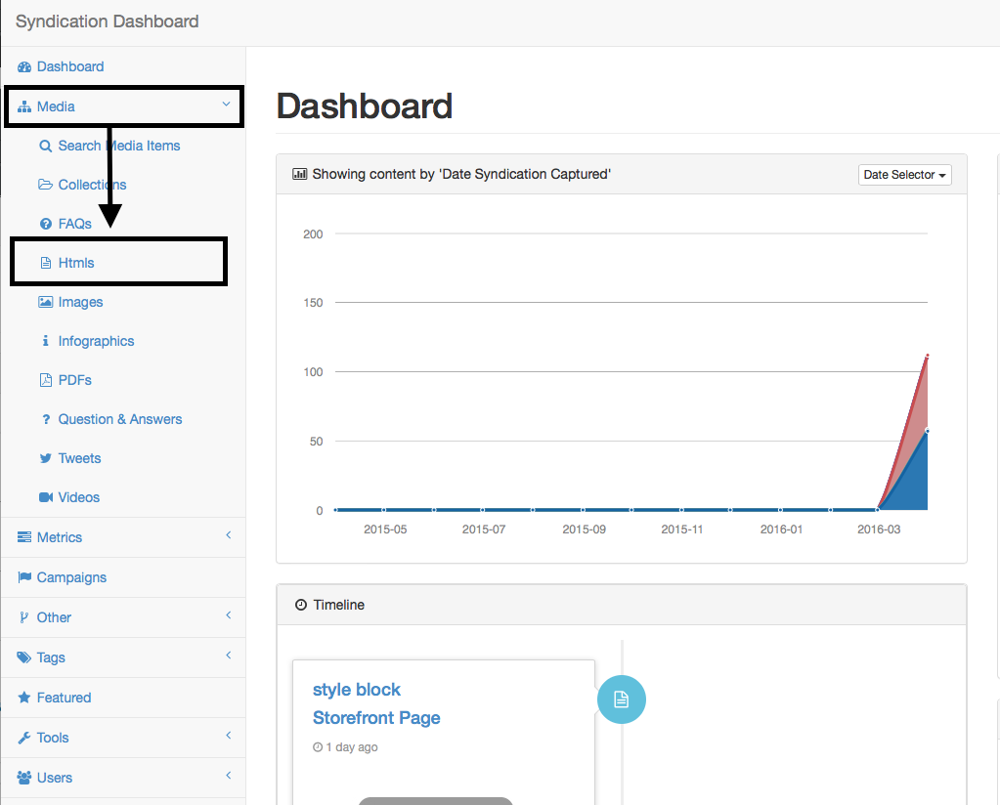
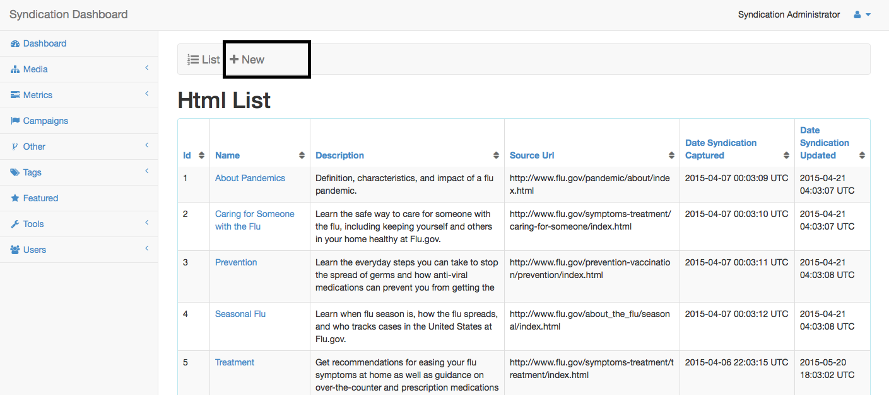
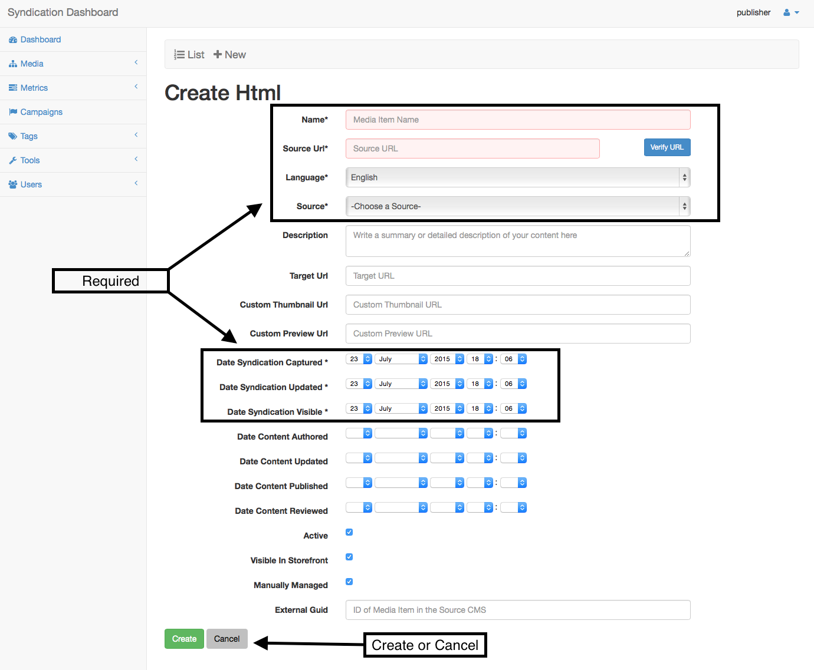
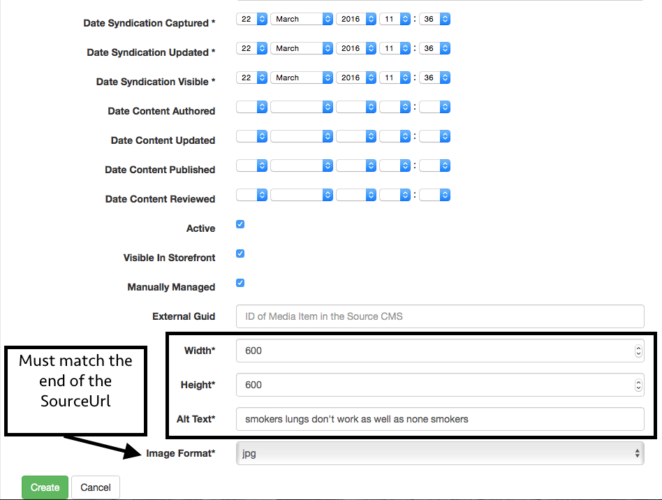
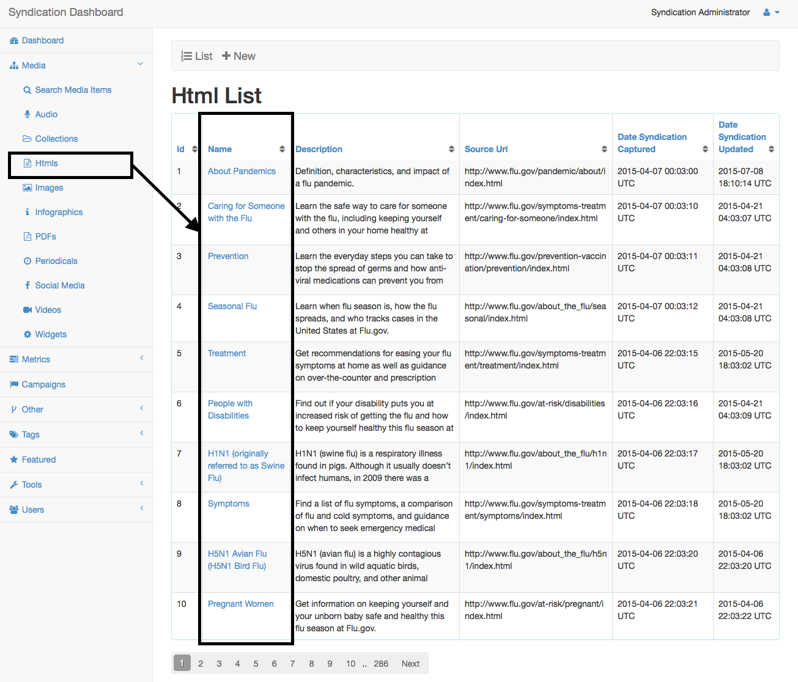
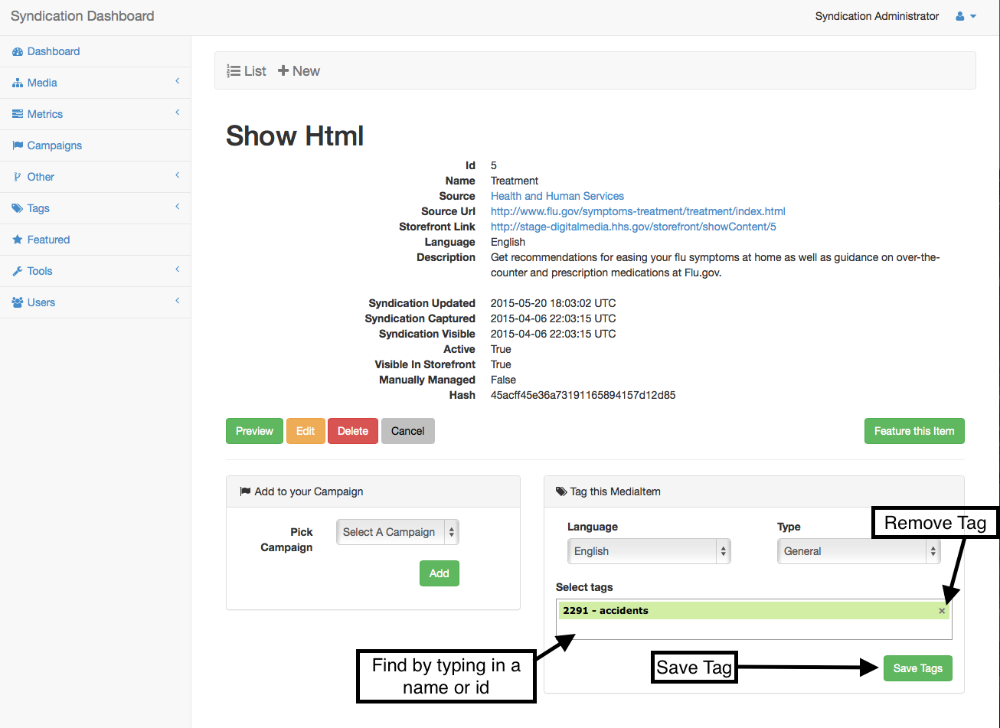
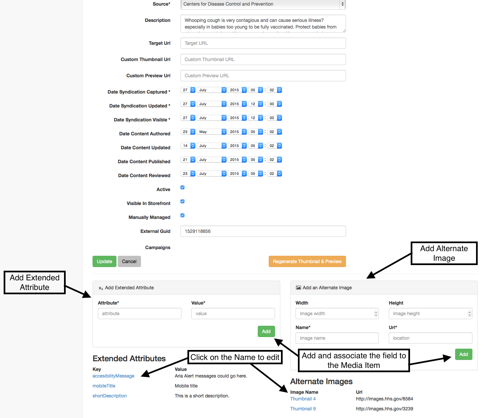
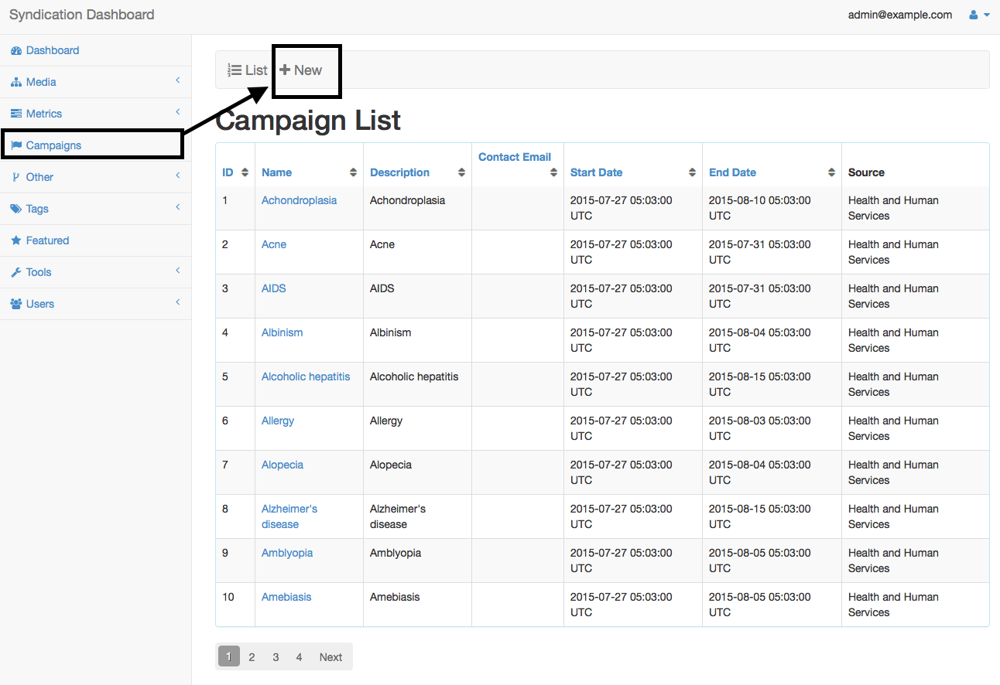

# Publisher Manual Item Creation

##Create a Html Item

#####Navigate to a new Html

+ Click on Htmls in the side nav-bar under Media

+ Click create in the upper nav bar

#####Fill out the following required fields

1.  ** Name - What you want the name to be
2.  ** Source url - This is the Url that gets scraped and turned into the 'syndicated content'
3.  ** Language - select the language of the group that will be viewing this item
4.  ** Source - Select the closest owner of the website.
5.  Description - The message you want to convey with your site.
6.  Target Url - The real page you want to send a user otherwise source url is used.
7.  Custom Thumbnail Url - Link to an image you want displayed for the site thumbnail. By default a cropped version of 
the sourceUrl/syndicated content will be used.
8.  Custom Preview Url - Link for the content you want displayed for the items preview. By default the syndicated content
will be used.
9.  Dates - These fields are updated automatically and should be left alone.
10. Active - This deteremines whether an item is visible to the public.
11. Visible In Storefront - Determines whether an item is visible in the storefront.
12. Manually Managed - Leave this checked unless you want to manually update all content for the item yourself. (Not Recommended to un-check)

13. Then save the item by clicking the Create button and you will be brought to the items show page

#####Image/Infographic
+ if making an image or infographic the Source Url will need to be a permanent accessible url for the image. And the end 
of the url must match the image format. 
+ The extra fields width, height and alt text are also required in addition to the
Html required fields.

##Tagging your Items
+ Tags are used in order to help associate a media item with other items that have a similar message.

+ Find your item again by searching for it in the Html index view and click on your items name

##### Then you may tag a mediaItem with the panel in the bottom right of the mediaItems show page.

+ You may tag the item with a current tag by typing in the tags name or Id
+ You may also create a new tag by typing in 
a tag name that doesn't exist yet
+ You can remove items by clicking the x on the right side of the tag's row and 
then hit the Save Tags button to save your changes

## Extended Attribute/ Alternate Image
+ Extended Attributes and Alternate Images are additional fields that help to bring more meaning to a Media Item.

+ To add these fields go to the bottom of your Items edit page where you will be able to view current ones or add new ones.
+ To Create the field and associate with the current Media Item click the add button in its panel. 
    You do not need to click update for the items to be saved.
+ To delete or edit one of the existing extended Attributes or Alt Images just click on the items Name name to be brought to 
    its show page.

## Campaigns

+ You may quickly add your MediaItem to a campaign by going the mediaItems show page and picking a campaign in the panel
 from the bottom of the page.

+ You may also create a new Campaign by clicking on Campaigns in the left Tab, then click the New nav button.

