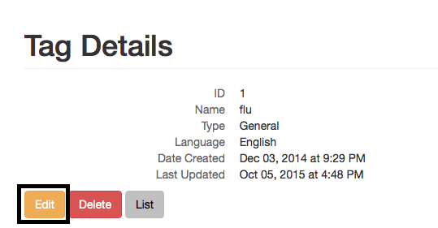
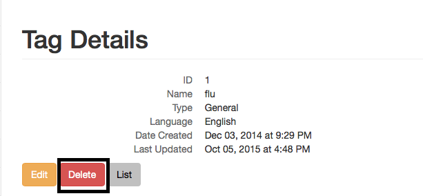
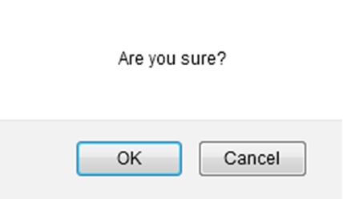
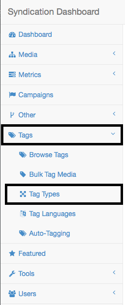
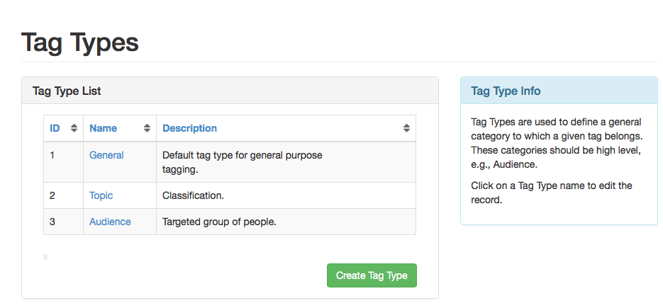
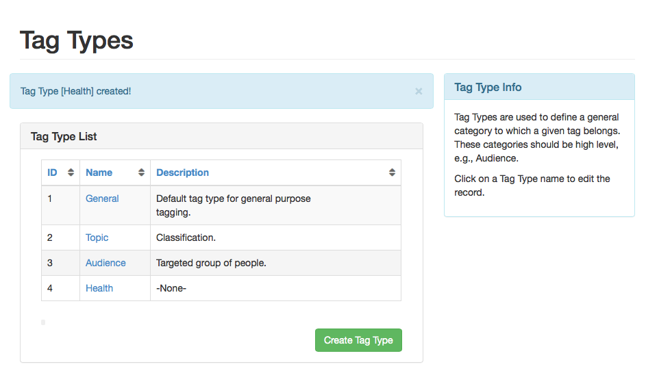
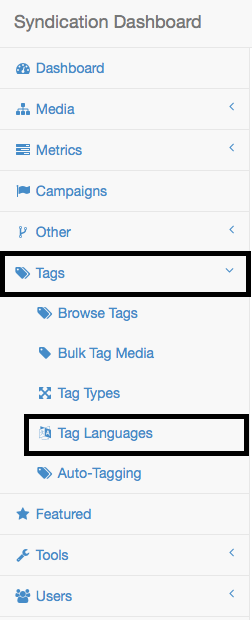

# Tags

## Browse Tags

#### View Tag List

+ From Syndication Dashboard, click Tags menu and Browse Tags submenu.
 

+ The Browse Tags screen will appear.

#### Create A Tag

+ From the Browse Tags screen, begin tying the name of a tag and matching tags will be listed.  If there are no matching tags then click Create button.

+ The Create Tags screen will appear.

+ Select a Language from drop-down menu. 

+ Select Tag Type from drop-down menu. 

+ Enter name of the Tag.  Note: There is a 255 character limit.

+ Click Save button, Browse Tags screen will appear with a confirmation message.

#### Sort Tag List

+ From Browse Tags screen, click on desired sortable heading (ID, Name, Type, Language) to sort.

+ Click the sortable heading again.  The order will be changed (descending to ascending).

#### Edit A Tag

+ From Browse Tags screen, click on desired Tag Name link.

+ Tag Details screen will appear.

+ Click Edit button.  Edit Tag screen will appear.

 

+ Modify desired fields.

+ Click Cancel or Save button.  Browse Tags screen will appear.  If the Save button was selected then a confirmation message will appear as in the example below.

#### Delete A Tag

+ From Browse Tag screen, click desired Tag Name link.

 
+ Tag Details screen will appear.

+ Click Delete button.  Pop-up window will appear with a message: Are You Sure?

+ Click OK button.  Browse Tags screen will appear with a confirmation message.

## Bulk Tag Media

+ From Syndication Dashboard, click Tags menu and Bulk Tag Media submenu.  

+ Tag Media screen will appear.

+ Enter desired media items.

+ Enter desired tags.

+ Click Tag Items button.

## Tag Types

#### View Tag Types List

+ From the Syndication Dashboard, click the Tags menu and Tag Types submenu.  

+ The Tag Types screen will appear.

 
#### Create A Tag Type

+ From Tag Type List screen, click Create Tag Type button.  Create Tag Type screen will appear.

+ Enter Name.

+ Enter Description.

+ Click Save button. Tag Type List screen will appear with a confirmation message.

#### Sort Tag Type List

+ From Tag Type List screen, click desired sortable heading (ID, Name, Description) to sort. 

+ Click sortable heading again.  Order will change (descending to ascending).

#### Edit A Tag Type

+ From Tag Types List screen, click link desired Tag Type Name link. 
 

+ The Edit Tag Type screen will appear.

 
+ Modify the desired fields.

+ Either click the Update or Cancel button.  The Are you Sure? pop-up window will appear.

+ Click the OK button.  The Tag Types screen will appear.  If the Update button was selected then a confirmation message will appear.

#### Delete A Tag Type

+ From Tag Types List screen, click on desired Tag Type Name link.

+ Edit Tag Type screen will appear.

+ Click Delete button.  Are You Sure? pop-up window will appear.

+ Click OK button.  Tag Type List screen will appear with a confirmation message.

## Tag Languages

#### View Tag Languages List

+ From Syndication Dashboard, click Tags menu and Tag Languages submenu.  

+ Tag Languages screen will appear with Name, ISO Code & Active status

+ Click on x for any language to activate,it will bring confirmation message then click OK button; that language will be activated.

+ Click on green check mark icon on any any activated lanuage, it will bring confirmation message if you want to deactivate that language. Click OK, it will deactivate that language & confirmation message will be displayed.

Note: English & Spanish language are always activated by default.

## Auto-Tagging

+ From Syndication Dashboard, click Tags menu and Auto-Tagging submenu.

+ Auto Taging page will appear

+ Click on Tag button next to a media item, it will tag that media item and bring confirmation message on screen.

+ Select/Change Language from drop down list and click Apply, it will display media items based on language selection.

+ At the bottom of the page click on Load next 50, it will load next 50 items
+ At the bottom of the page click on Start From Beginning, it will bring media items from beginning.
+ At the top of the page click Tag All, it will display confirmation messge: Are you sure? Will apply all suggested tags on this page, and may take several seconds to complete.
+ Click Ok and it will bring message on tagging all media item: xx media items were tagged with 166 tags

