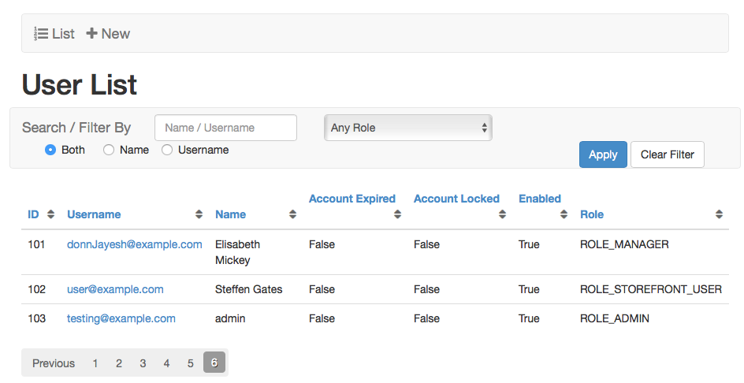
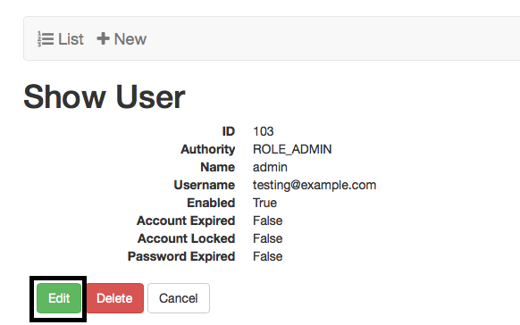
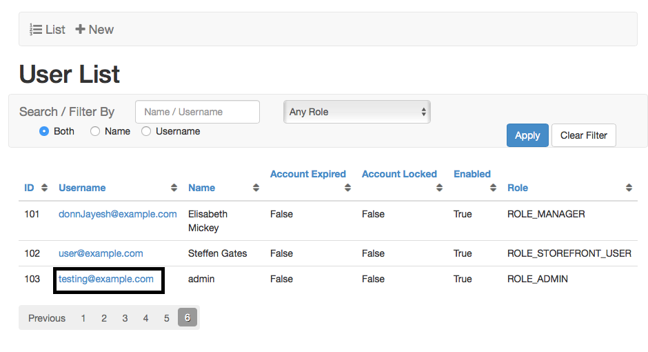
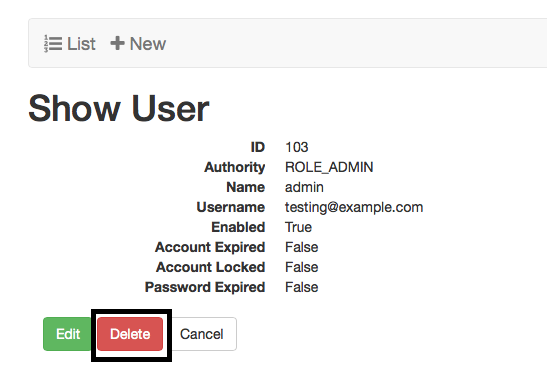
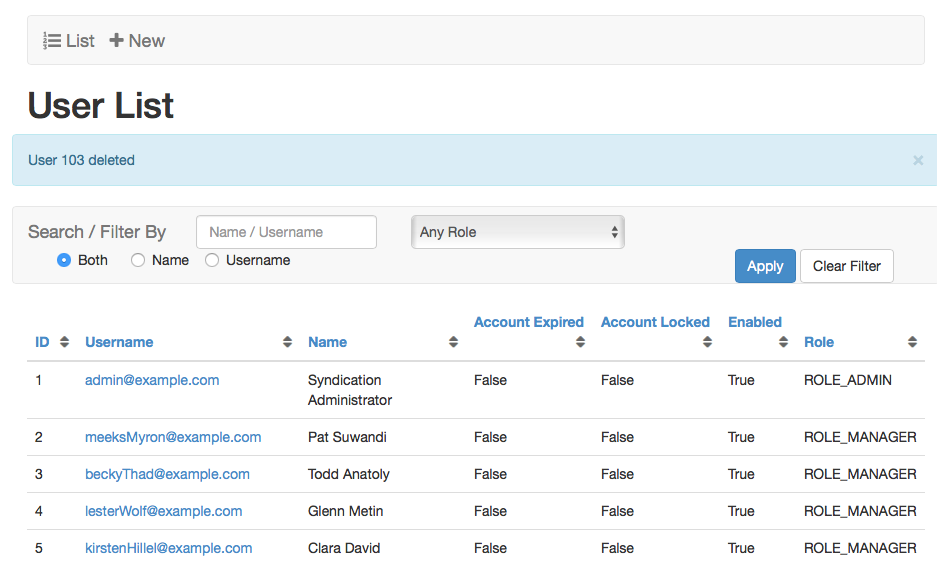
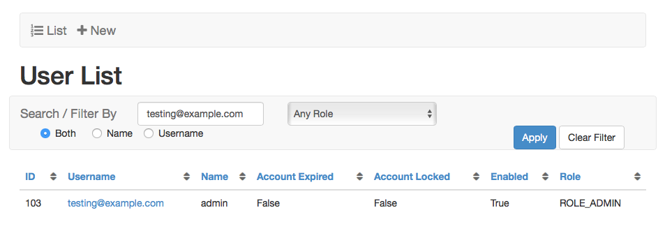

# Users

## List Users

+ From Syndication Dashboard, click Users menu and List Users submenu.  
 

+ User List screen will appear.

##### Create User

+ From Syndication Dashboard, click Users menu Create User submenu.  

+ Create User screen will appear.

 
+ Select Authority from drop-down menu.  Refer to Appendix B, User Permissions by Role.  

+ Optionally, enter Name.

+ Enter Email

+ Enter Password.

+ Re-enter Password.

+ Select Subscriber [only applies to ROLE_PUBLISHER authority].

+ Enabled checkbox will be checked.

+ Click Create button.  Show User screen should appear with a confirmation message.

 
+ Click List or Cancel button.  User List screen will appear.

##### Edit User

+ From User List screen, click desired username link.

 
+ Show User screen will appear.

 
+ Click Edit button. Edit User screen will appear.

 
+ Modify desired fields.   

+ Either click Update or cancel button.

##### Sort User List

+ From User List screen, click desired sortable heading (ID, Username, Name, Account Expired, Account Locked, Enabled) to sort. 

+ Click again, order will be changed (descending to ascending).

##### Delete User

+ From User List screen, click desired Username link.
 

+ Show User screen will appear.	
 

+ Click Delete button. Pop-up window will appear asking: Are You Sure?.
 

+ Click OK button.  User List screen will appear with deleted confirmation message.

###
[TOC]

## Search User

+ At User List page, enter Name/Username.

+ Click on Name or Username radio button.

+ Click Apply, it will bring search result.

+ Click on Clear Filter, search query will go away & full list will appear.

## User Breakdown

+ From Syndication Dashboard, click Users menu and User Breakdown

+ User Breakdown page will open with two table & pie chart.

## My Account

+ From Syndication Dashboard, click Users menu and My Account submenu.

+ My Account page will open

+ Edit fields where required and hit Update button, it will bring confirmation message & redirect to Dashboard page.

