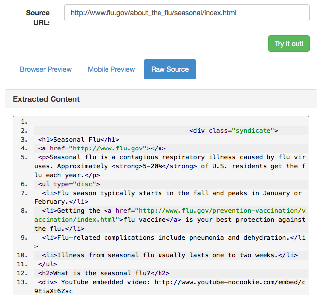

# Tools

## Health Reports

+ Click Tools menu and Health Reports submenu. 

+ Health Reports page will appear.

+ Click on Check All Media, it will display confirmation message: Are you sure? This can take several hours to run.
+ OK, it will display confirmation message: Health report re-scan has started, it may take several hours to complete.

+ Once its done checking,it will bring flagged media items:

+ Click on check mark button for one one of the media items under Ignore column; that media item will be moved to Ignored Media tab.
+ Click on Ignored Media tab, media item will be displayed.

+ Click on Flagged Media tab, all flagged media items will be listed
+ Click on question (?) mark button for one one of the media items under Validate column; that media item will be scanned again & confirmation message will be displayed.

** **

## Media Indexes

#### Reindex All

+ From Syndication Dashboard, click the Tools menu and Content Indexes submenu.  

 

+ Content Indexing screen will appear.

 

+ Click desired corresponding button under the Reindex All heading.

#### Reindex Media

+ From Content Indexing Reindex Media screen, enter name of the media item or media id(s).

+ Click corresponding button (Reindex Media by Name or Reindex Media by ID).

#### Reindex Sources

+ From Content Indexing Reindex Media screen, click Sources tab, Reindex Source screen will appear.
 

+ Enter name of the source or source id(s).

+ Click corresponding button (Reindex Source by Name or Reindex Source by ID).

#### Reindex Campaigns

+ From Content Indexing Reindex Media screen, click Campaigns tab.  Reindex Campaign screen will appear.

+ Enter name of the campaign or campaign id(s).

+ Click corresponding button (Reindex Campaign by Name or Reindex Campaign by ID).

#### Reindex Tags

+ From Content Indexing Reindex Media screen, click Tags tab.  Reindex Tags screen will appear.

 
+ Enter name of the tag or tag id(s).

+ Select desired Language from drop-down menu.

+ Select desired Tag Type from drop-down menu.

+ Click corresponding button (Reindex Tag by Name or Reindex Tag by ID).
** **

## Logs

+ Click on Tools menu & Logs submenu.

+ System Log Viewer page will open with Admin Dashboard tab open.

+ Click on API tab, it will bring API logs on screen.

+ Click on CMS Manager tab, it will bring CMS Manager logs on screen.

+ Click on Storefront tab, it will bring Storefront logs on screen.

+ Click on Tiny Url tab, it will bring Tiny Url logs on screen.

+ Click on Tag Cloud tab, it will bring Tag Cloud logs on screen.

+ All logs have errors & Details tab.
+ All logs have Constrained & Unconstrained view.

** **

## Media Preview & Test

+ Click on Tools & Media Preview & Test

+ It will open Syndicated Media Preview & Extraction Testing page

+ Enter a valid source url at Source URL text box & click Try it out! button.
+ It will bring result in Browser Preview tab:

+ Click at Mobile Preview tab, it will display previews in different mobile phoen resolution.

+ Click at Raw Source tab, it will display Extracted Content.

** **

