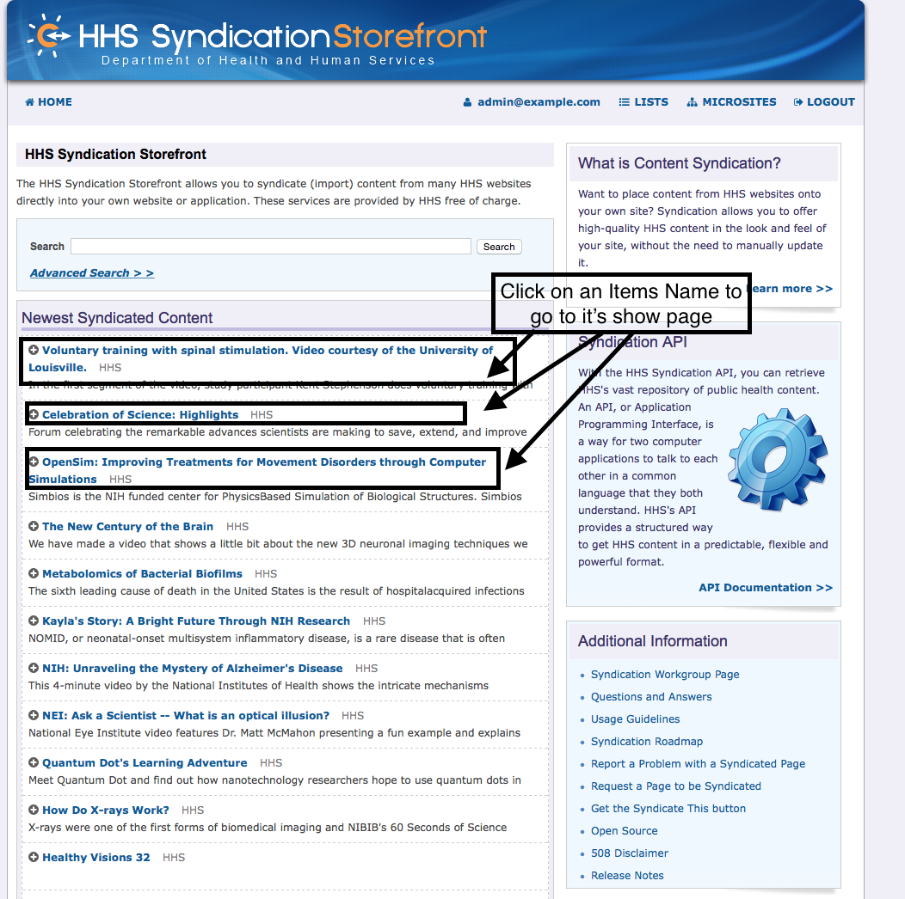
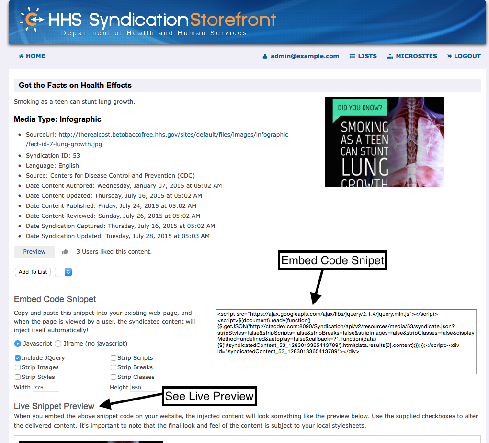
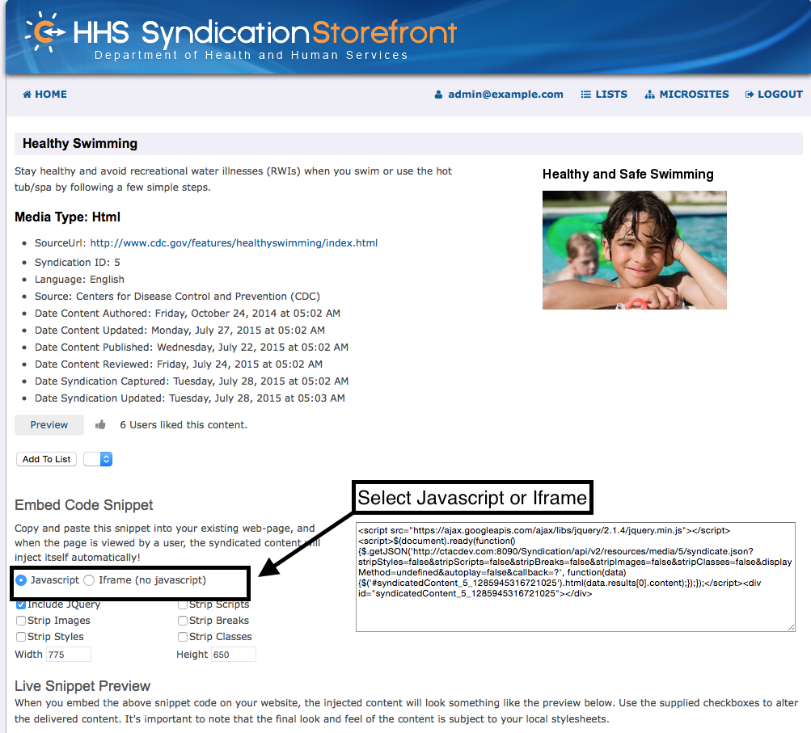
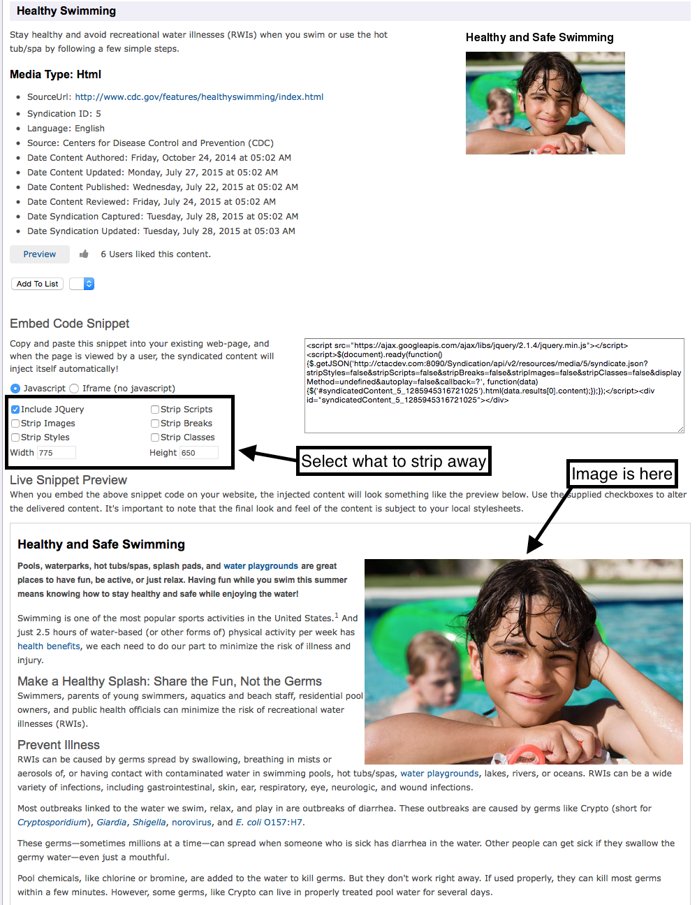
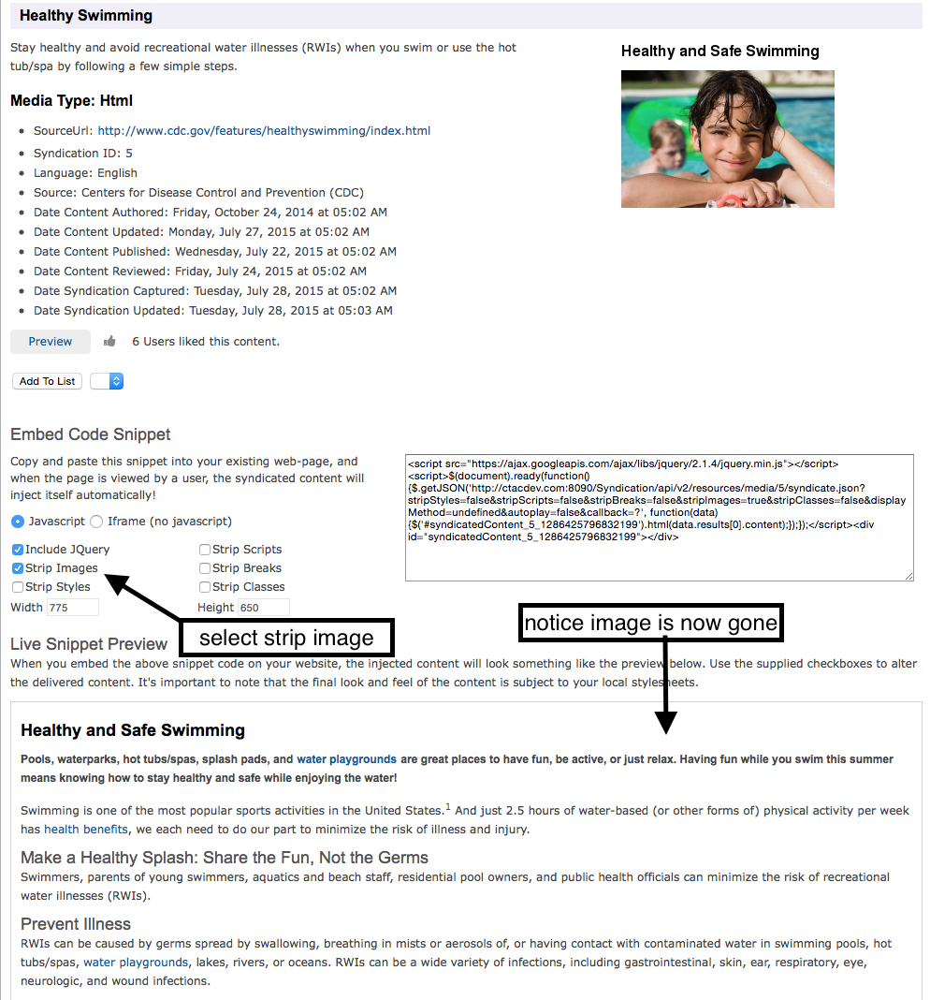
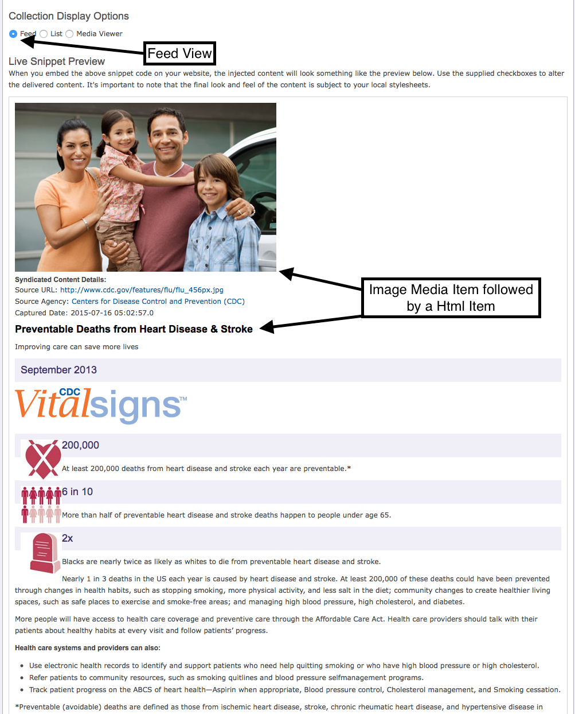
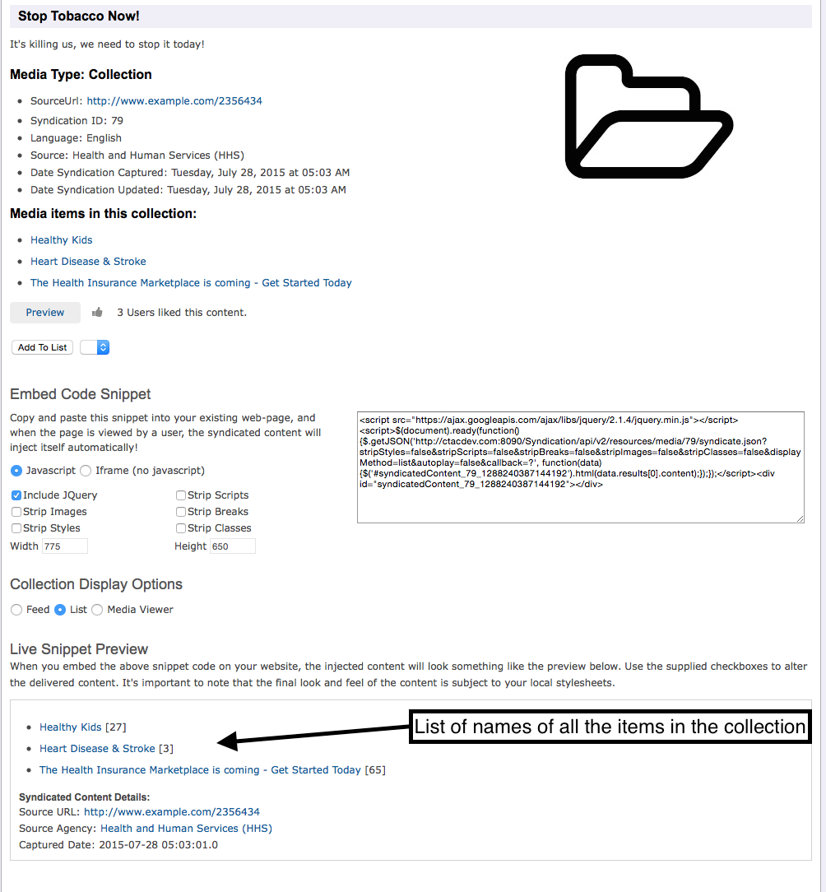
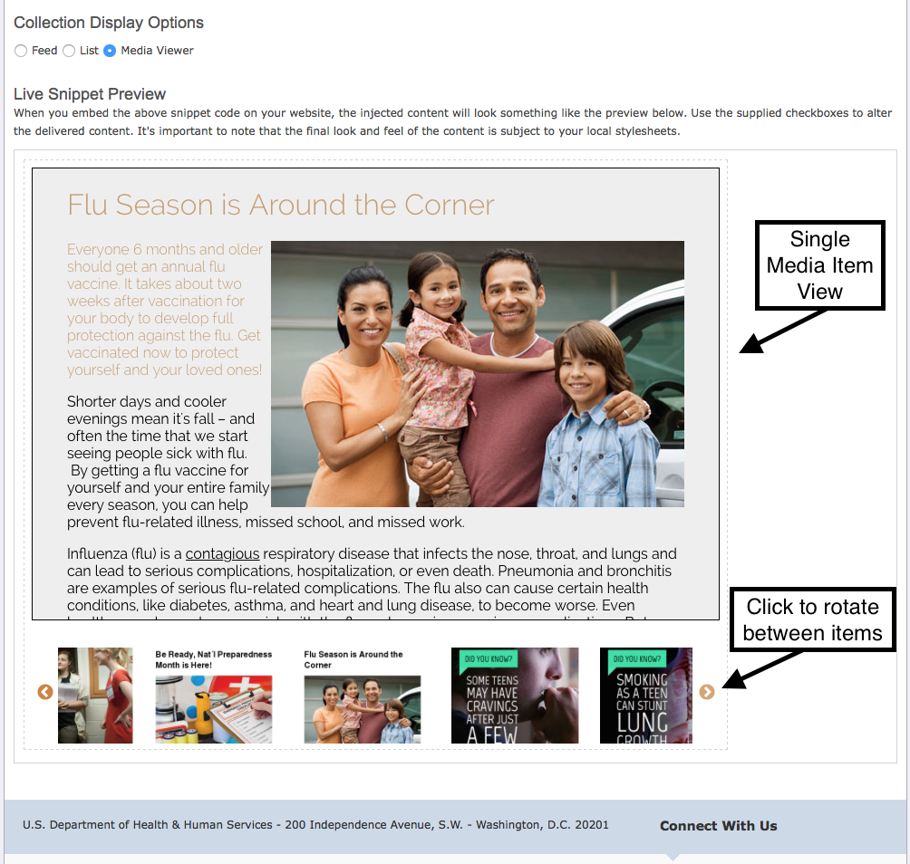

# How to Use Syndicated Content

## What is Syndicated Content

+ Content syndication allows you to place content from HHS websites onto your own site.
+ It allows you to offer high-quality HHS content in the look and feel of your site.
+ The syndicated content is automatically updated in real time, requiring no effort from your staff to keep the pages 
    up to date.
    
## Search for Your Content
+ To find suitable content for your needs follow this [Search](UserGuide.html#search) guide.
+ Once you have found your content click on the Items name to go to its show page.

+ From here you can preview how the content will look and get the Embed Code Snippet to put the content on your site.
+ If you do not see the Embed Code Snippet then you must first [Login](UserGuide.html#login).

## Live preview Snippet
+ This live preview snippet can be customized to fit your needs and the embed code snippet will be automatically updated
to recognize your changes. 
+ The first option allows you to pick the embed code style to either be Javascript or an Iframe. If you think 
 users may have javascript disabled then you may want to go with the Iframe. 
 
 
 
+ The other options such as stripping Jquery, images, styles... all depend on how you want the content to interact
with your site. Select a few and see how the content changes. Here is an example of changing the options for an Html item.
 
 
 
 + Now we will select 'strip images' and notice how the image is now gone.
 
  
 
## Collections
+ Collections are designed to have mutliple Media Items inside them so they offer a couple of extra Display options for
the embed snippet beyond simply stripping out styling and scripts.

#### Feed
+ A feed view will stack all of the Items in the collection on top of each other in a blog style display.
  

####List
+ The list view makes a compact list of the item Name's in the Collection.
  

#### Media Viewer
+ The Media Viewer takes the items and puts them in a Carousel displaying a clean view of one item at a time and 
allowing you to rotate between all of the items in the collection. 
+ You can rotate between the items by clicking on the items picture or the carousel right/left button if there are more
 than three items in the collection.
+ This view can only be embeded as an Iframe.
 