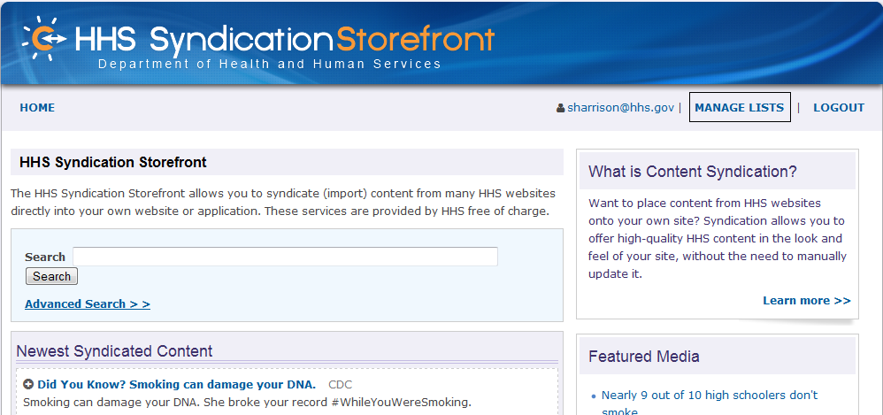

Syndication Storefront User Guide
=============================================

Introduction
---------------------------------------------

This document includes select processes for using the Syndication Storefront.

Scope
---------------------------------------------

This document includes select processes for the Syndication Storefront.  It does not include installation and configuration instructions for any syndication related components.

Home Page
---------------------------------------------

### View Home Page

+ Launch a web browser, enter the following Uniform Resource Locator (URL) in the address bar:  http://digitalmedia.hhs.gov.

+ Hit Enter or Click Go button next to the address bar.  The Syndication Storefront Home page will appear.

### View What Is Content Syndication?

+ From Home page, under What is Content Syndication? heading, click Learn More link; Questions and Answers screen will appear.

+ Click desired link on the right-hand side of the screen.

### View Featured Media

+ From Home page, click at desired Featured Media title link.

+ Featured Media details screen will appear.

+ Click Preview button.  A pop-up window will appear.

+ Either scroll up and down or left to right to see the rest of the media item as applicable.

+ Click X in the upper right-hand corner to close the screen.

### View Application Programming Interface (API) Documentation

+ From the Home page, under the Syndication API heading, click the API documentation link.

+ The HHS Media Services API screen will appear.

+ Click desired links to review HHS Media Service API documentation.

### View Additional Information

+ From Home page, under the Additional Information section, click Questions and Answers link.

+ Questions and Answers screen will appear.

+ Click Home link.  The Home page will appear.

+ From Home page, under the Additional Information heading, click Usage Guidelines link.

+ Usage Guidelines screen will appear.

+ Click Home link. Home page will appear.

+ From Home page, under the Additional Information heading, click Syndication Roadmap link.

+ Syndication Roadmap screen will appear.

+ Click desired link on the right-hand side of the screen for more information.

+ Click Home link. Home page will appear.

+ From Home page, under Additional Information heading, click Report a Problem With A Syndicated Page link.

+ Report a Problem with the Syndication System screen will appear.

+ Enter E-mail address.

+ Optionally, enter URL of the page with an issue.

+ Enter a description of the problem.

+ Click Submit button. Home page will appear with confirmation message that the message was sent.

+ From Home page, under Additional Information heading, click Request a Page to be Syndicated link.

+ The Request The Syndication Of A Content Item pop-up window will appear.

+ Enter the E-mail address.

+ Enter the Content URL.

+ Enter a description.

+ Click the Submit button.  The Home page will appear with a confirmation message.

+ Click "Get the Syndicate This button link"

+ Syndicate This code snippet page will open:

+ Click "Release Notes"

+ Release Note page will open with recent release date:

## Search

### Basic Search

+ From the Home page, enter the term in the Search field.  Search is based on either the name (or partial name), description (or partial description), or uniform resource locater (url) (or partial url) for the media item.  

+ Click the Search button.  If there are results then they will appear under the Search Results heading.  

+ Click the title link of the desired media item.  The detailed media item screen will appear.

### Advanced Search

+ From the Home page, click the Advanced Search link.

+ The Media Item Lookup screen will appear.

+ Optionally, enter the Title of the media item.

+ Optionally, select the Source from the drop-down menu.

+ Optionally, enter URL.

+ Optionally, select the Media Type from the drop-down list.

+ Optionally, select the Language from the drop-down menu.

+ Click the Search button.  If there are search results then they will appear.

+ Screenshot - Search by Title

+ Screenshot - Search by Title & Media Type:

+ Screenshot - Search by Title, Source, Media Type & Language:

+ Screenshot - when there is no search result available:

+ Click the desired title of the media item.  The detailed media item screen will appear.

## New User Registration

+ From the Home page, click the Register link.

+ The Register screen will appear.

+ Enter your name (First Name, Middle Initial, Last Name).

+ Enter your E-mail address.

+ Enter your Password.

+ Re-enter your Password.

+ Enter the reCAPTCHA text.

+ Click the Register button.  The Sign In screen will appear with the account created confirmation message.

## Reset Password

+ From the Home page, click the Login link.  

+ Login screen will appear.

+ Click on Forgot Password? link. Forgot Your Password? screen will appear.

+ Enter Account E-mail Address.

+ Enter reCAPTCHA text.  

+ Click on Request Password Reset button.  The Sign In screen will appear and an email will be sent with the new password.

## Login

+ From Home page, click the Login link.

+ Login screen will appear.

+ Enter E-mail address.

+ Enter Password.

+ Optionally, click on Remember me checkbox.

+ Click on Sign In button.  The Home page will appear with the user name in the upper right-hand corner.

## Manage Lists

### View My Media List

+ After logging into the storefront, click the Manage Lists link.

+ The My Media List screen will appear.

### Create A Media List

+ From My Media List screen, click the Create Media List link.

+ Create Media List screen will appear.

+ Enter Name.

+ Enter Description.

+ Select Media Items by entering a letter or character in the title in the Media Items field.  Potential matching items will appear in a drop-down list.

+ Click on Create button.  The Show Media List screen will appear with a created confirmation message.

+ Click on View Media List link to return to the My Media List screen.

### Edit A Media List

+ From My Media List screen, click on desired name link.

+ Show Media List screen will appear.

+ Click Edit button. Edit Media List screen will appear.

+ Modify desired fields.

+ Click Update button.  The Show Media List screen with the updated confirmation message will appear.

+ Click View Media List link.  The My Media List screen will appear.

### Delete A Media List

+ From My Media List screen, click the desired name link.

+ Show Media List screen will appear.

+ Click Delete button.  The Are you sure? pop-up window will appear.

+ Click OK button.  The My Media List screen with the deleted confirmation message will appear.

### Un/Like a Media

+ Click on Home button.

+ click on + sign on any media item, it will open thumbs up iocon.

+ Click on thumbs up, it will say x Users liked this content.

+ Click again on thumbs up icon, it will unlike that media item.

### Post Media in Social Network

+ click on + sign on any media item, it will display social media icon.

+ Click on Facebook/Google Plus/LinkedIn icon, it will redirect to log in to that site; once user is logged in s/he can post that media in that Particular site.

## Logout

+ Click on Logout link.

