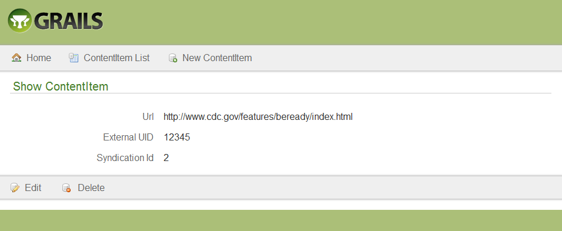

# Content Item Controller

## View

+ From the Tag Administration screen, click the Application (App) Information (Info) link.
 

+ The Available Controllers screen will appear.

 

+ Click the tagCloud.ContentItemController link.  The Content Item List screen will 
will appear.
 

## Create

+ From the Content Item List screen, click the New Content Item button.  

 

+ The Create Content Item screen will appear.
 

+ Enter the URL.  Note: this should begin with http or https.

+ Optionally, enter the External Unique Identification (UID).

+ Optionally, enter the Syndication ID.

+ Click the Create button.  The Show Content Item screen will appear with the created confirmation message.

 

+ Click the Content Item List button.  The Content Item List screen will appear.

* Note: creating an item in the Content Item Controller does not create an item imported from Syndication that appears in the Tag Administration screen.  If you created a content item for an item that has a Syndication ID that corresponds to an item imported from Syndication in the Tag Administration screen with a different URL then the next time a tag is added in the Tag Administration screen, the URL that corresponds to the Syndication ID entered will be updated.  For detailed instructions, go to Add a Tag.

## Sort

5.3.1 From the Content Item List screen, click the desired sortable heading (ID, SynID, UID, URL).

5.3.2 Click the heading again.  The order will be changed (descending to ascending).

## Edit

+ From the Content Item List screen, click the desired ID link.

 

+ The Show Content Item screen will appear.

 

+ Click the Edit button.  The Edit Content Item screen will appear.

 

+ Modify the desired fields.

+ Click the Update button.  The Show Content Item screen with updated confirmation message will appear.

 

+ Click the Content Item List button.  The Content Item List screen will appear.

* Note: editing an item in the Content Item Controller does not edit an item imported from Syndication that appears in the Tag Administration screen.

## Delete

+ From the Content Item List screen, click the desired ID link.

  

+ The Show Content Item screen will appear.

 

+ Click the Delete button.  The Are you sure? pop-up window will appear.

 

+ Click the OK button.  The Content Item List screen will appear with the deleted confirmation message.

 
+ Click the Home link to return to the Tag Administration screen. Note: deleting an item in the Content Item Controller does not delete an item imported from Syndication that appears in the Tag Administration screen.
 

