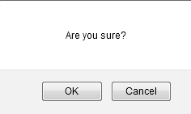

# Language Controller

## View

+ From the Tag Administration screen, click the Application (App) Information (Info) link.

 

+ The Available Controllers screen will appear.

 
6+ Click the tagCloud.LanguageController link.  The Language List screen will 
will appear.

## Create

+ From the Language List screen, click the New Language button.  

 

+ he Create Language screen will appear.
 

+ Enter the Name.  Note: language names are based on the International Organization for Standardization (ISO) standards found at the following website: http://loc.gov/standards/iso639-2/php/code_list.php

+ Enter the ISO Code.  Note: ISO Codes must correspond to the ISO standard found at the following website: http://loc.gov/standards/iso639-2/php/code_list.php.

+ Click the Create button.  The Show Language screen will appear with the created confirmation message.
 

+ Click the Language List button.  The Language List screen will appear.

 
## Sort

+ From the Language List screen, click the desired sortable heading (Name, ISO Code).

+ Click the heading again.  The order will be changed (descending to ascending).

## Edit

+ From the Language List screen, click the desired language name link.

 

+ The Show Language screen will appear.

 

+ Click the Edit button.  The Edit language screen will appear.
 

+ Modify the desired fields.

+ Click the Update button.  The Show Language screen with updated confirmation message will appear.  Note: Since the languages and ISO codes can’t be created unless they correspond to the ISO standards provided in the previous section, to edit there would need to be an update to the standards for a language.

+ Click the Language List button.  The Language List screen will appear.

 

## Delete

+ From the Language List screen, click the desired name link.

  
+ The Show Language screen will appear.

 

+ Click the Delete button.  The Are you sure? pop-up window will appear.
 

+ Click the OK button.  The Language List screen will appear with the deleted confirmation message.

 

+ Click the Home link to return to the Tag Administration screen.  

