# Tag Administration

## Add Tag

+ From the Tag Administration screen, click the Add Tag link next to the desired Syndication Identification (ID) and Source URL.  

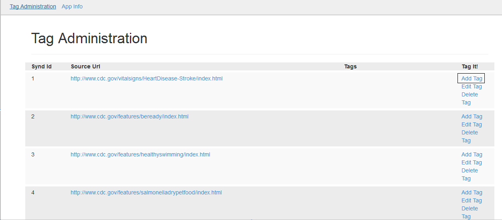 

+ The Tag Details screen will appear.

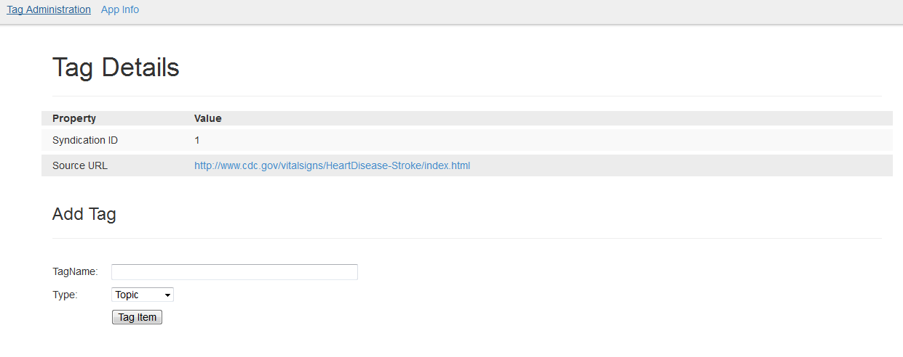
 
+ Enter the Tag Name.

+ Select the &lt;Tag&gt; Type from the drop-down menu.

+ Click the Tag Item button.  The Tag Administration screen will appear with a confirmation message.

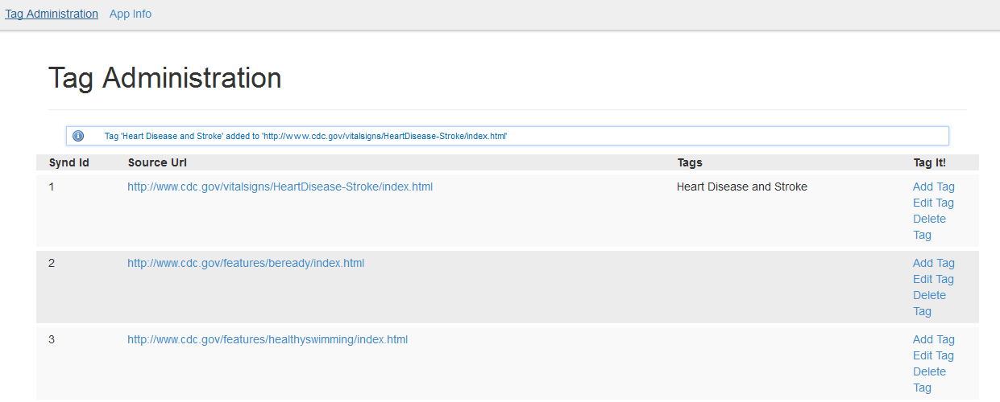 

## Edit Tag

+ From the Tag Administration screen, click the Edit Tag link next to the desired Syndication ID and Source URL.

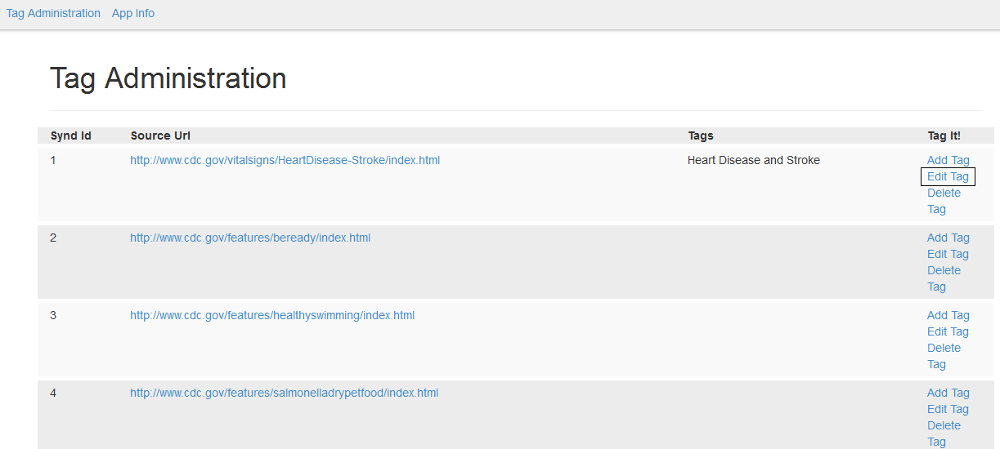 

+ The Tag Details screen will appear.

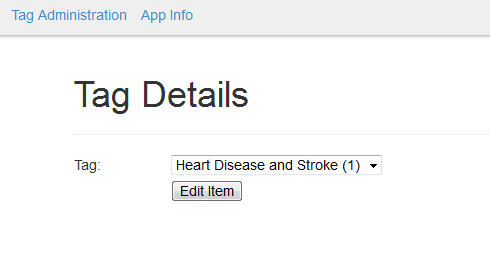  

+ Select the Tag to edit from the drop-down menu.

+ Click the Edit Item button.  The Edit Tag screen will appear.

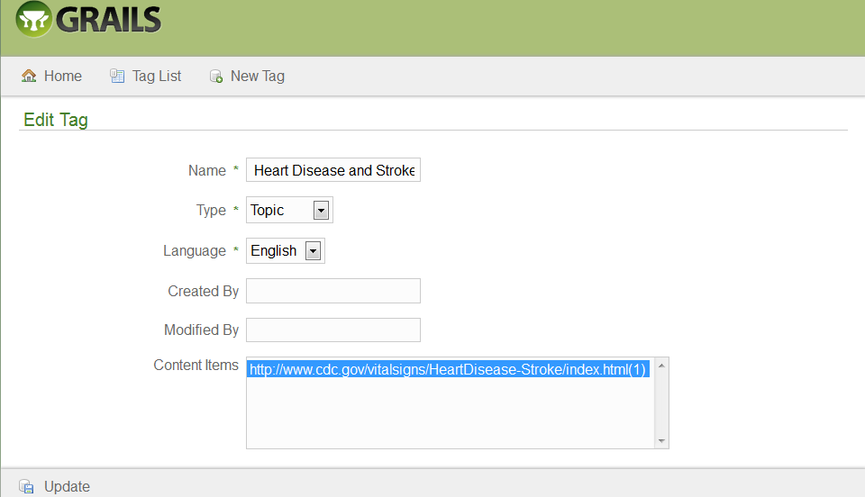 

+ Modify the desired fields.

+ Click the Update button.  The Show Tag screen will appear with the updated confirmation message.

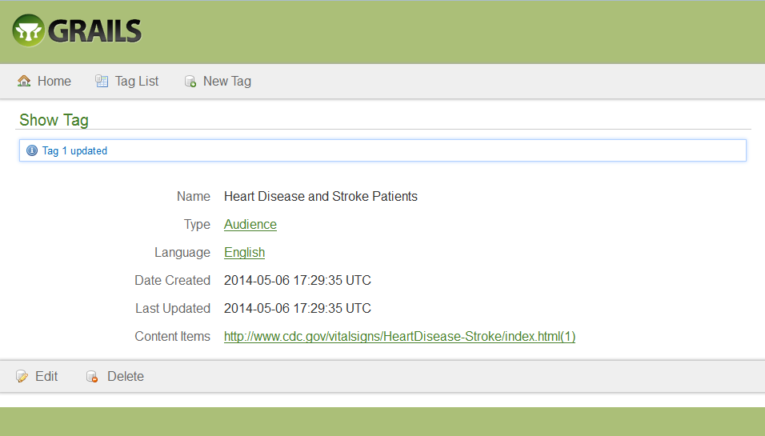 

+ Click the Home button.  The Tag Administration screen will appear.

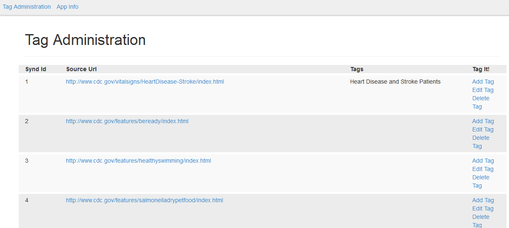 

## Delete Tag

+ From the Tag Administration screen, click the Delete Tag link next to the desired Syndication ID and Source URL.

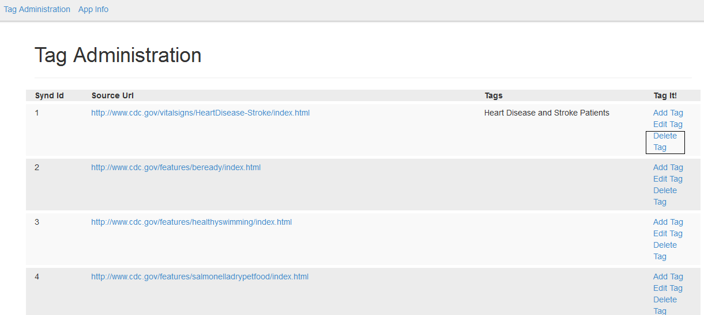
 
+ The Tag Details screen will appear.

 
+ Select the Tag from the drop-down menu.

+ Click the Delete Item button.  The Show Tag screen will appear.

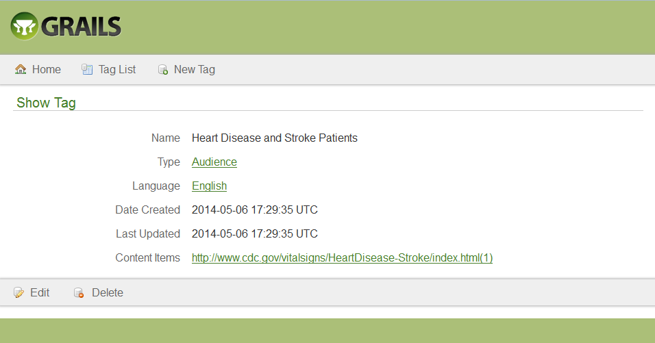
 
+ Click the Delete button.  The Are you sure? pop-up window will appear.

 
+ Click the OK button.  The Tag List screen will appear with the deleted confirmation message.

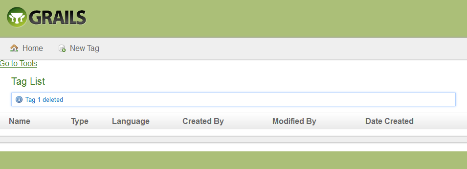
 
+ Click the Home Link.  The Tag Administration screen will appear with the tag deleted.

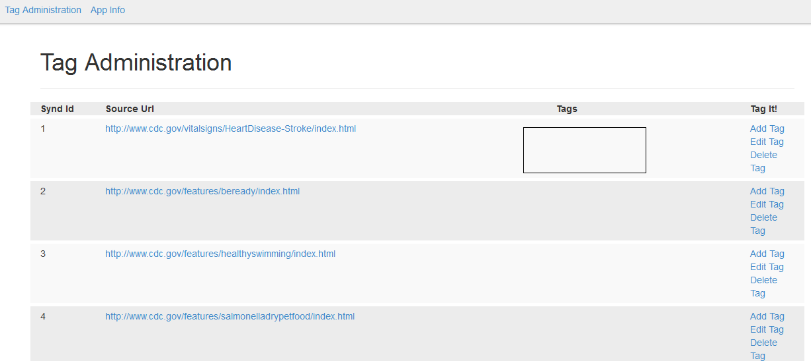
