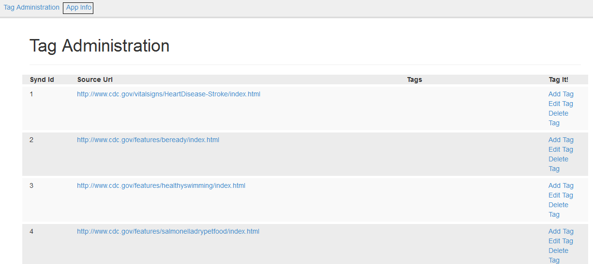
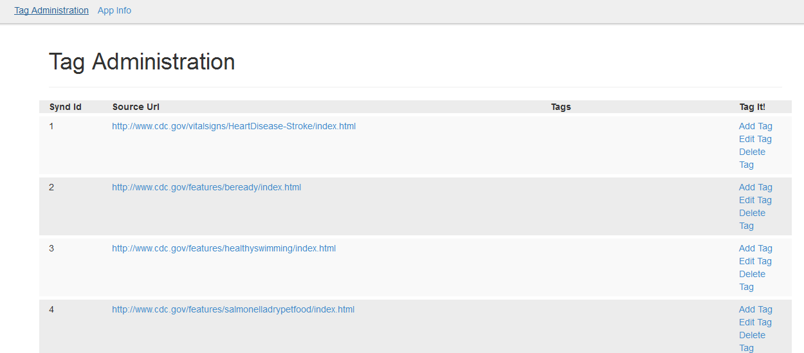
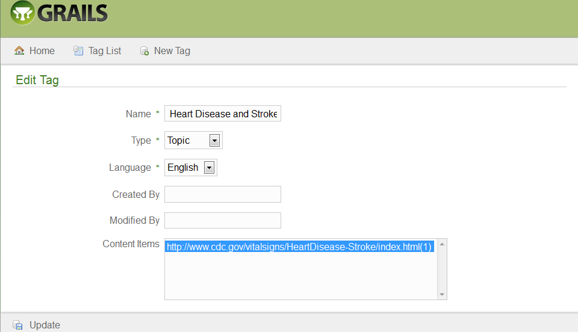
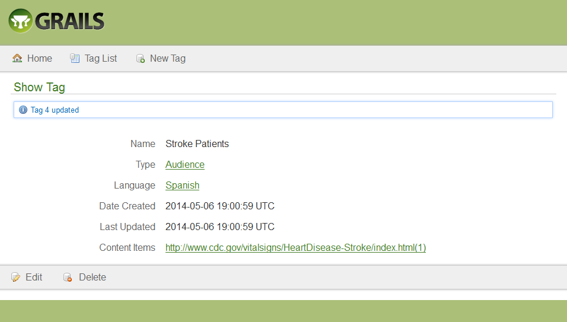
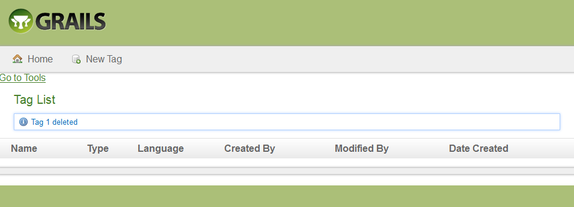

# Tag Controller

## View

+ From the Tag Administration screen, click the Application (App) Information (Info) link.

 

+ The Available Controllers screen will appear.
 

+ Click the tagCloud.TagController link.  The Tag List screen will 
will appear.

 

## Create

+ From the Tag List screen, click the New Tag button.  

 

+ The Create Tag screen will appear.

 

+ Enter the Name.

+ Select the &lt;Tag&gt; Type from the drop-down menu.

+ Optionally, enter the Created By name.

+ Optionally, enter the Modified By name.

+ Select the Content Item(s) associated with the tag.

+ Click the Create button.  The Show Tag screen will appear with the created confirmation message.

 

+ Click the Tag List button.  The Tag List screen will appear.

 

+ Click the Home button.  The Tag Administration screen will appear. 

 

* Note:  creating a tag in the Tag Controller does not add a tag to an item imported from Syndication that appears in the Tag Administration screen.  For detailed instructions, go to Add a Tag.

## Sort

+ From the Tag Controller Tag List screen, click the desired sortable heading (Name, Type, Language, Created By, Modified By, Date Created).

+ Click the heading again.  The order will be changed (descending to ascending).

## Edit

+ From the Tag List screen, click the desired tag name link.

 

+ The Show Tag screen will appear.

 

+ Click the Edit button.  The Edit Tag screen will appear.

 

+ Modify the desired fields.

+ Click the Update button.  The Show Tag screen with updated confirmation message will appear.  

 

+ Click the Tag List button.  The Tag List screen will appear.

 

## Merge Tags

+ From the Tag List screen, click the Go to Tools link.

 

+ The Merge Tags screen will appear.
 

+ Enter the names of the tags to merge.

+ Enter the New Tag name.

+ Click the Merge button.  The Tag List screen will appear with the tags merged.

## Split Tags

+ From the Tag List screen, click the Go to Tools link.

 

+ The Merge Tags screen will appear.

 

+ Click Split Tag.  The Split Tag screen will appear.

 

+ Enter the name of the tag to split. 

+ Enter the name for each New Tag.

+ Click the Split button.  The Tag List screen will appear with the tags split.

 

## Delete Tag

+ From the Tag List screen, click the desired name link.

 

+ The Show Tag screen will appear.

 

+ Click the Delete button.  The Are you sure? pop-up window will appear.

 

+ Click the OK button.  The Tag List screen will appear with the deleted confirmation message.
 

+ Click the Home link to return to the Tag Administration screen.  

