# Type Controller

## View

+ From the Tag Administration screen, click the Application (App) Information (Info) link.

+ The Available Controllers screen will appear.

+ Click the tagCloud.TypeController link.  The Type List screen will 
will appear.

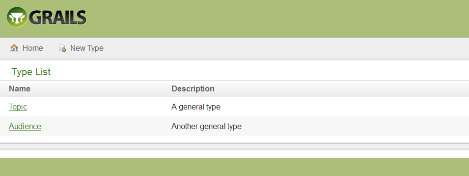 

## Create

+ From the &lt;Tag&gt; Type List screen, click the New Type button.  

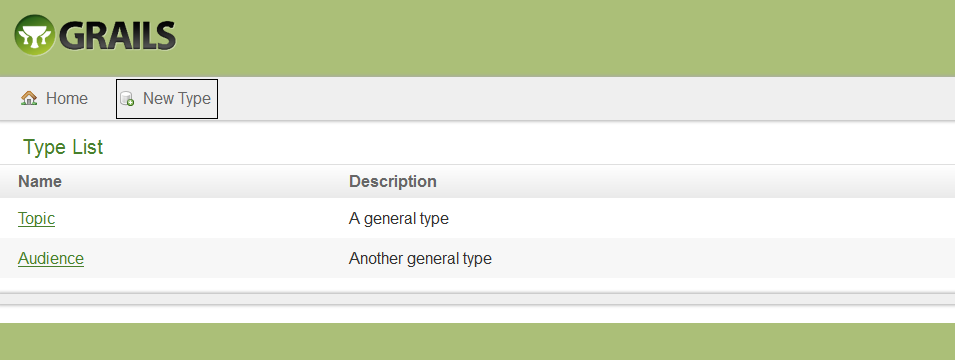 

+ The Create Type screen will appear.

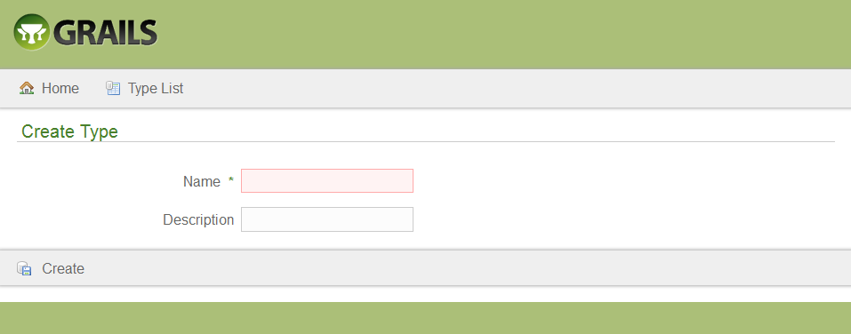 

+ Enter the Name.  

+ Enter Description.  

+ Click the Create button.  The Show Type screen will appear with the created confirmation message.

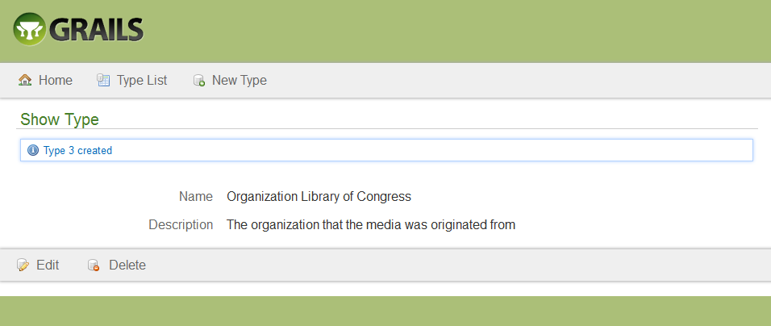 

+ Click the Type List button.  The Type List screen will appear.

 
## Sort

+ From the Type List screen, click the desired sortable heading (Name, Description).

+ Click the heading again.  The order will be changed (descending to ascending).

## Edit

+ From the Type List screen, click the desired type name link.

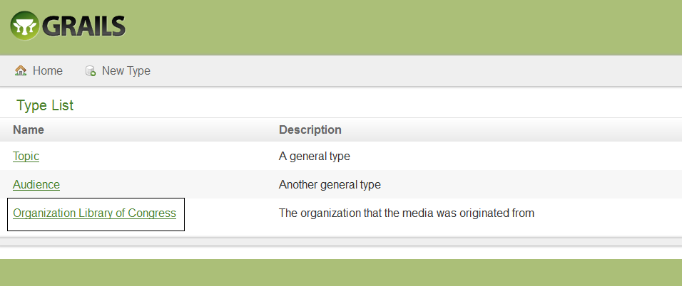 

+ The Show Type screen will appear.

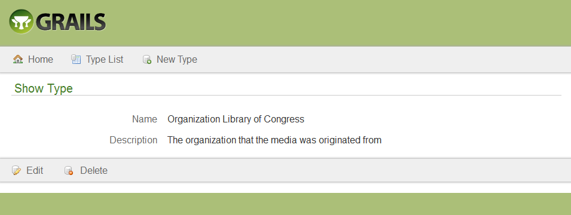 

+ Click the Edit button.  The Edit Type screen will appear.

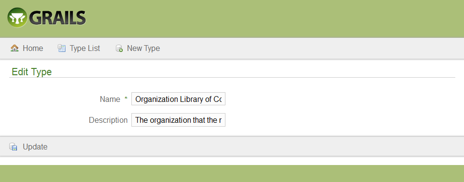
 
+ Modify the desired fields.

+ Click the Update button.  The Show Type screen will appear with the updated confirmation message.

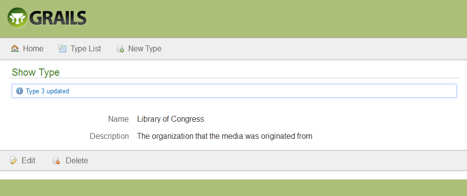 

+ Click the Type List button.  The Type List screen will appear.
 
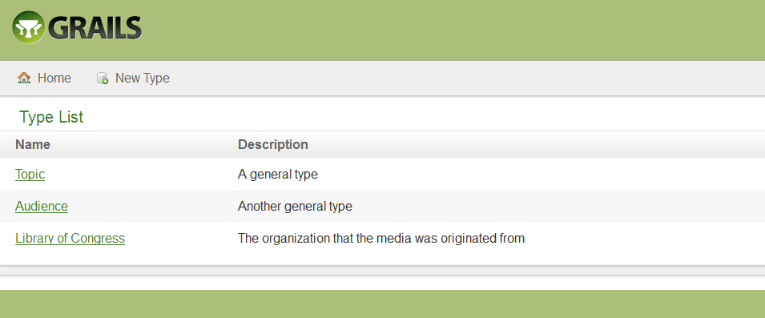

## Delete

+ From the Type List screen, click the desired name link.

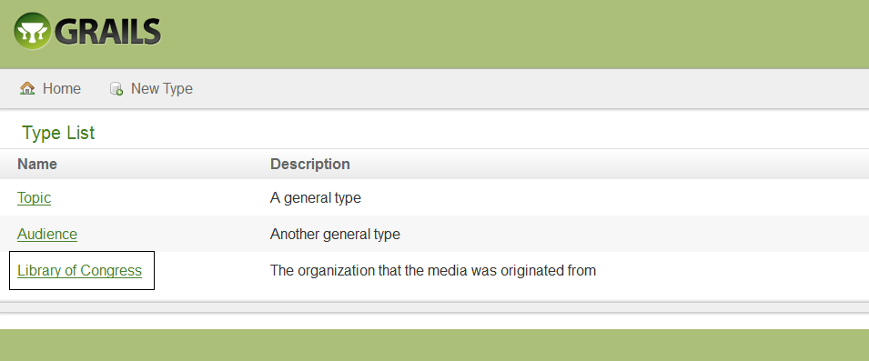 

+ The Show Type screen will appear.
 
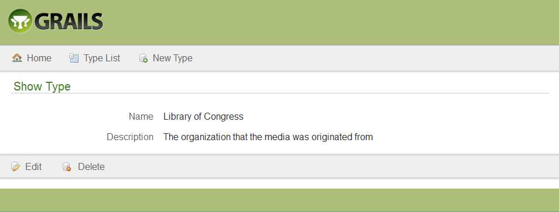

+ Click the Delete button.  The Are you sure? pop-up window will appear.

 

+ Click the OK button.  The Type List screen will appear with the deleted confirmation message.

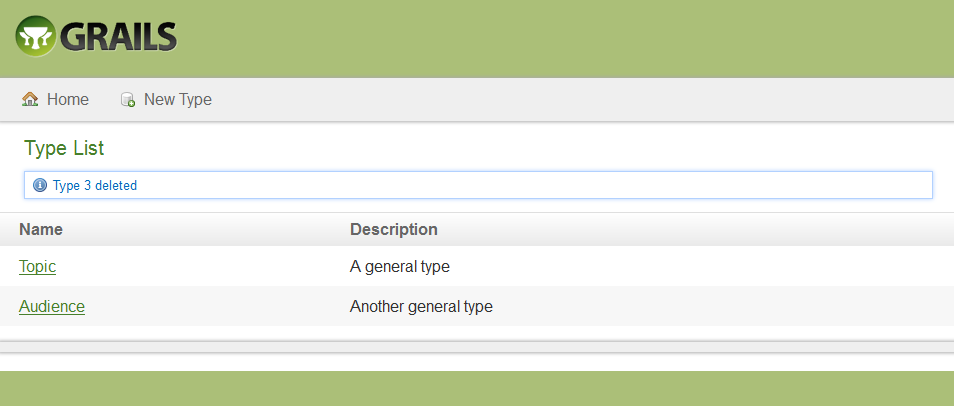 

+ Click the Home link to return to the Tag Administration screen.  

