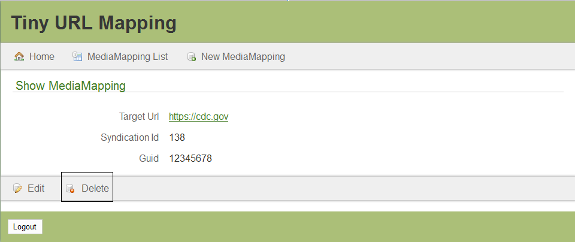

# Media Mapping
 
## Create

+ From the Media Mapping List screen, click the New Media Mapping button.  
 

+ The Create Media Mapping screen will appear.

 

+ Enter the Target URL.  Note: this should be http or https.

+ Optionally, enter the Syndication Identification (ID).

+ Optionally, enter the Globally Unique Identifier (Guid). 
 
+ Click the Create button.  The Show Media Mapping screen will appear with a confirmation message.

 

+ Click the Media Mapping List button.  The Media Mapping screen will appear.

 

## Edit

+ From the Media Mapping List screen, click the desired ID link.

 

+ The Show Media Mapping screen will appear.

 

+ Click the Edit link.  

 
+ The Edit Media Mapping screen will appear.

 
+ Modify the desired fields.

+ Click the Update button.  The Show Media Mapping screen will appear with a confirmation message.

 

+ Click the Media Mapping List.  The Media Mapping List screen will appear.

## Sort

+ From the Media Mapping List screen, click the desired sortable heading (ID, Target URL, Syndication ID, GUID).

+ Click the sortable heading again.  The order will be changed (descending to ascending).

## Delete

+ From the Media Mapping List screen, click the desired ID.

+ The Show Media Mapping screen will appear.

 

+ Click the Delete button.  The Are you sure? pop-up window will appear.

 
+ Click the OK button.  The Media Mapping List screen will appear with a deleted confirmation message.
 

